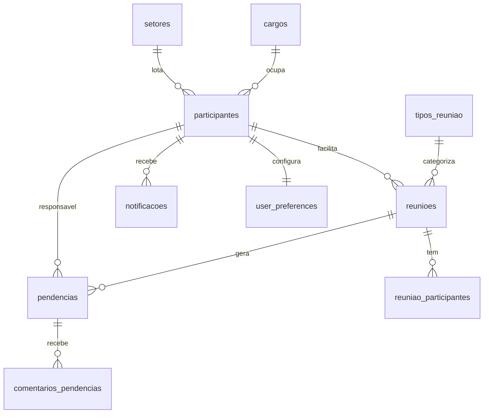
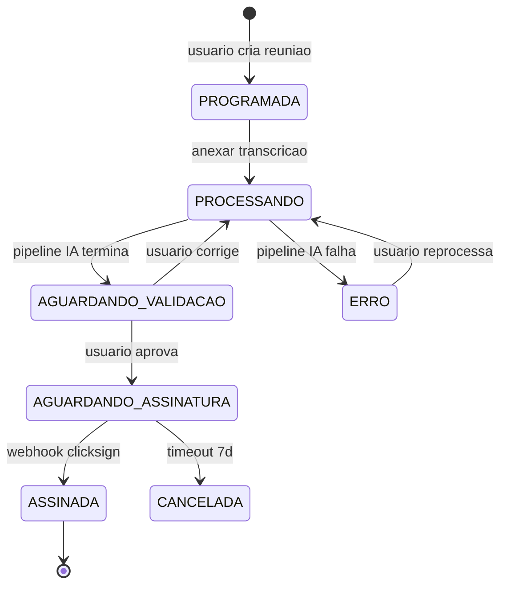
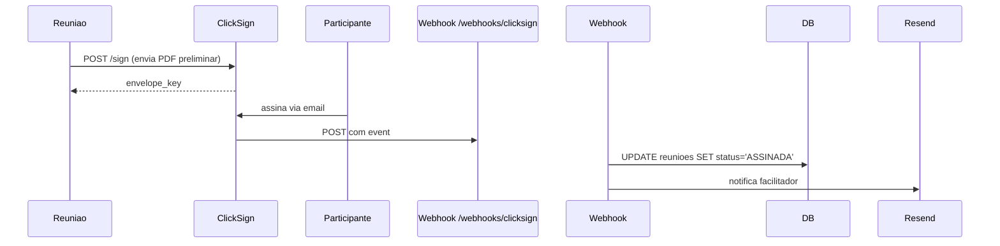
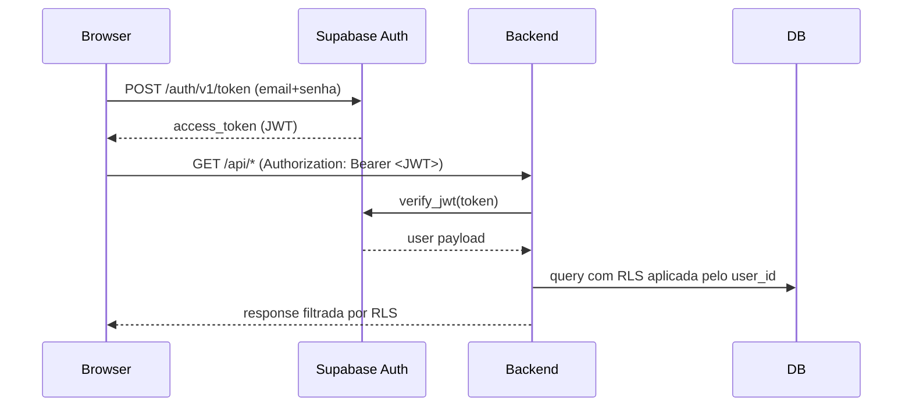

# snapshot — manter `docs/spec/snapshots/` fresco

Uma skill, sete arquivos vivos. O time tem sempre um **mapa atualizado** da aplicação sem precisar manter nada à mão (exceto o que naturalmente exige curadoria humana: fluxogramas e descrições semânticas da estrutura de pastas).

## Princípio arquitetural

**Esta skill é metodologia pura.** Lê config de `docs/spec/deploy/project.json` (compartilhada com `/deploy` e `/ship`). Não tem conhecimento hardcoded sobre projetos específicos.

A skill executa sempre o mesmo algoritmo (detectar mudança → parsear → gerar → comparar → commit se mudou). Cada gerador é parametrizado pelo `project.json` do repo atual.

Relação com outras skills:
- **`/deploy ship`**: chama `/snapshot` no Passo 9.5 (pós-health verde, antes de fechar). Snapshot regenerado é commitado em commit separado `chore(spec): snapshot pós deploy <sha7>`.
- **`/ship`**: usa `/snapshot --diff <base>..HEAD` no Passo 7 pra gerar a seção "Mudanças" do PR body.

## Sintaxe

```bash
/snapshot                          # default: regenera tudo, commita se mudou
/snapshot --check                  # dry-run: mostra o que mudaria, não escreve
/snapshot --diff <base>..HEAD      # markdown comparando snapshot atual com o que teria depois das mudanças entre <base> e HEAD
/snapshot --force                  # regenera tudo, ignora idempotência
/snapshot --only <arquivo>         # regenera só 1 arquivo (ROTAS|ENTIDADES|SCHEMA|MIGRATIONS|INTEGRACOES|FLUXOGRAMAS|ESTRUTURA)
```

---

## Bootstrap (toda invocação)

1. **Descobrir raiz do repo:**
   ```bash
   REPO_ROOT=$(git -C "$PWD" rev-parse --show-toplevel)
   ```
   Se falhar → "Não é um repositório git." e PARAR.

2. **Ler `project.json`:** `$REPO_ROOT/docs/spec/deploy/project.json`. Se ausente → PARAR com mensagem "Rode `/deploy setup` primeiro".

3. **Garantir pasta:** `mkdir -p $REPO_ROOT/docs/spec/snapshots/`.

4. **Capturar paths críticos** do `project.json`:
   - `routers_dir`: derivar dos `services[].diff_routing.trigger_paths` que contém `routers/` (default Hospital: `hospital-reunioes/backend/app/routers/`)
   - `migrations_dir`: `project.migrations.dir` (Hospital: `hospital-reunioes/supabase/migrations`)
   - `backend_app_dir`: derivar pra estrutura (Hospital: `hospital-reunioes/backend/app/`)
   - `frontend_src_dir`: derivar pra estrutura (Hospital: `hospital-reunioes/frontend/src/`)
   - `supabase_dir`: derivar (Hospital: `hospital-reunioes/supabase/`)
   - `integrations`: `project.project.integrations[]`

---

## Algoritmo principal

### Passo 1 — Detectar mudança (idempotência)

Comparar último snapshot conhecido com o que seria gerado agora:

```bash
LAST_SNAPSHOT_SHA=$(git log -1 --format=%H -- docs/spec/snapshots/ 2>/dev/null || echo "")
CURRENT_SHA=$(git rev-parse HEAD)

if [ "$LAST_SNAPSHOT_SHA" = "$CURRENT_SHA" ] && [ -z "$FORCE" ]; then
  # Mesmo commit do último snapshot — nada mudou
  echo "snapshot já atualizado (commit $CURRENT_SHA)"
  exit 0
fi

# Detectar arquivos relevantes que mudaram desde último snapshot
CHANGED_FILES=$(git diff --name-only "$LAST_SNAPSHOT_SHA" HEAD -- \
  "$routers_dir" \
  "$migrations_dir" \
  "$backend_app_dir" \
  "$frontend_src_dir" \
  "$supabase_dir" \
  docs/spec/deploy/project.json 2>/dev/null)

if [ -z "$CHANGED_FILES" ] && [ -z "$FORCE" ]; then
  echo "nenhuma mudança relevante desde último snapshot"
  exit 0
fi
```

Se houver mudança ou `--force`: seguir.

### Passo 2 — Gerar cada arquivo

Cada gerador roda em paralelo (no nível de processo) ou sequencial. Geradores escrevem em **buffer**, não em arquivo, até o Passo 3 (comparação).

#### 2.1 — ROTAS.md (auto-gerado, sobrescreve)

Parsear cada `<routers_dir>/*.py`:

```python
# Pseudo-código
import ast, re
for py_file in sorted(routers_dir.glob("*.py")):
    if py_file.name in ("__init__.py",): continue
    tree = ast.parse(py_file.read_text())

    # Encontrar APIRouter init pra pegar prefix e tags
    prefix = extract_router_prefix(tree)  # ex: "/reunioes"
    tags = extract_router_tags(tree)

    # Encontrar funções com decorator @router.METHOD("path", ...)
    for node in ast.walk(tree):
        if not isinstance(node, (ast.AsyncFunctionDef, ast.FunctionDef)):
            continue
        for dec in node.decorator_list:
            method, path = parse_route_decorator(dec)  # ("GET", "/{id}")
            if not method: continue

            full_path = prefix + path
            docstring = ast.get_docstring(node) or ""
            short_desc = docstring.split("\n")[0][:80] if docstring else humanize_name(node.name)

            # Detectar auth: procurar Depends(get_current_user) etc nos defaults dos args
            needs_auth = any(
                "get_current_user" in ast.unparse(arg)
                or "require_super_admin" in ast.unparse(arg)
                for arg in node.args.defaults + node.args.kw_defaults
                if arg
            )

            routes.append({
                "method": method, "path": full_path,
                "handler": node.name, "desc": short_desc,
                "auth": needs_auth, "router_file": py_file.stem
            })
```

Agrupar por router (arquivo) e renderizar:

```markdown
# ROTAS.md
<!-- gerado automaticamente por /snapshot — não editar -->
<!-- last_update: <ISO> -->

Endpoints da aplicação Hospital Reuniões.

## auth (`app/routers/auth.py`)

| Método | Rota                       | O que faz                          | Auth |
|--------|----------------------------|------------------------------------|------|
| GET    | /auth/me                   | Retorna usuário autenticado        | ✅   |
| POST   | /auth/invite/{id}          | Envia reset de senha               | ✅   |

## reunioes (`app/routers/reunioes.py`)

| Método | Rota                                              | O que faz                          | Auth |
|--------|---------------------------------------------------|------------------------------------|------|
| GET    | /reunioes                                         | Lista reuniões com filtros         | ✅   |
| POST   | /reunioes/agendar                                 | Cria reunião programada            | ✅   |
| ...    | ...                                               | ...                                | ...  |

## ... outros routers ...

---
**Totais:** N endpoints em M routers · X% exigem auth
```

#### 2.2 — ENTIDADES.md (auto-gerado, sobrescreve)

Parsear cada `<migrations_dir>/*.sql` em ordem alfabética. Detectar `CREATE TABLE` e construir modelo cumulativo (`CREATE TABLE foo`, depois `ALTER TABLE foo ADD COLUMN bar`).

```python
# Pseudo-código
tables = {}  # nome → {columns: [...], fks: [...], indexes: [...]}

for sql_file in sorted(migrations_dir.glob("*.sql")):
    sql = sql_file.read_text()

    # CREATE TABLE statements
    for match in re.finditer(r"CREATE TABLE\s+(?:IF NOT EXISTS\s+)?(\w+)\s*\(([^;]+)\);", sql, re.IGNORECASE | re.DOTALL):
        table_name = match.group(1)
        body = match.group(2)
        cols = parse_table_body(body)  # extrai (name, type, constraints, references)
        tables[table_name] = {"columns": cols, "fks": extract_fks(cols), "first_seen": sql_file.name}

    # ALTER TABLE ADD COLUMN
    for match in re.finditer(r"ALTER TABLE\s+(\w+)\s+ADD COLUMN\s+([^;]+);", sql, re.IGNORECASE):
        table_name = match.group(1)
        if table_name in tables:
            col = parse_column_def(match.group(2))
            tables[table_name]["columns"].append(col)

    # ALTER TABLE DROP COLUMN
    for match in re.finditer(r"ALTER TABLE\s+(\w+)\s+DROP COLUMN\s+(\w+)", sql, re.IGNORECASE):
        table_name, col_name = match.group(1), match.group(2)
        if table_name in tables:
            tables[table_name]["columns"] = [c for c in tables[table_name]["columns"] if c["name"] != col_name]

    # DROP TABLE
    for match in re.finditer(r"DROP TABLE\s+(?:IF EXISTS\s+)?(\w+)", sql, re.IGNORECASE):
        tables.pop(match.group(1), None)
```

Renderizar:

```markdown
# ENTIDADES.md
<!-- gerado automaticamente por /snapshot — não editar -->
<!-- last_update: <ISO> -->

Modelo de dados Hospital Reuniões. Tabelas no banco Supabase.

## participantes

Origem: `001_create_participantes.sql` (alterada em 014, 017, 030, 036)

| Campo               | Tipo            | Obrigatório | Default              | Descrição                          |
|---------------------|-----------------|-------------|----------------------|------------------------------------|
| id                  | VARCHAR(10) PK  | sim         | gerado (P001+)       | identificador único                |
| nome_completo       | TEXT            | sim         | —                    | nome completo do participante      |
| email               | TEXT UNIQUE     | não (externos) | —                 | email (nullable só pra externos)   |
| role                | user_role       | sim         | 'coordenador'        | papel (diretor/coordenador/...)    |
| ...                 | ...             | ...         | ...                  | ...                                |

**Relacionamentos:**
- Referenciada por: `reunioes(facilitador_id)`, `pendencias(responsavel_id)`, ...

---

## reunioes
...
```

#### 2.3 — SCHEMA.md (auto-gerado, sobrescreve)

Mermaid ER diagram derivado das FKs detectadas em ENTIDADES.md.

```markdown
# SCHEMA.md
<!-- gerado automaticamente por /snapshot — não editar -->

## Diagrama ER (Mermaid)



## Indexes críticos
- `reunioes(data)`, `reunioes(facilitador_id)`, `reunioes(deleted_at)`
- `pendencias(id_reuniao)`, `pendencias(responsavel_id)`, `pendencias(status, deleted_at)`
- `comentarios_pendencias(id_acao)`
- `notificacoes(destinatario_id, lida)`
```

#### 2.4 — MIGRATIONS.md (auto-gerado, sobrescreve)

Listagem cronológica enxuta:

```python
for sql_file in sorted(migrations_dir.glob("*.sql")):
    # Primeira linha começando com "-- " é o comentário humano
    first_comment = next((ln[3:] for ln in sql_file.read_text().splitlines() if ln.startswith("-- ") and len(ln) > 4), None)
    if not first_comment:
        # Inferir das primeiras CREATE/ALTER/DROP
        first_comment = infer_summary(sql_file.read_text())

    counts = {
        "create_table": len(re.findall(r"CREATE TABLE", sql_text, re.I)),
        "alter_table": len(re.findall(r"ALTER TABLE", sql_text, re.I)),
        "create_index": len(re.findall(r"CREATE INDEX", sql_text, re.I)),
        "drop": len(re.findall(r"DROP\s+(TABLE|COLUMN|INDEX)", sql_text, re.I)),
    }
```

Renderizar:

```markdown
# MIGRATIONS.md
<!-- gerado automaticamente por /snapshot — não editar -->

Ordem cronológica de migrations aplicadas ao banco Supabase. Mais antigas no topo.

| # | Arquivo                              | Resumo                                              | C | A | I | D |
|---|--------------------------------------|-----------------------------------------------------|---|---|---|---|
| 1 | 001_create_participantes.sql         | criar tabela participantes + enum user_role         | 1 | 0 | 1 | 0 |
| 2 | 002_create_reunioes.sql              | criar reunioes + reuniao_participantes + indexes    | 2 | 0 | 3 | 0 |
| ...                                                                                                          |
| 38| 038_fk_indexes.sql                   | adicionar indexes em FKs frequentes                 | 0 | 0 | 3 | 0 |

**Legenda:** C=CREATE TABLE, A=ALTER TABLE, I=CREATE INDEX, D=DROP. Total: 38 migrations, 14 tabelas vivas.
```

#### 2.5 — INTEGRACOES.md (auto-gerado, sobrescreve)

Cruza `project.json.integrations[]` com grep no código pra achar usos reais:

```python
for integration in project.json["project"]["integrations"]:
    name = integration["name"]
    env_key = integration["configured_via"]
    note = integration["note"]

    # Procurar onde é usada
    usages = grep_recursive(
        backend_app_dir,
        rf"{env_key}|{name}",
        exclude_patterns=["test_*", "__pycache__"]
    )
    primary_file = pick_most_relevant(usages)  # heurística: arquivo com mais ocorrências
```

Renderizar:

```markdown
# INTEGRACOES.md
<!-- gerado automaticamente por /snapshot — não editar -->

Serviços externos usados pela aplicação Hospital Reuniões.

## OpenRouter
**Pra que serve:** LLM primário — geração de ata e correções via openai/gpt-5.4-mini
**Onde aparece no código:** `app/pipeline/llm_client.py` (cliente principal)
**Secret no Coolify:** `OPENROUTER_API_KEY`
**Variáveis relacionadas:** `LLM_MODEL`
**Fallback:** OpenAI (se OpenRouter cair)

## OpenAI
**Pra que serve:** Fallback automático se OpenRouter indisponível
**Onde aparece:** `app/pipeline/llm_client.py:fallback_to_openai()`
**Secret:** `OPENAI_API_KEY`
**Variáveis:** `LLM_FALLBACK_MODEL` (default: gpt-4o-mini)

## ClickSign
**Pra que serve:** Assinatura digital de atas (sandbox em dev, app em prod)
**Onde aparece:** `app/services/clicksign_service.py`, webhook em `app/routers/webhooks.py`
**Secret:** `CLICKSIGN_API_KEY`, `CLICKSIGN_WEBHOOK_SECRET`
**Variáveis:** `CLICKSIGN_BASE_URL` (https://sandbox.clicksign.com vs https://app.clicksign.com)
**Fluxo:** Ver `FLUXOGRAMAS.md` > "Assinatura ClickSign"

## Resend
...

## Fireflies
...

---
**Resumo:** N integrações externas · X% têm webhook · Y% têm secrets auto-gerados
```

#### 2.6 — FLUXOGRAMAS.md (NÃO regenera, só alerta)

```markdown
# FLUXOGRAMAS.md
<!-- mantido manualmente — /snapshot só alerta se rota/estado novo apareceu sem fluxo correspondente -->
<!-- last_human_update: 2026-05-21 -->

## Ciclo de vida de uma Reunião

<!-- curated:start -->

<!-- curated:end -->

## Assinatura ClickSign (webhook)

<!-- curated:start -->

<!-- curated:end -->

## Autenticação Supabase

<!-- curated:start -->

<!-- curated:end -->

---

## Alertas automáticos

`/snapshot` faz pré-check de **gaps de fluxograma**. Se uma rota nova foi adicionada em ROTAS.md ou um status novo aparece em ENTIDADES.md (enum changed) sem fluxograma correspondente aqui, a skill imprime um aviso pra você considerar adicionar.
```

#### 2.7 — ESTRUTURA.md (parcial auto-gerado, parte curada)

```markdown
# ESTRUTURA.md
<!-- gerado parcialmente por /snapshot. Blocos <!-- curated:start --> são preservados. -->

## Backend (FastAPI, Python 3.12)

Localização: `hospital-reunioes/backend/`

```
app/
├── routers/         # endpoints HTTP — 1 arquivo por área (auth, participantes, reunioes, ...)
├── services/        # lógica de negócio (audit, email, notificacao, auth_provisioning)
├── models/          # schemas Pydantic (schemas.py, admin_schemas.py)
├── pipeline/        # pipeline de IA (transcrição → resumo → ata → correção iterativa)
├── middleware/      # auth, logging, request_id
├── cron/            # jobs agendados (lembrete 24h, alerts de prazo, reprocessamento)
├── scripts/         # utilities (importação legada, backfill)
├── utils/           # helpers (parsing query_params, PostgREST filters)
├── prompts/         # templates de prompt pra IA
├── static/          # assets estáticos
├── templates/       # templates de email
├── dependencies.py  # dependências FastAPI (auth, supabase client, RLS helpers)
├── config.py        # Settings (env vars validadas)
├── limiter.py       # rate limiting (slowapi)
└── main.py          # FastAPI app entry point
```

<!-- curated:start -->
**Notas humanas:**
- A pasta `pipeline/` é o coração: pega áudio/transcrição, passa por LLM em N etapas (extração de fala → resumo → estruturação em JSON → geração de ata em PT → revisão), e cospe `json_ata` que é renderizado como PDF.
- `routers/admin/` exige `is_super_admin=true` no JWT — apenas Pedro hoje.
- `cron/lembrete_24h.py` roda a cada hora, busca reuniões com `data` exatamente 24h no futuro e `lembrete_24h_enviado=false`.
<!-- curated:end -->

## Frontend (Next.js 15, App Router, pnpm)

Localização: `hospital-reunioes/frontend/`

```
src/
├── app/             # App Router (layout, pages, auth, dashboard, admin)
├── components/      # UI reutilizável (kanban, tables, forms, modals, calendar)
├── hooks/           # custom hooks (useUser, usePendencias, useNotificacoes)
├── lib/             # utilities (API client, formatting, validation)
├── types/           # TypeScript types (User, Reuniao, Pendencia, ...)
└── constants/       # constantes (mapeamentos, labels, enums espelhados)
```

<!-- curated:start -->
**Notas humanas:**
- Stack: shadcn/ui + Tailwind + Zustand pra estado global + TanStack Query pra HTTP.
- Páginas principais: `/dashboard` (kanban de pendências), `/reunioes` (calendário+lista), `/admin/usuarios` (CRUD super_admin).
- Variáveis NEXT_PUBLIC_* viram build args do Docker (registradas em `project.json`).
<!-- curated:end -->

## Supabase (self-hosted, PostgreSQL 15)

Localização: `hospital-reunioes/supabase/`

```
supabase/
├── migrations/      # 38 SQL files (ordem cronológica 001-038)
├── functions/       # Edge Functions
├── templates/       # HTML de email (recovery, confirmation, magic_link, invite)
└── snippets/        # SQL helpers
```

<!-- curated:start -->
**Notas humanas:**
- Auth: tabela `auth.users` (gerenciada pelo Supabase), referenciada por `participantes.auth_user_id`.
- RLS habilitada em todas as tabelas (migration 009). Backend usa SERVICE_ROLE_KEY pra bypass quando faz operações admin.
- Storage: buckets pra `atas-pdf`, `audios`, `transcricoes` (migration 006).
<!-- curated:end -->
```

---

### Passo 3 — Comparar com versão existente (idempotência)

Pra cada arquivo gerado em buffer:

```python
existing = (snapshots_dir / file).read_text() if (snapshots_dir / file).exists() else ""
generated = buffer[file]

# Comparar ignorando comments de timestamp (`<!-- last_update: ... -->`)
def strip_metadata(text):
    return re.sub(r"<!-- last_update:.*?-->", "", text)

if strip_metadata(existing) == strip_metadata(generated):
    print(f"{file}: sem mudanças")
    continue

# Mudou — escrever
(snapshots_dir / file).write_text(generated)
changed_files.append(file)
```

**Preservar blocos curated:** se `existing` tem `<!-- curated:start -->...<!-- curated:end -->` e `generated` não tem aquele bloco, **manter o bloco do `existing`** dentro do `generated` antes de comparar.

### Passo 4 — Detectar gaps (alertas pra FLUXOGRAMAS.md)

Cruzar:
- Rotas novas em ROTAS.md vs fluxogramas em FLUXOGRAMAS.md
- Estados novos em enums (de ENTIDADES.md) vs estados em fluxogramas

Se gap detectado: imprimir aviso (não bloqueia):

```
⚠ ALERTA: rota nova `/pendencias/repactuar` não está em nenhum fluxograma.
   Considere adicionar um diagrama em docs/spec/snapshots/FLUXOGRAMAS.md
   (entre blocos <!-- curated:start --> e <!-- curated:end -->).
```

### Passo 5 — Commit separado (se houver mudança)

Se algum arquivo mudou:

```bash
cd "$REPO_ROOT"
git add docs/spec/snapshots/
git commit -m "$(cat <<EOF
chore(spec): atualizar snapshot pós deploy $(git rev-parse --short HEAD)

Arquivos atualizados:
$(for f in "${changed_files[@]}"; do echo "- docs/spec/snapshots/$f"; done)

Gerado automaticamente por /snapshot. Não dispara novo /deploy ship.
EOF
)"
```

**Importante:** o `scope_map` em `project.json` mapeia `docs/spec/snapshots/**` pra escopo `spec`. Commits com prefix `chore(spec):` são reconhecidos por `/deploy ship` (Passo 5) e **não disparam novo ciclo de deploy** (heurística: commits `docs`/`spec` que tocam só MD não geram trigger de service).

Se `--check` (dry-run): mostrar diff mas não commitar nem escrever.

---

## Modo `--diff <base>..HEAD`

Caso de uso: o `/ship` invoca `/snapshot --diff main..HEAD` no Passo 7 pra preencher a seção "Mudanças" do PR body.

```bash
/snapshot --diff main..HEAD
```

Comportamento:
1. Roda algoritmo principal mas escreve buffer numa pasta temporária `/tmp/snapshots-diff-<sha>/`.
2. Compara `/tmp/snapshots-diff-<sha>/*.md` com `docs/spec/snapshots/*.md` atual.
3. Gera markdown:

```markdown
## 📊 Mudanças no snapshot

### Rotas
- ✨ Nova: `POST /pendencias/{id}/repactuar`
- 🔧 Modificada: `GET /reunioes` agora aceita `?status_ata=ASSINADA`
- ❌ Removida: `GET /admin/legacy/*`

### Entidades
- 🆕 Tabela nova: `pendencias_repactuacoes`
- ➕ Coluna nova em `pendencias`: `repactuada_em` (TIMESTAMPTZ)

### Migrations
- ➕ `039_pendencias_repactuacoes.sql`: criar tabela de histórico de repactuação

### Integrações
- (sem mudanças)
```

4. Imprime no stdout. **Não commita.** Não escreve nada em `docs/spec/snapshots/`.

Esse markdown é o que vai pra dentro do PR body do `/ship`.

---

## Modo `--check` (dry-run)

```bash
/snapshot --check
```

Roda algoritmo principal, mostra que arquivos mudariam e o diff resumido, mas **não escreve nem commita**.

Output:

```
═══ /snapshot --check ═══

Arquivos que mudariam:
  ROTAS.md (12 linhas adicionadas, 3 removidas)
  ENTIDADES.md (5 linhas adicionadas)
  MIGRATIONS.md (1 linha adicionada)

Sem mudanças:
  SCHEMA.md, INTEGRACOES.md, FLUXOGRAMAS.md, ESTRUTURA.md

Alertas:
  ⚠ Rota nova `/pendencias/repactuar` sem fluxograma

Rode `/snapshot` (sem --check) pra aplicar as mudanças.
```

---

## Modo `--only <arquivo>`

```bash
/snapshot --only ROTAS
```

Regenera só 1 arquivo (útil em desenvolvimento da skill ou pra testar geradores individualmente). Aceita: `ROTAS`, `ENTIDADES`, `SCHEMA`, `MIGRATIONS`, `INTEGRACOES`, `ESTRUTURA`. **Não aceita `FLUXOGRAMAS`** (esse não é regenerado, só alertado).

---

## Anti-padrões críticos

- ❌ Hardcodar paths como `hospital-reunioes/backend/...` na skill. Tudo vem de `project.json`.
- ❌ Regenerar `FLUXOGRAMAS.md` automaticamente. Esse arquivo é curado por humano.
- ❌ Sobrescrever blocos `<!-- curated:start -->...<!-- curated:end -->`. **Sempre preservar.**
- ❌ Commitar se nada mudou. Idempotência é regra.
- ❌ Disparar `/deploy ship` em loop. Scope map em `project.json` garante que `chore(spec):` não vira deploy.
- ❌ Ler valores de secrets (mesmo só nomes) pra escrever em INTEGRACOES.md como valor. **Só o `env_key` (nome da variável)**, nunca o valor.

---

## Relação com outras skills

| Skill | Quando interage |
|---|---|
| **`/deploy ship`** | Invoca `/snapshot` no Passo 9.5 (pós health verde). Commit separado entra antes do prepend do CHANGELOG.md. |
| **`/ship`** | Invoca `/snapshot --diff <base>..HEAD` no Passo 7 pra preencher "Mudanças" do PR body. |
| **`/start`** | Não invoca diretamente. Pode mencionar `/snapshot --check` se detectar que a app mudou bastante. |

---

## Verificação manual

```bash
# Rodar dry-run
/snapshot --check

# Aplicar de verdade
/snapshot

# Conferir
ls -la docs/spec/snapshots/
git log --oneline -5 docs/spec/snapshots/

# Regenerar 1 só
/snapshot --only ROTAS

# Gerar markdown pra PR body
/snapshot --diff main..feat/minha-branch
```

---

## Falhas e recuperação

| Cenário | Ação |
|---|---|
| `project.json` ausente | PARAR com "Rode `/deploy setup` primeiro" |
| Routers Python com sintaxe inválida | Skipa o arquivo, adiciona warning no output, continua. Não bloqueia. |
| Migration SQL malformada | Skipa, warning, continua. ENTIDADES.md tenta reconstruir do que conseguiu parsear. |
| Bloco `<!-- curated -->` mal-fechado | Preserva tudo entre `<!-- curated:start -->` e fim do arquivo, warning, segue. |
| Commit falha (working tree sujo) | Reporta erro, NÃO força. Usuário decide. |
