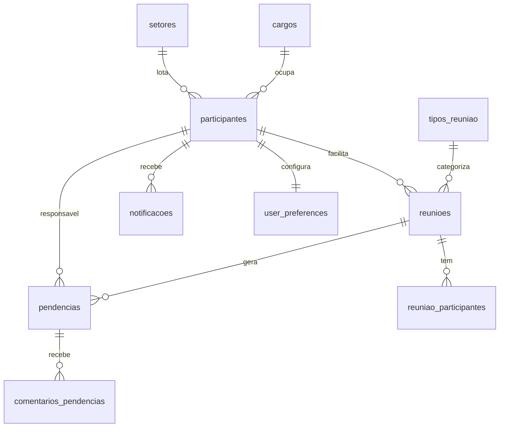
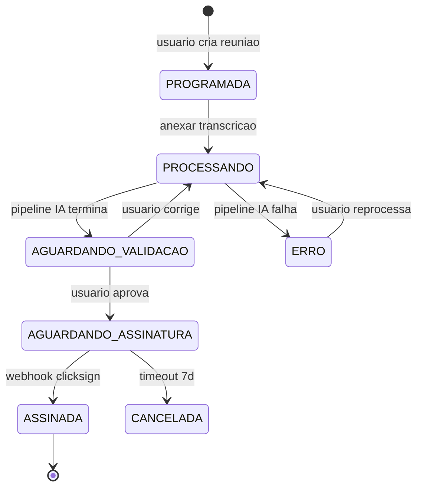
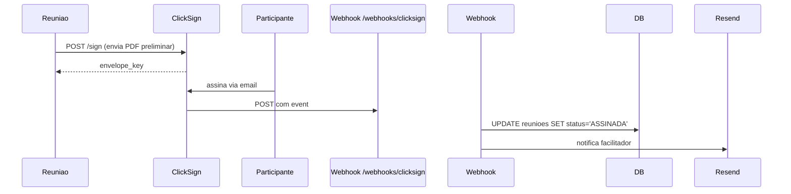
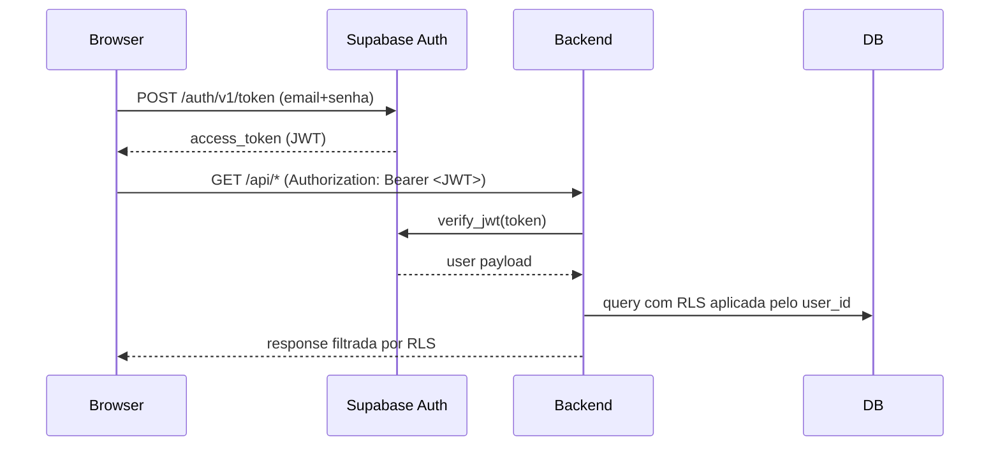

## Algoritmo principal

### Passo 1 — Detectar mudança (idempotência)

Comparar último snapshot conhecido com o que seria gerado agora:

```bash
LAST_SNAPSHOT_SHA=$(git log -1 --format=%H -- docs/spec/snapshots/ 2>/dev/null || echo "")
CURRENT_SHA=$(git rev-parse HEAD)

if [ "$LAST_SNAPSHOT_SHA" = "$CURRENT_SHA" ] && [ -z "$FORCE" ]; then
  # Mesmo commit do último snapshot — nada mudou
  echo "snapshot já atualizado (commit $CURRENT_SHA)"
  exit 0
fi

# Detectar arquivos relevantes que mudaram desde último snapshot
CHANGED_FILES=$(git diff --name-only "$LAST_SNAPSHOT_SHA" HEAD -- \
  "$routers_dir" \
  "$migrations_dir" \
  "$backend_app_dir" \
  "$frontend_src_dir" \
  "$supabase_dir" \
  docs/spec/deploy/project.json 2>/dev/null)

if [ -z "$CHANGED_FILES" ] && [ -z "$FORCE" ]; then
  echo "nenhuma mudança relevante desde último snapshot"
  exit 0
fi
```

Se houver mudança ou `--force`: seguir.

### Passo 2 — Gerar cada arquivo

Cada gerador roda em paralelo (no nível de processo) ou sequencial. Geradores escrevem em **buffer**, não em arquivo, até o Passo 3 (comparação).

#### 2.1 — ROTAS.md (auto-gerado, sobrescreve)

**Fonte primária: o app FastAPI montado.** `scripts/introspect_routes.py` roda no venv do backend (`<backend>/.venv/bin/python`, com `uv run` como segunda tentativa), importa `app.main:app` e devolve cada rota em JSON: método, path, nome, módulo, tags, dependencies e docstring. O app já resolveu tudo, inclusive as rotas criadas por **factory** (path em f-string, como `taxonomia.py` e `dados_atendimento.py`), que o parser estático não enxerga. As dependencies vêm reais e completas: as do router e as do decorator, não só as da assinatura do handler. Uma rota conta como autenticada quando alguma dependency está em `AUTH_DEPENDENCIES` ou se chama `require_*`.

**Quem enumera é o `app.openapi()["paths"]`, não o `app.routes`** (issue #542). Do FastAPI 0.141 em diante o `include_router` guarda o router incluído em vez de copiar as rotas para cima, e varrer `app.routes` volta sem rota nenhuma de router: as 192 viram 0, sem erro nenhum. O schema é contrato público e devolve as mesmas 192 operações nas duas versões. O `app.routes` continua entrando só para casar cada operação com o objeto de rota e trazer módulo e dependencies; nunca como segunda fonte de enumeração, porque duas fontes se cobrem e aí quebrar a principal deixa de aparecer em teste nenhum.

**Piso de sanidade (`PISO_ROTAS`), em dois eixos.** `validar_enumeracao` reprova a listagem por **contagem** (menos rotas que o piso) e por **metadados** (rotas demais sem `module`). Nos dois casos o helper sai com código 2 e o `snapshot.py` **interrompe a geração** (`EnumeracaoDeRotasQuebrada`, exit 3) em vez de cair no fallback AST.

O segundo eixo existe porque o primeiro não cobre o pior estado: o schema é público e continua respondendo mesmo quando o casamento com o objeto de rota quebra (o `iter_route_contexts` renomeado, ou o `_get_api_route_for_openapi` devolvendo `None`). Aí a contagem sai certa e os metadados zerados, e o `ROTAS.md` vira "192 endpoints em 1 routers, 0% exigem auth": documentação afirmando que a aplicação inteira é aberta, gravada e commitada em silêncio a cada deploy. Isso é diferente de "não consegui montar o app", onde o fallback AST abaixo continua valendo e sai carimbado como parcial. Cobertura em `hospital-reunioes/backend/tests/test_snapshot_enumeracao_rotas.py`.

> **Atenção ao mexer só neste script.** O `.github/workflows/ci.yml` tem `.claude/**` no `paths-ignore`, então um PR que toque **apenas** o `introspect_routes.py` ou o `snapshot.py` **não dispara CI nenhum**. Os testes acima vivem em `hospital-reunioes/backend/tests/`, fora do ignore, e é isso que faz o CI rodar. Se for mexer aqui sem tocar em nada fora do `.claude/`, rode a suíte à mão, nas duas versões do FastAPI (a do `uv.lock` e a que o CI instala sem lock).

Os paths saem relativos ao `api_prefix` (o prefixo entra no `include_router`, não no decorator), então o doc continua listando `/reunioes/{id}` e não `/api/reunioes/{id}`.

**Fallback: parser AST**, quando o app não pode ser montado (venv ausente, dependências ou `.env` faltando — o script roda com `python3` puro). Aí a listagem é **parcial** e o ROTAS.md sai carimbado com um aviso no topo, além do warning no stderr. Nunca se cala a lacuna: um doc incompleto que se apresenta como completo é pior que a falha.

O modo `--diff <base>..HEAD` usa **AST dos dois lados**: o "antes" vem de um git ref, que não dá para montar. Por isso ele avisa quantas rotas de factory ficaram fora da comparação, em vez de imprimir um "sem mudanças" enganoso.

Pseudo-código do fallback estático:

```python
# Pseudo-código
import ast, re
for py_file in sorted(routers_dir.glob("*.py")):
    if py_file.name in ("__init__.py",): continue
    tree = ast.parse(py_file.read_text())

    # Encontrar APIRouter init pra pegar prefix e tags
    prefix = extract_router_prefix(tree)  # ex: "/reunioes"
    tags = extract_router_tags(tree)

    # Encontrar funções com decorator @router.METHOD("path", ...)
    for node in ast.walk(tree):
        if not isinstance(node, (ast.AsyncFunctionDef, ast.FunctionDef)):
            continue
        for dec in node.decorator_list:
            method, path = parse_route_decorator(dec)  # ("GET", "/{id}")
            if not method: continue

            full_path = prefix + path
            docstring = ast.get_docstring(node) or ""
            short_desc = docstring.split("\n")[0][:80] if docstring else humanize_name(node.name)

            # Detectar auth: procurar Depends(get_current_user) etc nos defaults dos args
            needs_auth = any(
                "get_current_user" in ast.unparse(arg)
                or "require_super_admin" in ast.unparse(arg)
                for arg in node.args.defaults + node.args.kw_defaults
                if arg
            )

            routes.append({
                "method": method, "path": full_path,
                "handler": node.name, "desc": short_desc,
                "auth": needs_auth, "router_file": py_file.stem
            })
```

Agrupar por router (arquivo) e renderizar:

```markdown
# ROTAS.md
<!-- gerado automaticamente por /snapshot — não editar -->
<!-- last_update: <ISO> -->

Endpoints da aplicação Hospital Reuniões.

## auth (`app/routers/auth.py`)

| Método | Rota                       | O que faz                          | Auth |
|--------|----------------------------|------------------------------------|------|
| GET    | /auth/me                   | Retorna usuário autenticado        | ✅   |
| POST   | /auth/invite/{id}          | Envia reset de senha               | ✅   |

## reunioes (`app/routers/reunioes.py`)

| Método | Rota                                              | O que faz                          | Auth |
|--------|---------------------------------------------------|------------------------------------|------|
| GET    | /reunioes                                         | Lista reuniões com filtros         | ✅   |
| POST   | /reunioes/agendar                                 | Cria reunião programada            | ✅   |
| ...    | ...                                               | ...                                | ...  |

## ... outros routers ...

---
**Totais:** N endpoints em M routers · X% exigem auth
```

#### 2.2 — ENTIDADES.md (auto-gerado, sobrescreve)

Parsear cada `<migrations_dir>/*.sql` em ordem alfabética. Detectar `CREATE TABLE` e construir modelo cumulativo (`CREATE TABLE foo`, depois `ALTER TABLE foo ADD COLUMN bar`).

```python
# Pseudo-código
tables = {}  # nome → {columns: [...], fks: [...], indexes: [...]}

for sql_file in sorted(migrations_dir.glob("*.sql")):
    sql = sql_file.read_text()

    # CREATE TABLE statements
    for match in re.finditer(r"CREATE TABLE\s+(?:IF NOT EXISTS\s+)?(\w+)\s*\(([^;]+)\);", sql, re.IGNORECASE | re.DOTALL):
        table_name = match.group(1)
        body = match.group(2)
        cols = parse_table_body(body)  # extrai (name, type, constraints, references)
        tables[table_name] = {"columns": cols, "fks": extract_fks(cols), "first_seen": sql_file.name}

    # ALTER TABLE ADD COLUMN
    for match in re.finditer(r"ALTER TABLE\s+(\w+)\s+ADD COLUMN\s+([^;]+);", sql, re.IGNORECASE):
        table_name = match.group(1)
        if table_name in tables:
            col = parse_column_def(match.group(2))
            tables[table_name]["columns"].append(col)

    # ALTER TABLE DROP COLUMN
    for match in re.finditer(r"ALTER TABLE\s+(\w+)\s+DROP COLUMN\s+(\w+)", sql, re.IGNORECASE):
        table_name, col_name = match.group(1), match.group(2)
        if table_name in tables:
            tables[table_name]["columns"] = [c for c in tables[table_name]["columns"] if c["name"] != col_name]

    # DROP TABLE
    for match in re.finditer(r"DROP TABLE\s+(?:IF EXISTS\s+)?(\w+)", sql, re.IGNORECASE):
        tables.pop(match.group(1), None)
```

Renderizar:

```markdown
# ENTIDADES.md
<!-- gerado automaticamente por /snapshot — não editar -->
<!-- last_update: <ISO> -->

Modelo de dados Hospital Reuniões. Tabelas no banco Supabase.

## participantes

Origem: `001_create_participantes.sql` (alterada em 014, 017, 030, 036)

| Campo               | Tipo            | Obrigatório | Default              | Descrição                          |
|---------------------|-----------------|-------------|----------------------|------------------------------------|
| id                  | VARCHAR(10) PK  | sim         | gerado (P001+)       | identificador único                |
| nome_completo       | TEXT            | sim         | —                    | nome completo do participante      |
| email               | TEXT UNIQUE     | não (externos) | —                 | email (nullable só pra externos)   |
| role                | user_role       | sim         | 'coordenador'        | papel (diretor/coordenador/...)    |
| ...                 | ...             | ...         | ...                  | ...                                |

**Relacionamentos:**
- Referenciada por: `reunioes(facilitador_id)`, `pendencias(responsavel_id)`, ...

---

## reunioes
...
```

#### 2.3 — SCHEMA.md (auto-gerado, sobrescreve)

Mermaid ER diagram derivado das FKs detectadas em ENTIDADES.md.

```markdown
# SCHEMA.md
<!-- gerado automaticamente por /snapshot — não editar -->

## Diagrama ER (Mermaid)



## Indexes críticos
- `reunioes(data)`, `reunioes(facilitador_id)`, `reunioes(deleted_at)`
- `pendencias(id_reuniao)`, `pendencias(responsavel_id)`, `pendencias(status, deleted_at)`
- `comentarios_pendencias(id_acao)`
- `notificacoes(destinatario_id, lida)`
```

#### 2.4 — MIGRATIONS.md (auto-gerado, sobrescreve)

Listagem cronológica enxuta:

```python
for sql_file in sorted(migrations_dir.glob("*.sql")):
    # Primeira linha começando com "-- " é o comentário humano
    first_comment = next((ln[3:] for ln in sql_file.read_text().splitlines() if ln.startswith("-- ") and len(ln) > 4), None)
    if not first_comment:
        # Inferir das primeiras CREATE/ALTER/DROP
        first_comment = infer_summary(sql_file.read_text())

    counts = {
        "create_table": len(re.findall(r"CREATE TABLE", sql_text, re.I)),
        "alter_table": len(re.findall(r"ALTER TABLE", sql_text, re.I)),
        "create_index": len(re.findall(r"CREATE INDEX", sql_text, re.I)),
        "drop": len(re.findall(r"DROP\s+(TABLE|COLUMN|INDEX)", sql_text, re.I)),
    }
```

Renderizar:

```markdown
# MIGRATIONS.md
<!-- gerado automaticamente por /snapshot — não editar -->

Ordem cronológica de migrations aplicadas ao banco Supabase. Mais antigas no topo.

| # | Arquivo                              | Resumo                                              | C | A | I | D |
|---|--------------------------------------|-----------------------------------------------------|---|---|---|---|
| 1 | 001_create_participantes.sql         | criar tabela participantes + enum user_role         | 1 | 0 | 1 | 0 |
| 2 | 002_create_reunioes.sql              | criar reunioes + reuniao_participantes + indexes    | 2 | 0 | 3 | 0 |
| ...                                                                                                          |
| 38| 038_fk_indexes.sql                   | adicionar indexes em FKs frequentes                 | 0 | 0 | 3 | 0 |

**Legenda:** C=CREATE TABLE, A=ALTER TABLE, I=CREATE INDEX, D=DROP. Total: 38 migrations, 14 tabelas vivas.
```

#### 2.5 — INTEGRACOES.md (auto-gerado, sobrescreve)

Cruza `project.json.integrations[]` com grep no código pra achar usos reais:

```python
for integration in project.json["project"]["integrations"]:
    name = integration["name"]
    env_key = integration["configured_via"]
    note = integration["note"]

    # Procurar onde é usada
    usages = grep_recursive(
        backend_app_dir,
        rf"{env_key}|{name}",
        exclude_patterns=["test_*", "__pycache__"]
    )
    primary_file = pick_most_relevant(usages)  # heurística: arquivo com mais ocorrências
```

Renderizar:

```markdown
# INTEGRACOES.md
<!-- gerado automaticamente por /snapshot — não editar -->

Serviços externos usados pela aplicação Hospital Reuniões.

## OpenRouter
**Pra que serve:** LLM primário — geração de ata e correções via openai/gpt-5.4-mini
**Onde aparece no código:** `app/pipeline/llm_client.py` (cliente principal)
**Secret no Coolify:** `OPENROUTER_API_KEY`
**Variáveis relacionadas:** `LLM_MODEL`
**Fallback:** OpenAI (se OpenRouter cair)

## OpenAI
**Pra que serve:** Fallback automático se OpenRouter indisponível
**Onde aparece:** `app/pipeline/llm_client.py:fallback_to_openai()`
**Secret:** `OPENAI_API_KEY`
**Variáveis:** `LLM_FALLBACK_MODEL` (default: gpt-4o-mini)

## ClickSign
**Pra que serve:** Assinatura digital de atas (sandbox em dev, app em prod)
**Onde aparece:** `app/services/clicksign_service.py`, webhook em `app/routers/webhooks.py`
**Secret:** `CLICKSIGN_API_KEY`, `CLICKSIGN_WEBHOOK_SECRET`
**Variáveis:** `CLICKSIGN_BASE_URL` (https://sandbox.clicksign.com vs https://app.clicksign.com)
**Fluxo:** Ver `FLUXOGRAMAS.md` > "Assinatura ClickSign"

## Resend
...

## Fireflies
...

---
**Resumo:** N integrações externas · X% têm webhook · Y% têm secrets auto-gerados
```

#### 2.6 — FLUXOGRAMAS.md (NÃO regenera, só alerta)

```markdown
# FLUXOGRAMAS.md
<!-- mantido manualmente — /snapshot só alerta se rota/estado novo apareceu sem fluxo correspondente -->
<!-- last_human_update: 2026-05-21 -->

## Ciclo de vida de uma Reunião

<!-- curated:start -->

<!-- curated:end -->

## Assinatura ClickSign (webhook)

<!-- curated:start -->

<!-- curated:end -->

## Autenticação Supabase

<!-- curated:start -->

<!-- curated:end -->

---

## Alertas automáticos

`/snapshot` faz pré-check de **gaps de fluxograma**. Se uma rota nova foi adicionada em ROTAS.md ou um status novo aparece em ENTIDADES.md (enum changed) sem fluxograma correspondente aqui, a skill imprime um aviso pra você considerar adicionar.
```

#### 2.7 — ESTRUTURA.md (parcial auto-gerado, parte curada)

```markdown
# ESTRUTURA.md
<!-- gerado parcialmente por /snapshot. Blocos <!-- curated:start --> são preservados. -->

## Backend (FastAPI, Python 3.12)

Localização: `hospital-reunioes/backend/`

```
app/
├── routers/         # endpoints HTTP — 1 arquivo por área (auth, participantes, reunioes, ...)
├── services/        # lógica de negócio (audit, email, notificacao, auth_provisioning)
├── models/          # schemas Pydantic (schemas.py, admin_schemas.py)
├── pipeline/        # pipeline de IA (transcrição → resumo → ata → correção iterativa)
├── middleware/      # auth, logging, request_id
├── cron/            # jobs agendados (lembrete 24h, alerts de prazo, reprocessamento)
├── scripts/         # utilities (importação legada, backfill)
├── utils/           # helpers (parsing query_params, PostgREST filters)
├── prompts/         # templates de prompt pra IA
├── static/          # assets estáticos
├── templates/       # templates de email
├── dependencies.py  # dependências FastAPI (auth, supabase client, RLS helpers)
├── config.py        # Settings (env vars validadas)
├── limiter.py       # rate limiting (slowapi)
└── main.py          # FastAPI app entry point
```

<!-- curated:start -->
**Notas humanas:**
- A pasta `pipeline/` é o coração: pega áudio/transcrição, passa por LLM em N etapas (extração de fala → resumo → estruturação em JSON → geração de ata em PT → revisão), e cospe `json_ata` que é renderizado como PDF.
- `routers/admin/` exige `is_super_admin=true` no JWT — apenas Pedro hoje.
- `cron/lembrete_24h.py` roda a cada hora, busca reuniões com `data` exatamente 24h no futuro e `lembrete_24h_enviado=false`.
<!-- curated:end -->

## Frontend (Next.js 15, App Router, pnpm)

Localização: `hospital-reunioes/frontend/`

```
src/
├── app/             # App Router (layout, pages, auth, dashboard, admin)
├── components/      # UI reutilizável (kanban, tables, forms, modals, calendar)
├── hooks/           # custom hooks (useUser, usePendencias, useNotificacoes)
├── lib/             # utilities (API client, formatting, validation)
├── types/           # TypeScript types (User, Reuniao, Pendencia, ...)
└── constants/       # constantes (mapeamentos, labels, enums espelhados)
```

<!-- curated:start -->
**Notas humanas:**
- Stack: shadcn/ui + Tailwind + Zustand pra estado global + TanStack Query pra HTTP.
- Páginas principais: `/dashboard` (kanban de pendências), `/reunioes` (calendário+lista), `/admin/usuarios` (CRUD super_admin).
- Variáveis NEXT_PUBLIC_* viram build args do Docker (registradas em `project.json`).
<!-- curated:end -->

## Supabase (self-hosted, PostgreSQL 15)

Localização: `hospital-reunioes/supabase/`

```
supabase/
├── migrations/      # 38 SQL files (ordem cronológica 001-038)
├── functions/       # Edge Functions
├── templates/       # HTML de email (recovery, confirmation, magic_link, invite)
└── snippets/        # SQL helpers
```

<!-- curated:start -->
**Notas humanas:**
- Auth: tabela `auth.users` (gerenciada pelo Supabase), referenciada por `participantes.auth_user_id`.
- RLS habilitada em todas as tabelas (migration 009). Backend usa SERVICE_ROLE_KEY pra bypass quando faz operações admin.
- Storage: buckets pra `atas-pdf`, `audios`, `transcricoes` (migration 006).
<!-- curated:end -->
```

---

### Passo 3 — Comparar com versão existente (idempotência)

Pra cada arquivo gerado em buffer:

```python
existing = (snapshots_dir / file).read_text() if (snapshots_dir / file).exists() else ""
generated = buffer[file]

# Comparar ignorando comments de timestamp (`<!-- last_update: ... -->`)
def strip_metadata(text):
    return re.sub(r"<!-- last_update:.*?-->", "", text)

if strip_metadata(existing) == strip_metadata(generated):
    print(f"{file}: sem mudanças")
    continue

# Mudou — escrever
(snapshots_dir / file).write_text(generated)
changed_files.append(file)
```

**Preservar blocos curated:** se `existing` tem `<!-- curated:start -->...<!-- curated:end -->` e `generated` não tem aquele bloco, **manter o bloco do `existing`** dentro do `generated` antes de comparar.

### Passo 4 — Detectar gaps (alertas pra FLUXOGRAMAS.md)

Cruzar:
- Rotas novas em ROTAS.md vs fluxogramas em FLUXOGRAMAS.md
- Estados novos em enums (de ENTIDADES.md) vs estados em fluxogramas

Se gap detectado: imprimir aviso (não bloqueia):

```
⚠ ALERTA: rota nova `/pendencias/repactuar` não está em nenhum fluxograma.
   Considere adicionar um diagrama em docs/spec/snapshots/FLUXOGRAMAS.md
   (entre blocos <!-- curated:start --> e <!-- curated:end -->).
```

### Passo 5 — Commit separado (se houver mudança)

Se algum arquivo mudou:

```bash
cd "$REPO_ROOT"
git add docs/spec/snapshots/
git commit -m "$(cat <<EOF
chore(spec): atualizar snapshot pós deploy $(git rev-parse --short HEAD)

Arquivos atualizados:
$(for f in "${changed_files[@]}"; do echo "- docs/spec/snapshots/$f"; done)

Gerado automaticamente por /snapshot. Não dispara novo /deploy ship.
EOF
)"
```

**Importante:** o `scope_map` em `project.json` mapeia `docs/spec/snapshots/**` pra escopo `spec`. Commits com prefix `chore(spec):` são reconhecidos por `/deploy ship` (Passo 5) e **não disparam novo ciclo de deploy** (heurística: commits `docs`/`spec` que tocam só MD não geram trigger de service).

Se `--check` (dry-run): mostrar diff mas não commitar nem escrever.

---
