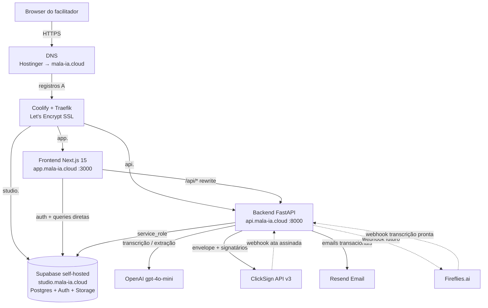

# Arquitetura — Hospital Reuniões

Stack, componentes e recursos externos. Desenho de alto nível do sistema.

---

## Stack tecnológico

| Camada | Tecnologia | Versão |
|---|---|---|
| Backend | FastAPI (Python) + Uvicorn | Python 3.12 |
| Gestor de dependências backend | `uv` | — |
| Frontend | Next.js (App Router) + React | Next.js 15 |
| Gestor de dependências frontend | `pnpm` | — |
| Banco + Auth + Storage | Supabase (self-hosted) | — |
| Reverse proxy + SSL | Traefik (via Coolify) + Let's Encrypt | — |
| Orquestração infra | Coolify em VPS Hostinger | — |
| PDF rendering (backend) | WeasyPrint | — |

---

## Diagrama de alto nível (produção)



**Pontos-chave:**
- Frontend chama backend via `/api/*` reescrito pelo `next.config.ts` → `NEXT_PUBLIC_API_URL`
- Frontend também chama Supabase **direto** para auth e alguns reads (com `NEXT_PUBLIC_SUPABASE_ANON_KEY`)
- Backend usa `SUPABASE_SERVICE_ROLE_KEY` (bypassa RLS) para todas as escritas
- Sem reverse proxy customizado — Traefik nativo do Coolify resolve TLS e roteamento

---

## Estrutura de pastas

### Backend (`hospital-reunioes/backend/`)

```
backend/
├── app/
│   ├── main.py                    # Registro de routers, middlewares
│   ├── config.py                  # Pydantic Settings (lê .env)
│   ├── routers/                   # Endpoints HTTP (FastAPI APIRouter)
│   ├── services/
│   │   ├── ai_processor.py        # Chamadas OpenAI
│   │   ├── email_service.py       # Resend → SMTP → mock (em cascata)
│   │   ├── clicksign_service.py   # Envelope + signatários
│   │   ├── storage.py             # Supabase Storage (buckets)
│   │   └── ...
│   ├── pipeline/
│   │   └── orchestrator.py        # Coordena extração + correção + geração
│   ├── prompts/                   # Prompts LLM (.md)
│   ├── templates/
│   │   └── ata_template.html      # Template Jinja2 + WeasyPrint
│   └── models/                    # Schemas Pydantic
├── pyproject.toml                 # Dependências (uv)
├── Dockerfile                     # Produção (no-reload, não-root, HEALTHCHECK)
└── tests/
```

### Frontend (`hospital-reunioes/frontend/`)

```
frontend/
├── src/
│   ├── app/                       # App Router do Next.js 15
│   │   ├── (públicas)             # /, /login, /signup, /reset-password
│   │   ├── dashboard/             # Home pós-login
│   │   ├── reunioes/              # lista + [id] + calendario + importar
│   │   ├── pendencias/            # lista + kanban
│   │   ├── perfil/, configuracoes/
│   │   ├── admin/                 # área administrativa (ver FLUXOS)
│   │   └── globals.css            # Tailwind
│   ├── components/
│   │   ├── reunioes/ChatCorrecao.tsx
│   │   ├── pendencias/PendenciaDetailModal.tsx
│   │   ├── admin/                 # AdminModal + AdminSidebar + DataTable + modais
│   │   └── ConfirmDialog.tsx
│   ├── lib/supabase/              # Clientes browser/server/middleware
│   ├── middleware.ts              # Supabase SSR auth
│   └── types/index.ts             # Tipos compartilhados
├── next.config.ts                 # Rewrites, output: "standalone"
├── package.json                   # Dependências (pnpm)
└── Dockerfile                     # Multi-stage (deps → builder → runner)
```

### Supabase (`hospital-reunioes/supabase/`)

```
supabase/
├── config.toml                    # Config para supabase local (Docker)
├── migrations/                    # 25+ arquivos .sql, ordem cronológica
└── seed/                          # Dados iniciais (opcional)
```

---

## Recursos externos

| Serviço | Propósito | Ambiente local | Ambiente produção |
|---|---|---|---|
| **OpenAI** | Extração e correção de ata via LLM (gpt-4o-mini) | `OPENAI_API_KEY` real ou mock | `OPENAI_API_KEY` |
| **ClickSign** | Envelope + assinatura digital de ata | `sandbox.clicksign.com` | `app.clicksign.com` |
| **Resend** | Email transacional (ClickSign, confirmação cadastro) | Opcional (cai em SMTP ou mock) | **Obrigatório** |
| **SMTP (Gmail)** | Fallback para email transacional quando Resend não configurado | Gmail SMTP | Fallback secundário |
| **Fireflies.ai** | Transcrição automática de reuniões (webhook de entrada) | Em integração | Em integração |
| **Supabase** | Postgres + Auth + Storage | Docker local | Self-hosted no Coolify |

Detalhes de **qual fluxo dispara qual integração** vivem em [FLUXOS.md](./FLUXOS.md).

Detalhes de **config local vs prod de cada serviço** vivem em [AMBIENTES.md](./AMBIENTES.md).

---

## Decisões arquiteturais que pesam

1. **Supabase self-hosted** (não Cloud) — custo previsível, controle total sobre backups, latência baixa pro backend na mesma VPS.
2. **Frontend chama Supabase direto** (auth + alguns reads) — reduz round-trips mas exige RLS rigoroso. Escritas sensíveis passam sempre pelo backend com `SERVICE_ROLE_KEY`.
3. **Pipeline IA síncrono** no request do backend (não fila separada) — simples, funciona para o volume atual (poucas atas/dia). Se escalar → migrar para Celery/Arq + Redis.
4. **PDF gerado server-side** com WeasyPrint + Jinja2 — visual consistente, assinaturas sempre sobre template conhecido.
5. **Email em 3 camadas** (Resend → SMTP → mock) — local funciona sem Resend, prod sempre em Resend; ver [AMBIENTES.md](./AMBIENTES.md).
6. **Sem observabilidade externa** (Sentry, Datadog) — logs do Coolify cobrem o caso. Se precisar: próxima fase.

---

## O que NÃO existe

- Rate limiting global
- Multi-tenant (hoje é instância única pro hospital)
- Staging automático (só dev local e produção)
- Jobs em background (tudo síncrono no request HTTP)
- CDN (Traefik serve tudo direto)
