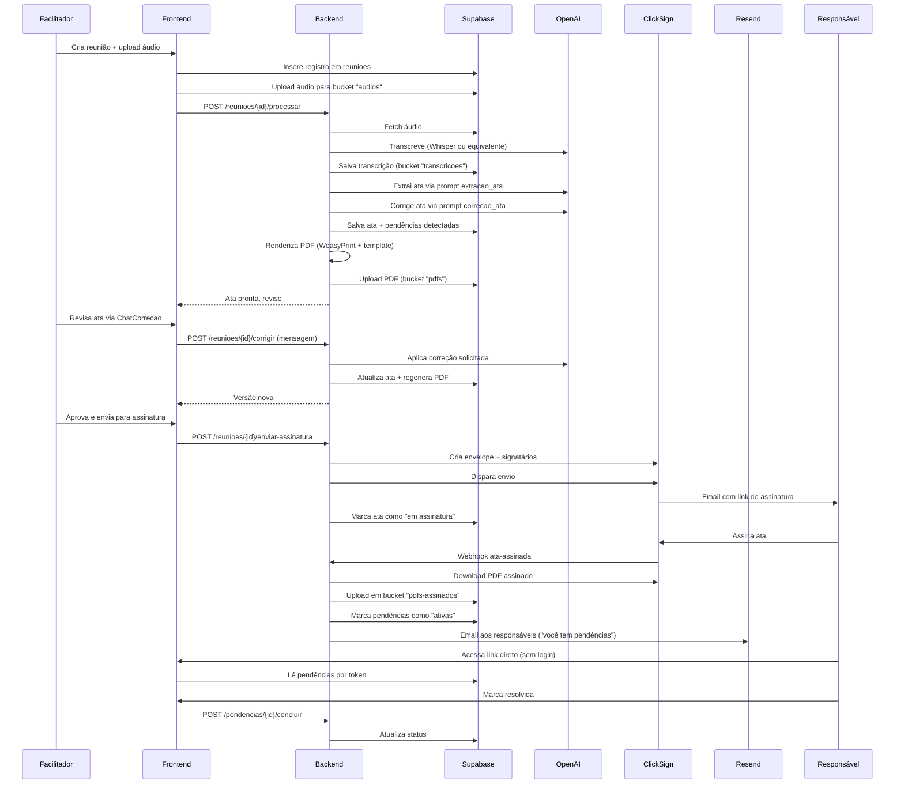
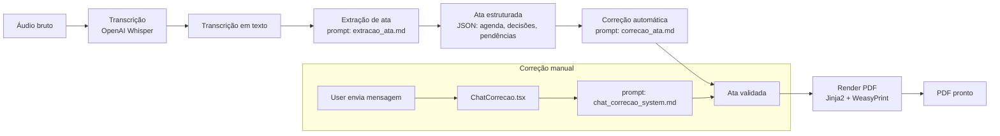

# Fluxos — Hospital Reuniões

Como o sistema processa uma reunião ponta a ponta. Fluxo principal, pipeline IA, webhooks, rotas.

---

## Fluxo principal — ciclo de vida de uma reunião

---

## Pipeline de IA (backend)

Coordenado por `app/pipeline/orchestrator.py`. Usa prompts em `app/prompts/`.

**Prompts ativos:**
- `extracao_ata.md` — extrai ata estruturada da transcrição
- `correcao_ata.md` — correção automática pós-extração (gramática, nomes, datas)
- `chat_correcao_system.md` — sistema do chat de correção manual
- `user_extracao.md` — prompt user do fluxo de extração

**Modelo:** `gpt-4o-mini` (configurável via env).

---

## Webhooks

### Entrada (terceiros chamam o backend)

| Origem | Endpoint | Quando dispara | Efeito |
|---|---|---|---|
| ClickSign | `POST /webhooks/clicksign` | Ata assinada por um signatário | Atualiza status de assinatura; se todos assinaram → muda ata para "assinada", ativa pendências, dispara emails |
| Fireflies | `POST /webhooks/fireflies` (em integração) | Transcrição automática pronta | Injeta transcrição no pipeline sem precisar de upload manual |

**Segurança webhooks:**
- ClickSign: HMAC assinado com `CLICKSIGN_WEBHOOK_SECRET`
- Fireflies: token no header (em integração)

### Saída (backend chama terceiros)

| Destino | Endpoint externo | Quando |
|---|---|---|
| OpenAI | API oficial | Toda etapa do pipeline IA |
| ClickSign | API v3 (`envelopes`, `signers`) | Envio de ata para assinatura |
| Resend | API oficial | Emails transacionais |
| SMTP | Gmail/Zoho | Fallback se Resend não configurado |

---

## Rotas frontend (visão por grupo)

### Públicas (sem login)
- `/` — landing / login
- `/signup` — cadastro de facilitador (fluxo com `SIGNUP_ENCRYPTION_KEY`)
- `/signup/confirmar` — confirmação via token
- `/pendencia/[token]` — acesso direto pra responsável não-logado ver e concluir pendência

### Autenticadas (facilitador)
- `/reunioes` — lista de reuniões
- `/reunioes/[id]` — detalhe, edição, ChatCorrecao, envio pra assinatura
- `/reunioes/calendario` — calendário
- `/pendencias/kanban` — Kanban de pendências
- `/participantes` — cadastro de participantes
- `/perfil` — editar perfil
- `/configuracoes` — configurações do facilitador

### Admin (usuários com `is_admin`)
- `/admin/usuarios` — gerencia facilitadores
- `/admin/super-admins` — gerencia super-admins
- `/admin/bulk` — operações em massa
- `/admin/atas-migracao` — migração de ATAs antigas (PDFs legados)

**Middleware:** `src/middleware.ts` lê sessão Supabase via SSR e redireciona não-autenticados para `/`. Grupos admin verificados no próprio componente + RLS.

---

## Rotas backend (resumo por router)

| Router | Caminho | Responsabilidade |
|---|---|---|
| `auth` | `/auth/*` | Login admin, signup, confirmação de cadastro |
| `reunioes` | `/reunioes/*` | CRUD + processar + corrigir + enviar assinatura |
| `pendencias` | `/pendencias/*` | Listar, concluir, forçar criação |
| `participantes` | `/participantes/*` | CRUD |
| `webhooks` | `/webhooks/*` | Entrada ClickSign + Fireflies |
| `admin` | `/admin/*` | Gestão de facilitadores, super-admins, bulk |
| `importacao` | `/importacao/*` | Import de ATAs antigas (RPC atômica) |
| `health` | `/api/health` | Health check para Coolify |

Endpoints detalhados ficam no código (`app/routers/*.py`). Mudanças em endpoint público costumam pedir update deste doc.

---

## Storage (Supabase buckets)

| Bucket | Conteúdo | Access |
|---|---|---|
| `audios` | Gravações brutas das reuniões | `service_role` lê/escreve; facilitadores lêem as próprias |
| `transcricoes` | Textos transcritos | `service_role` |
| `pdfs` | ATAs em PDF (não assinadas) | `service_role` escreve; signed URL pra facilitador |
| `pdfs-assinados` | ATAs assinadas (retorno ClickSign) | `service_role` escreve; signed URL pra facilitador + responsável |

---

## Jobs agendados

Atualmente **nenhum**. Notificações via ClickSign/Resend são síncronas a eventos (webhook ou ação de usuário). Se houver necessidade de cron (ex: lembrete de pendências não concluídas), próxima fase.
