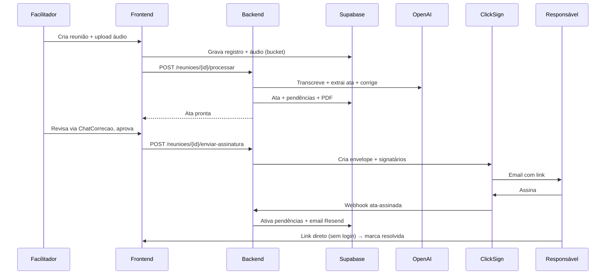

# Blueprint — Hospital Reuniões

Doc vivo do projeto. Reflete o estado **atual** do sistema. Detalhes finos ficam no código — este arquivo dá a visão de 5 minutos.

---

## O que é (30 segundos)

**Hospital Reuniões** automatiza o ciclo de vida de reuniões corporativas de hospital de alta complexidade: gravação → transcrição por IA → geração de ata → assinatura digital → acompanhamento de pendências.

**Quem usa:** 5 facilitadores (1 diretor + 4 diretoras). Colaboradores não logam — só recebem emails da ClickSign e links diretos pra pendências.

**Estado:** aguardando primeiro deploy em produção (`mala-ia.cloud`). Banco de desenvolvimento ainda mocado.

---

## Stack

| Camada | Tecnologia |
|---|---|
| Backend | FastAPI (Python 3.12) + `uv` + Uvicorn |
| Frontend | Next.js 15 (App Router) + `pnpm` |
| Infra | Supabase self-hosted + Coolify em VPS Hostinger + Traefik/Let's Encrypt |
| PDF | WeasyPrint + Jinja2 |
| Integrações | OpenAI (`gpt-4o-mini`), ClickSign, Resend, Fireflies |

---

## Fluxo principal

Pipeline IA é coordenada em `backend/app/pipeline/orchestrator.py` usando prompts em `backend/app/prompts/*.md`.

---

## Ambientes

### LOCAL vs PRODUÇÃO

| Dimensão | LOCAL | PRODUÇÃO |
|---|---|---|
| Frontend URL | `http://localhost:3000` | `https://app.mala-ia.cloud` |
| Backend URL (FE → BE) | `http://hr-backend:8000/api` (Docker DNS) | `https://api.mala-ia.cloud/api` |
| Supabase | Docker local (`host.docker.internal:54351`) | Self-hosted (`studio.mala-ia.cloud`) |
| ClickSign | `sandbox.clicksign.com` | `app.clicksign.com` |
| Email | Mock ou Gmail SMTP | Resend obrigatório |
| SSL | Sem (HTTP) | Traefik + Let's Encrypt |

### Matriz crítica de produção

A skill `/deploy` aborta o deploy se alguma destas estiver errada:

| Var | Valor em prod |
|---|---|
| `ENVIRONMENT` | `production` |
| `DEBUG` | `false` |
| `ENABLE_BYPASS_ENDPOINTS` | `false` |
| `CLICKSIGN_BASE_URL` | `https://app.clicksign.com` |
| `RESEND_API_KEY` | presente e não vazio |
| `SIGNUP_ENCRYPTION_KEY` | presente (auto-gerado pela skill) |
| `NEXT_PUBLIC_*` | `is_build_time: true` no Coolify |

Lista completa de env vars vive em `backend/.env.example` + `backend/app/config.py`.

---

## Rotas (visão por grupo)

### Frontend
- **Públicas:** `/`, `/login`, `/signup*`, `/reset-password*`
- **Autenticadas:** `/dashboard`, `/reunioes*`, `/pendencias*`, `/perfil`, `/configuracoes`
- **Admin:** `/admin`, `/admin/usuarios`, `/admin/reunioes`, `/admin/pendencias`, `/admin/cargos`, `/admin/setores`, `/admin/tipos-reuniao`, `/admin/logs`, `/admin/solicitacoes`, `/admin/bulk`

`src/middleware.ts` usa Supabase SSR pra redirecionar não-autenticados; `is_admin` é checado no componente + RLS.

### Backend (routers em `backend/app/routers/`)
`auth`, `signup`, `reunioes`, `pendencias`, `comentarios`, `participantes`, `perfil`, `configuracoes`, `notificacoes`, `webhooks` (ClickSign + Fireflies), `importacao`, `health`, `admin/*` (usuarios, super_admins, taxonomia, logs, signup_requests, acoes_massa, operacoes, legacy).

---

## Slash commands

| Comando | O que faz |
|---|---|
| `/deploy` | Ship pra produção: pre-flight, push, Coolify, migrations, health check, auto-rollback |
| `/deploy setup` | Setup inicial do Coolify (1x por projeto) |
| `/deploy status` | Reporta estado atual de produção (read-only) |
| `/deploy rollback` | Reverte pro último SHA saudável |
| `/atualizar-app` | Rebuild da stack docker-compose local |
| `/resetsupa` | Reseta Supabase local (apaga dados, mantém schema) |
| `/migrar-atas` | Migração assistida de ATAs antigas (PDFs em `atas-migracao/`) |
| `/blueprint-sync` | Gera changelog humano dos commits em `blueprint/historico/` (manual) |

---

## Convenções

- **Idioma:** pt-BR em toda comunicação; código em inglês.
- **Deploy:** só via `/deploy`. Nunca push manual direto pra `main`.
- **Planos:** `.md` na raiz do projeto (ex: `plano-nova-feature.md`), gitignored.
- **Commits:** convencionais (`feat:`, `fix:`, `chore:`, `refactor:`, `docs:`, `test:`).
- **Não criar:** `implementacoes/`, `PRODUCAO.md`, `deploy-history.md` — substituídos por `blueprint/DEPLOY.md` + `git log` + `blueprint/historico/`.

---

## Docs irmãos

- **`DEPLOY.md`** — fonte única de verdade de produção (UUIDs, domínios, vars obrigatórias, histórico de deploys). Mantido pela skill `/deploy`, seções `config-*` editadas manualmente.
- **`historico/`** — changelog humano em pt-BR dos commits, um arquivo por mês (`YYYY-MM.md`). Preenchido pela skill `/blueprint-sync` quando invocada manualmente.
