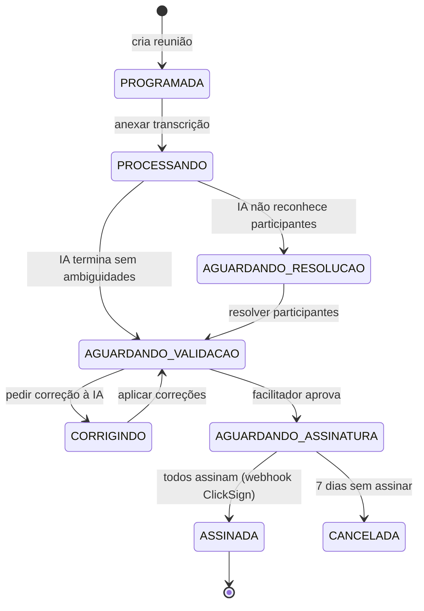
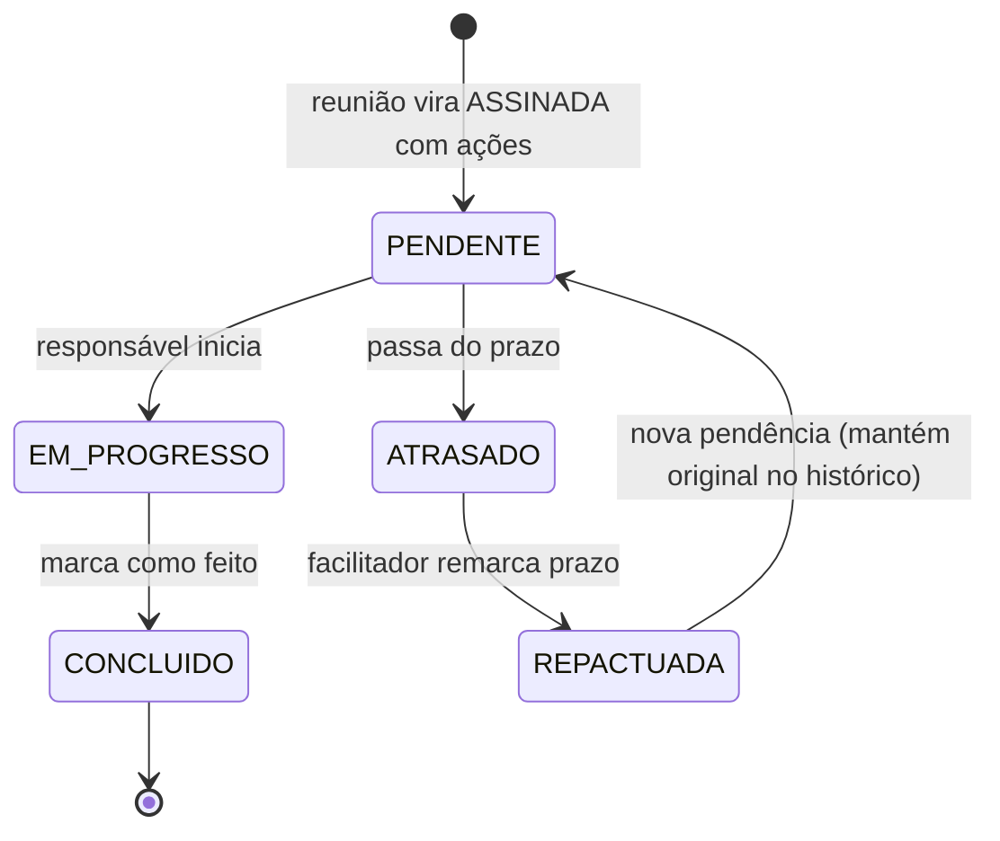
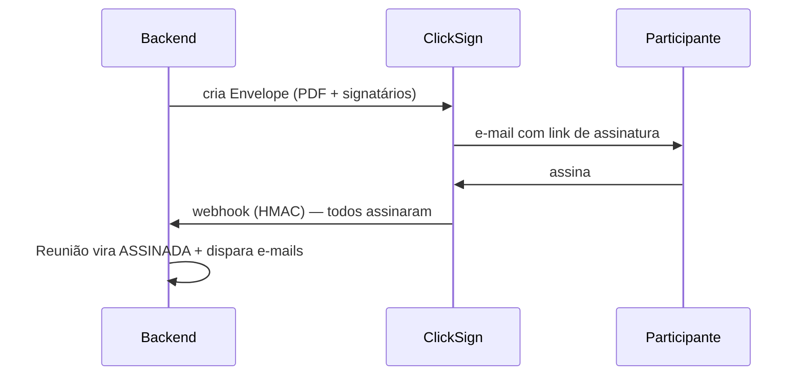

<!-- Documento único de arquitetura. As seções entre <!-- AUTO:...:start/end --> são
     regeneradas pelo /snapshot a cada deploy (a partir do código). O resto é curado por humano. -->

# Arquitetura — Hospital Reuniões

Um único documento pra entender a aplicação inteira. Feito pra qualquer pessoa — técnica ou não — pegar o todo em poucos minutos. As partes marcadas como **(auto)** se atualizam sozinhas a cada deploy; o resto é mantido à mão.

## 1. O que é

Hospital Reuniões automatiza o ciclo de vida de reuniões corporativas de um hospital: **gravação → transcrição por IA → geração da Ata → assinatura digital → acompanhamento de Pendências**.

- **Quem usa:** 5 facilitadores (1 diretor + 4 diretoras). Colaboradores **não logam** — recebem e-mails da ClickSign e links diretos para suas pendências.
- **Stack:** backend FastAPI (Python 3.12), frontend Next.js 15, banco Supabase self-hosted, deploy via Coolify (VPS Hostinger), PDF via WeasyPrint.
- **Glossário do domínio:** veja [`CONTEXT.md`](../CONTEXT.md) (Reunião, Ata, Pendência, Facilitador, Colaborador, Envelope…).

## 2. Como funciona (os fluxos)

### Ciclo de uma Reunião



### Ciclo de uma Pendência



### Assinatura da Ata (ClickSign)



> Os fluxos de **autenticação** e do **pipeline de IA** estão em [`docs/spec/snapshots/FLUXOGRAMAS.md`](spec/snapshots/FLUXOGRAMAS.md).

## 3. Rotas (API) (auto)

<!-- AUTO:rotas:start -->
**77 endpoints** em 12 áreas:

| Área | Endpoints |
|---|---|
| `admin` | 15 |
| `auth` | 2 |
| `comentarios` | 3 |
| `health` | 1 |
| `importacao` | 4 |
| `notas` | 8 |
| `notificacoes` | 3 |
| `participantes` | 7 |
| `pendencias` | 6 |
| `perfil` | 1 |
| `reunioes` | 26 |
| `webhooks` | 1 |

_Lista completa: `docs/spec/snapshots/ROTAS.md`._
<!-- AUTO:rotas:end -->

## 4. Dados (auto)

<!-- AUTO:dados:start -->
**13 tabelas:** `participantes` · `reunioes` · `reuniao_participantes` · `pendencias` · `agendamentos_email` · `tokens_validacao` · `comentarios_pendencias` · `notificacoes` · `user_preferences` · `audit_log` · `bulk_jobs` · `cargos` · `tipos_reuniao`

_Colunas, FKs e diagrama ER: `docs/spec/snapshots/ENTIDADES.md` e `SCHEMA.md`._
<!-- AUTO:dados:end -->

> Como o acesso aos dados é controlado: o backend usa `SERVICE_ROLE_KEY` e aplica as regras em Python (não há RLS direto do frontend). Detalhe e porquê em [`docs/adr/0002`](adr/0002-controle-acesso-aplicacao-service-role.md).

## 5. Integrações (auto)

<!-- AUTO:integracoes:start -->
| Serviço | Para quê |
|---|---|
| **OpenRouter** | LLM único — atas, correções, extração e transcrição via openai/gpt-5.4-mini (configurável via LLM_MODEL) |
| **ClickSign** | Assinatura digital de atas (sandbox em dev, app em prod) |
| **Resend** | Emails transacionais e SMTP do Supabase Auth |
| **Fireflies** | Sync de transcrições via webhook |
<!-- AUTO:integracoes:end -->

## 6. Estrutura de pastas

```
hospital-reunioes/
├── backend/   FastAPI — app/{routers,services,models,pipeline,middleware,cron}
├── frontend/  Next.js 15 — src/{app,components,hooks,lib,types}
└── supabase/  migrations/ (schema) · templates/ (e-mails) · functions/
docs/          CONTEXT.md · ARQUITETURA.md · adr/ · agents/ · spec/ · onboarding/
.claude/skills/ skills do time (workflow)
```

- **`backend/pipeline/`** é o coração: transcrição → LLM (extração → resumo → estrutura → ata PT) → PDF.
- **`backend/cron/`**: jobs diários (alerta de prazo, lembrete 24h).
- Mapa detalhado (com notas humanas) em [`docs/spec/snapshots/ESTRUTURA.md`](spec/snapshots/ESTRUTURA.md).

## 7. Skills & Workflow (como desenvolvemos)

O desenvolvimento é **GitHub-issue-centric** (modelo Matt Pocock). O guia visual completo está em [`docs/onboarding/workflow.html`](onboarding/workflow.html).

**Fluxo:** `/grill-with-docs` → `/to-prd` → `/to-issues` → `/pegar-issue` → `/tdd` → `/ship` → `/deploy`.

**Skills do projeto** (versionadas em `.claude/skills/`, já instaladas):

| Grupo | Skills |
|---|---|
| Planejar → issues | `grill-with-docs` · `to-prd` · `to-issues` · `triage` |
| Desenvolver | `pegar-issue` · `tdd` · `diagnose` · `prototype` · `improve-codebase-architecture` · `zoom-out` |
| Entregar | `ship` (PR + 3 gates + merge) · `deploy` (Coolify + health + rollback) |
| Apoio | `snapshot` (atualiza este doc) · `atualizar-app` (dev local) · `setup-matt-pocock-skills` |

**Skills globais** (no seu Claude Code, valem em todos os projetos — não precisam de instalação por repo): `passagem` (handoff pt-BR), `check` (tarefas no Obsidian), e os plugins `superpowers` (brainstorming, worktrees, TDD), `code-review`, `security-review`, `frontend-design`, `context7`, `github`.

> Nada mais a instalar para o workflow — tudo acima já está no lugar. Para atualizar as skills do Pocock: `npx skills add mattpocock/skills --copy`.

---

_Seções **(auto)** regeneradas pelo `/snapshot` ao final de cada deploy (lendo o código). Para forçar agora: `python3 .claude/skills/snapshot/scripts/snapshot.py --force`._
