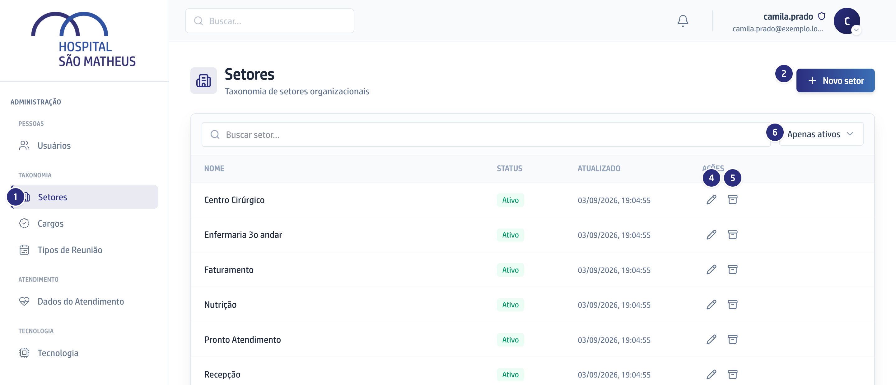
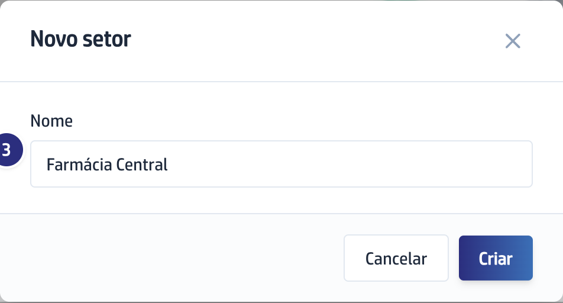

## Quando usar

Antes de cadastrar a primeira pessoa de uma unidade que ainda não existe na
lista. É desta lista que sai a sugestão do campo **Setor** na ficha de cada
pessoa.

## Passo a passo

1. Na barra da esquerda, em **Taxonomia**, clique em **Setores**.

   

2. Clique em **Novo setor**, no alto à direita.
3. Escreva o **Nome**, até 200 letras, e clique em **Criar**.

   

4. Para corrigir, clique no lápis, **Editar**, na linha do setor.
5. Para tirar um setor de circulação sem apagar nada, clique no ícone de caixa,
   **Arquivar**, e confirme. A coluna **Status** passa a **Arquivado**.
6. Para trazer de volta, mude o filtro para **Apenas arquivados** e clique em
   **Reativar**.

## Se der errado

- **O botão Criar está apagado:** o **Nome** está vazio. É o único campo
  obrigatório.
- **A gravação foi recusada:** já existe um setor com esse nome. A lista não
  aceita repetido.
- **Você arquivou e o setor continua na ficha de alguém:** arquivar tira da
  sugestão de agora em diante, não apaga o que já foi gravado nas pessoas.
