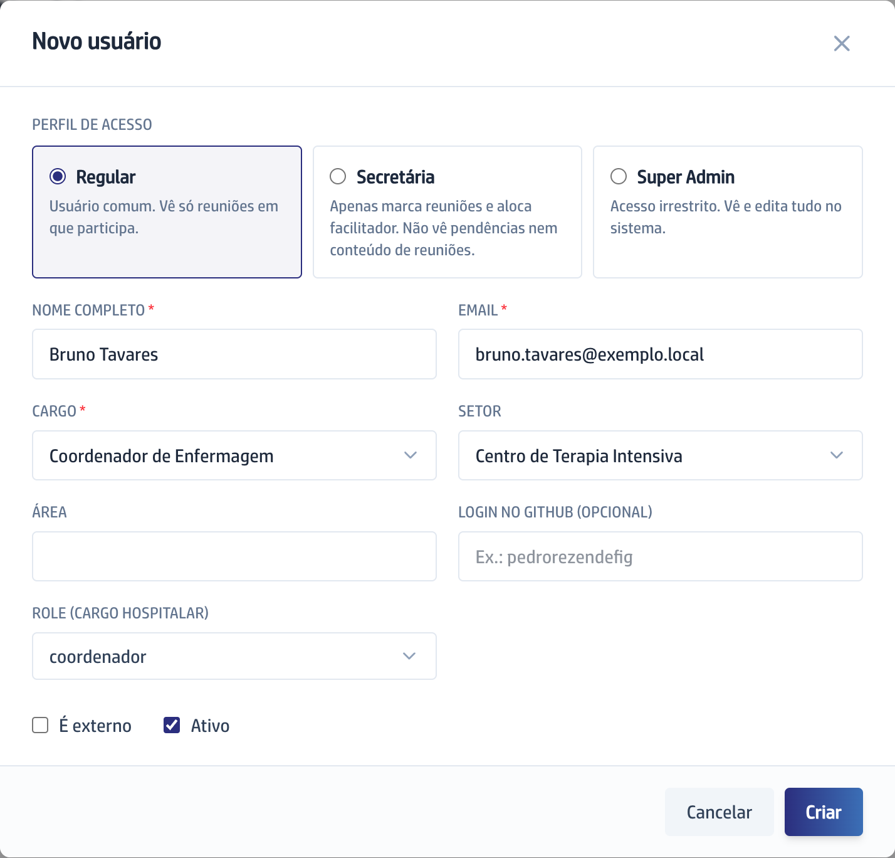

## Quando usar

Quando alguém novo vai usar a plataforma, ou quando a pessoa precisa existir no
cadastro para ser citada numa ata e receber pendências. Só o Super Admin abre
esta tela.

## Passo a passo

1. Na barra da esquerda, em **Pessoas**, clique em **Usuários**.
2. Clique em **Novo Usuário**, no alto à direita.
3. Escolha o **Perfil de acesso**: **Regular**, **Secretária** ou
   **Super Admin**. Cada opção traz embaixo o que ela alcança.
4. Preencha **Nome completo** e **Email**, obrigatórios. O email não se repete.
5. Preencha **Cargo** e, se quiser, **Setor** e **Área**. Os campos sugerem o
   que já existe e aceitam texto novo.
6. Em **Role (cargo hospitalar)**, escolha a posição real da pessoa, e então
   clique em **Criar**. Aparece **Usuário criado com sucesso**.

A pessoa ainda **não consegue entrar**: a ficha existe, a senha não. O passo
seguinte é [Entregar o acesso a uma pessoa](../entregar-o-acesso-a-uma-pessoa/).

## Se der errado

- **A gravação foi recusada por causa do email:** já existe alguém com esse
  endereço. Procure a pessoa na busca da lista antes de criar de novo.
- **O campo Cargo virou opcional sozinho:** você marcou **Secretária**. Nesse
  perfil o cargo não se aplica, e o campo **Role** some do formulário.
- **Você não sabe o que pôr em Role:** ela não dá acesso a tela nenhuma, mas
  decide quem apaga reunião. Veja [A Role que ninguém vê](../como-funciona/a-role-que-ninguem-ve/).
