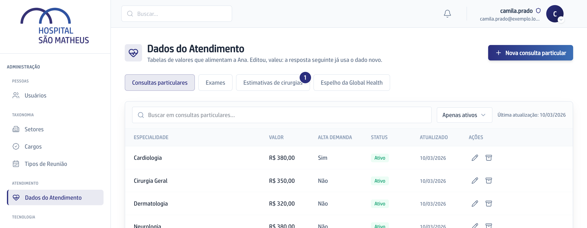
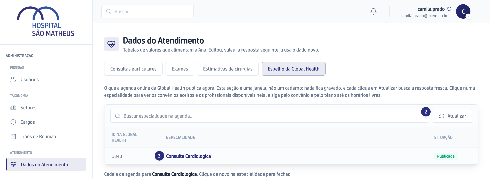
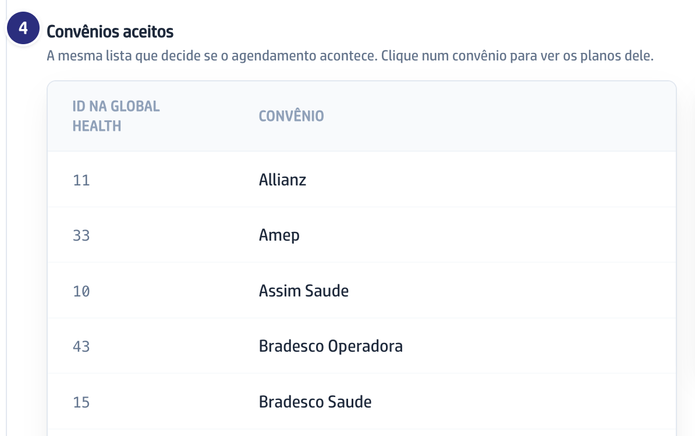

## Quando usar

Quando alguém reclama que a assistente não ofereceu horário, não aceitou um
convênio ou não achou o médico. O Espelho mostra o que a agenda online publica
agora, e quase sempre a resposta está aqui.

O Espelho fica dentro dos Dados do Atendimento, então quem abre aquela tela abre
esta: Secretária, Regular e Super Admin. Aqui ninguém edita nada.

## Passo a passo

1. Em **Dados do Atendimento**, clique no botão **Espelho da Global Health**.

   

2. Clique em **Atualizar** para buscar a lista fresca. Nada fica gravado: é uma
   janela, não um caderno.

   

3. Clique numa especialidade. Abrem **Convênios aceitos** e
   **Profissionais disponíveis** dela.
4. Clique num convênio para ver os planos, e num plano para abrir os
   **Horários livres**.

   

5. Sem especialidade, convênio e plano escolhidos, a consulta de horário nem é
   feita. Escolha os três antes de concluir que não há vaga.
6. Para restringir a um médico, use a lista **Médico**, que começa em
   **Todos os profissionais**.

## Se der errado

- **A lista está vazia com um aviso de falha em cima:** a consulta não chegou à
  agenda online. A lista está vazia por causa da falha, não por falta de
  cadastro. Clique em **Atualizar** de novo.
- **O convênio não aparece na especialidade:** ele não está liberado para ela.
  Isso se resolve no Painel de Controle da agenda online, não aqui.
- **O médico não aparece:** ele está com o botão desligado na agenda online
  para aquela especialidade.
