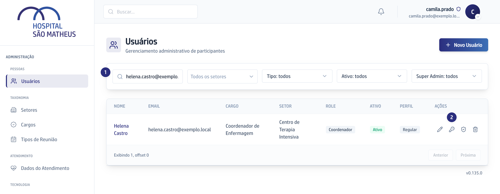
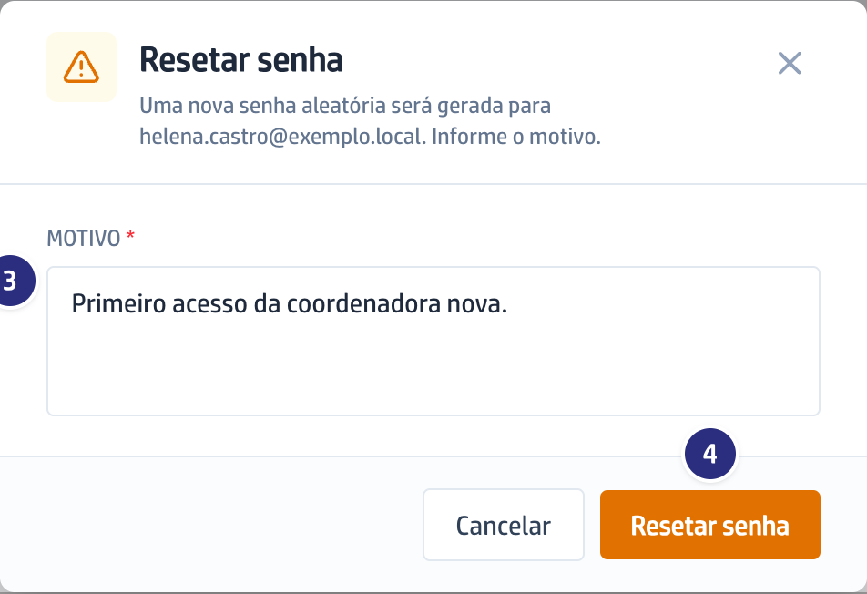
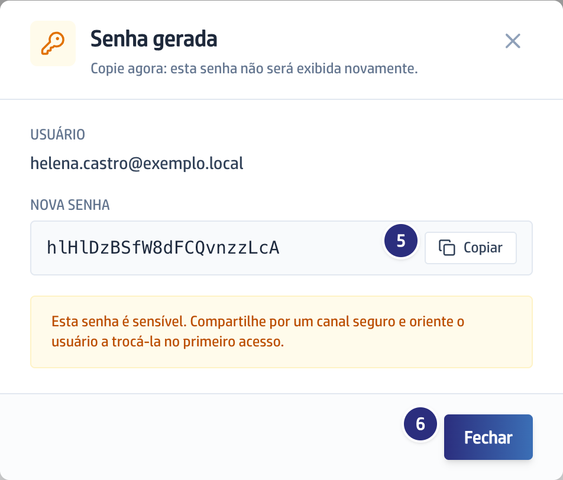

## Quando usar

Depois de cadastrar alguém, e sempre que alguém perder a senha. A plataforma
não manda email de boas-vindas nem link de primeiro acesso: quem entrega a
senha é você, e ela aparece uma vez só.

## Passo a passo

1. Em **Usuários**, ache a pessoa pela busca **Buscar por nome ou email**.

   

2. Na linha dela, clique no ícone de chave, **Resetar senha**.
3. Escreva o **Motivo**. Ele é obrigatório e fica guardado.

   

:::caution[A senha aparece uma vez só]
A senha não volta a aparecer depois que você fechar a janela.
:::

4. Clique em **Resetar senha**.
5. Abre a janela **Senha gerada**, com o aviso "Copie agora: esta senha não
   será exibida novamente". Clique em **Copiar**.

   

6. Entregue a senha à pessoa por um caminho seguro e peça que ela troque no
   primeiro acesso. Depois clique em **Fechar**.

## Se der errado

- **Você fechou a janela sem copiar:** a senha não aparece de novo. Repita o
  **Resetar senha**, que gera outra.
- **A tela recusa com "Participante sem email cadastrado":** a ficha está sem
  endereço, e é o endereço que identifica a pessoa na entrada. Preencha o
  **Email** pelo lápis, **Editar**, e repita. Quem nunca entrou na plataforma
  não é problema: o próprio **Resetar senha** cria a conta dessa pessoa na
  hora.
- **A pessoa continua sem entrar depois de receber a senha:** confira se a
  ficha dela está com **Ativo** marcado. Quem está desligado é recusado na
  porta.
