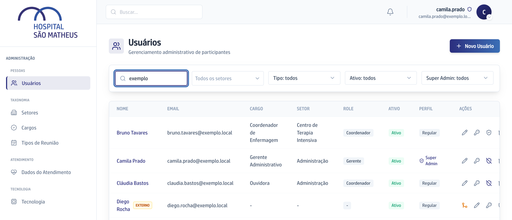

Esta seção cobre a área de **Administração**: as pessoas que entram na
plataforma, o que cada uma alcança, as listas de Setores, Cargos e Tipos de
Reunião que o resto do app consome, e as tabelas de valores que a Ana usa para
responder ao paciente.

## As palavras que você vai ver o tempo todo

**Usuário** é a pessoa cadastrada na plataforma. Ela pode ter login ou não:
quem só é citado numa reunião fica no cadastro sem nunca entrar.

**Perfil de acesso** é o que decide o que a pessoa enxerga no app inteiro. São
três: **Regular**, **Secretária** e **Super Admin**. Cada pessoa tem um.

**Acesso aos POPs** e **Acesso à Ouvidoria** são dois acessos à parte, que se
concedem na mesma tela e não dependem do Perfil de acesso.

**Role** é uma etiqueta antiga que aparece só aqui, na lista e no formulário.
Ela não é o que abre as telas. Veja [A Role que ninguém vê](como-funciona/a-role-que-ninguem-ve/).

**Externo** é a pessoa que entrou no cadastro sozinha, pelo nome citado numa
ata, sem ninguém ter preenchido ficha. A lista marca essas linhas com
**EXTERNO**.

## Quem entra e o que alcança

No menu da esquerda do app, o item **Admin** aparece para todo mundo que tem
papel nas Reuniões, e não só para o Super Admin. O que muda é o que existe lá
dentro.

- **Super Admin** abre o painel em **Usuários** e vê as quatro seções.
- **Secretária** e **Regular** abrem direto em **Dados do Atendimento**, o
  único item da barra para eles.

## A barra da esquerda, seção por seção

Sob o título **Administração**:

- **Pessoas**: **Usuários**, a lista de todo mundo, com as ações de criar,
  editar, resetar senha e tirar do ar.
- **Taxonomia**: **Setores** e **Cargos**, as listas que aparecem prontas nos
  formulários do resto do app, mais [Tipos de Reunião](cadastrar-um-tipo-de-reuniao/),
  que se comporta de outro jeito.
- **Atendimento**: **Dados do Atendimento**, os preços, preparos e estimativas
  que a Ana lê, mais o **Espelho da Global Health**.
- **Tecnologia**: o Quadro de Demandas entre o hospital e a empresa que cuida
  do sistema. Existe na tela, é do Super Admin, e este manual não a cobre.

No pé da barra, **Voltar ao app** devolve você ao painel de reuniões.

## O caminho de ponta a ponta de uma pessoa nova

1. Cadastre a pessoa em **Novo Usuário**, com o Perfil de acesso dela.
2. Gere a senha em **Resetar senha** e entregue a ela. Antes disso, ela não
   entra.
3. Se ela vai cuidar de procedimentos ou de manifestações, conceda **Acesso aos
   POPs** ou **Acesso à Ouvidoria** no botão de editar.
4. Quando a pessoa sair do hospital, desmarque **Ativo** na ficha dela.
