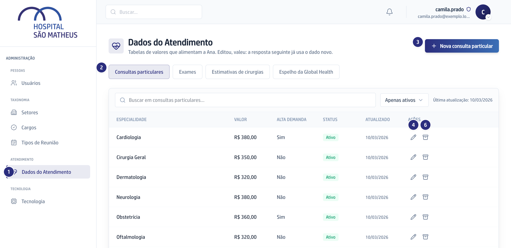
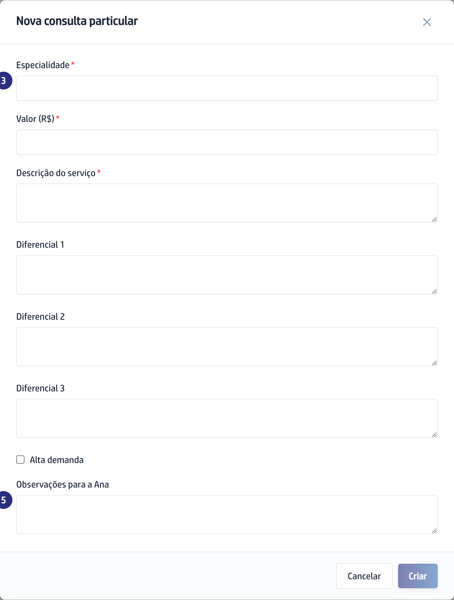

## Quando usar

Sempre que um preço particular mudar, um exame novo passar a ser oferecido ou o
preparo de um exame for alterado. O que você grava aqui vale na resposta
seguinte da assistente, sem espera.

Esta é a única tela da área de administração que não é só do Super Admin: quem
edita é a Secretária, e o Super Admin também. Quem tem perfil Regular abre e lê,
sem os botões de edição.

## Passo a passo

1. Na barra da esquerda, em **Atendimento**, clique em
   **Dados do Atendimento**.

   

2. Escolha a tabela na fileira de botões: **Consultas particulares**,
   **Exames** ou **Estimativas de cirurgias**.
3. Para incluir, clique em **Nova consulta particular**, **Novo exame** ou
   **Nova estimativa de cirurgia**. Os campos com estrela são obrigatórios.

   

4. Para corrigir, clique no lápis, **Editar**, na linha do registro.
5. Escreva em **Observações para a Ana** o que a assistente deve falar junto do
   valor. Na cirurgia, o **Aviso obrigatório da Ana** é obrigatório e sempre
   acompanha a estimativa.
6. Para tirar da resposta sem apagar, clique no ícone de caixa, **Desativar**.
   Aparece **Registro desativado; sai da resposta da Ana**.

## Se der errado

- **O botão de incluir não aparece:** você entrou com perfil de leitura. Editar
  aqui é do Super Admin e da Secretária.
- **O formulário não envia:** falta um campo com estrela. Na cirurgia são
  cinco, mais o aviso obrigatório.
- **O paciente recebeu o valor antigo:** confira se o registro certo está
  **Ativo** e se não existe uma segunda linha com o mesmo nome ainda ligada.
