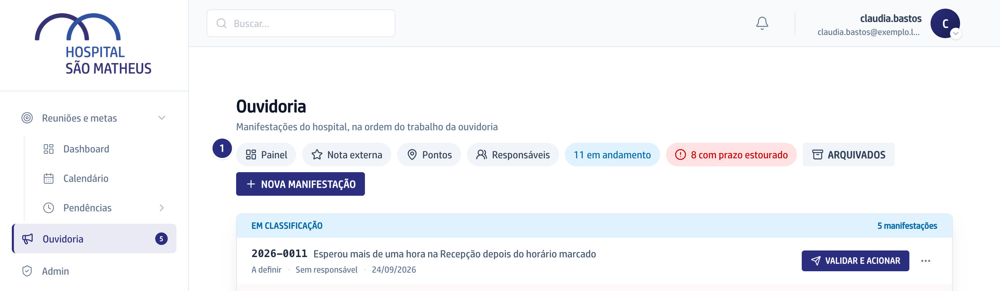
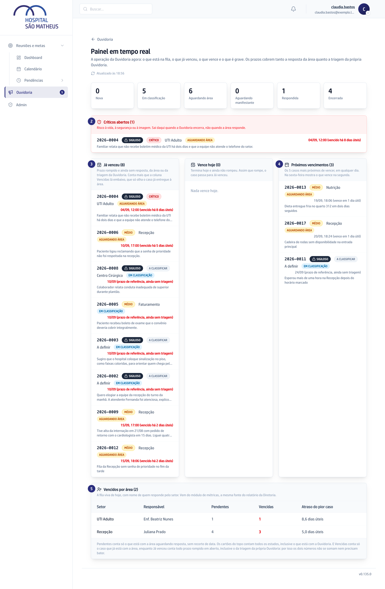

O vídeo é o capítulo 7 do módulo, gravado na versão 0.109.0: ele mostra esta
tarefa, não as mudanças que vieram depois.

## Quando usar

No começo do dia, e sempre que precisar saber onde a Ouvidoria está apertada.
O painel atualiza sozinho e é a mesma fonte dos números do relatório.

## Passo a passo

1. Na Ouvidoria, abra o atalho **Painel**, que leva a **Painel em tempo real**.

   

2. Comece por **Críticos abertos**: risco à vida, à segurança ou à imagem.

   

3. Veja **Já venceu** e **Vence hoje** para saber o que cobrar hoje.
4. Olhe **Próximos vencimentos** para se antecipar ao que vence depois.
5. Desça até **Vencidos por área** para ver quais setores estão devendo, com o
   nome de quem responde por eles.

## Se der errado

- **Um bloco aparece marcado como não carregado:** ele não está dizendo que não
  há nada. Recarregue a página antes de tirar conclusão.
- **Um caso grave continua no painel mesmo com a área já tendo respondido:** ele
  sai quando a Ouvidoria encerra, não quando a área responde.
- **A conta de Já venceu não bate com a coluna Vencidas:** as duas perguntas são
  diferentes. A tabela por área olha o caso já entregue à área; o bloco de cima
  conta também o que está parado na Ouvidoria.
- **Alguém vai projetar a tela numa reunião:** cuidado com os casos marcados como
  sigilosos.
