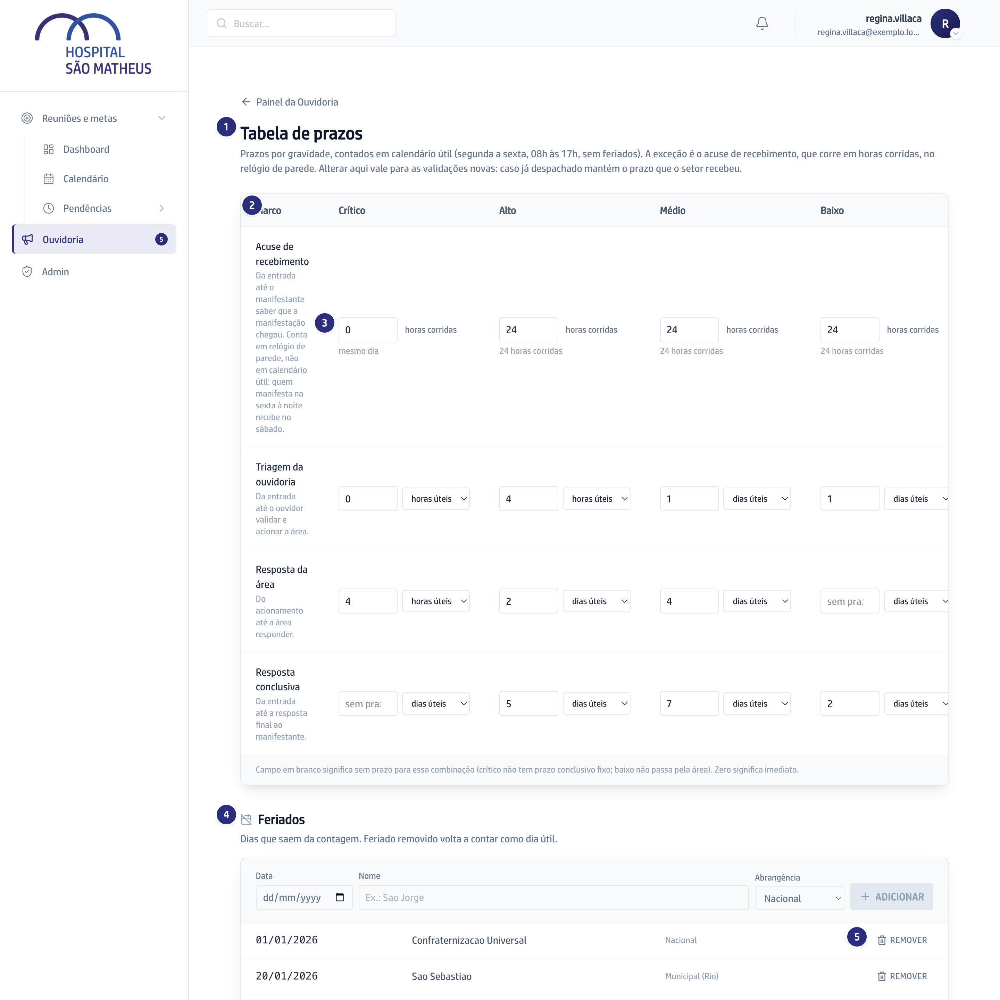

## Quando usar

Quando a Diretoria decide mudar quanto tempo cada um tem, ou quando entra um
feriado novo no calendário do Rio. Ninguém mais mexe nesta tela.

## Passo a passo

1. Na Ouvidoria, abra o atalho **Prazos**, que leva a **Tabela de prazos**.

   

2. A tabela cruza os quatro marcos (**Acuse de recebimento**, **Triagem da
   ouvidoria**, **Resposta da área** e **Resposta conclusiva**) com as quatro
   gravidades.
3. Digite o número na célula e escolha a unidade, **horas úteis** ou **dias
   úteis**. Campo em branco quer dizer que não existe prazo para aquela
   combinação, e zero quer dizer imediato.
4. Em **Feriados**, preencha **Data**, **Nome** e **Abrangência** e clique em
   **Adicionar**.
5. Para tirar um dia da lista, use **Remover**. Ele volta a contar como dia útil.

## Se der errado

- **Um caso já encaminhado continua com o prazo antigo:** é assim mesmo. A
  tabela nova vale para as validações novas; quem já recebeu a demanda mantém o
  prazo que recebeu.
- **O acuse de recebimento não respeita o expediente:** só ele. Esse prazo corre
  em horas corridas, contando noite e fim de semana, porque é uma promessa a
  quem esperou.
- **Alguém mudou um prazo e ninguém sabe quem:** sabe sim. Cada mudança guarda
  quem mudou, quando e de quanto para quanto.
