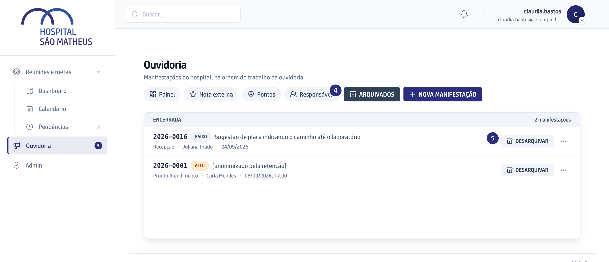

## Quando usar

Quando a lista está cheia de casos encerrados e você quer ver só o que ainda
anda. Arquivar organiza a lista: não muda o caso, não apaga nada e não tira o
caso dos relatórios.

## Passo a passo

1. Na lista, na linha de um caso encerrado, clique em **Arquivar**. É o botão
   da própria linha, à direita.

   

2. Confirme. O caso sai da lista e continua contando nos números.
3. Para limpar de uma vez, use **Arquivar todos os encerrados**, no cabeçalho do
   grupo **Encerrada**.
4. Para rever o que foi guardado, ligue o filtro **Arquivados**.

   

5. Para trazer um caso de volta, clique em **Desarquivar**, o botão da linha
   na lista de arquivados.

## Se der errado

- **O caso que você quer arquivar ainda anda:** só caso encerrado arquiva. Caso
  em andamento tem prazo correndo, e escondê-lo seria esconder atraso.
- **A pessoa voltou a reclamar do mesmo:** o caso reaberto sai do arquivo
  sozinho, porque volta a andar.
- **O caso arquivado não abre mais:** abre. Ele continua acessível pelo
  protocolo e continua nos relatórios e no painel.
