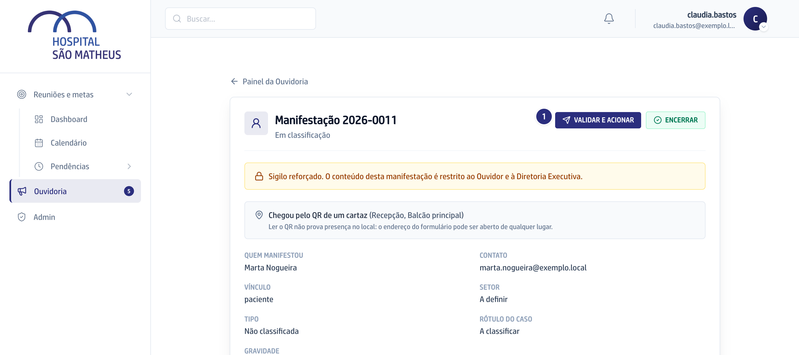
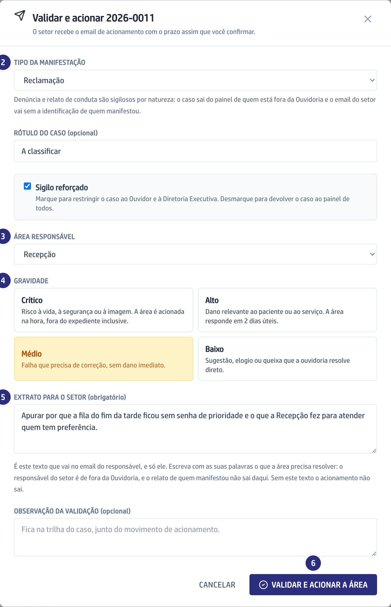

O vídeo é o capítulo 2 do módulo, gravado na versão 0.109.0: o que mudou
depois não aparece nele.

## Quando usar

Assim que um caso novo aparece na lista. É o único ato que põe um setor para
trabalhar: nada aciona uma área sozinho.

## Passo a passo

1. Abra o caso, leia o relato inteiro e clique em **Validar e acionar**.

   

2. Escolha o **Tipo da manifestação**. É o tipo que faz o caso nascer sigiloso.

   

3. Escolha a **Área responsável**. Setor sem titular vigente sobe ao gestor, e a
   tela avisa; sem titular e sem gestor, o acionamento é recusado.
4. Escolha a **Gravidade**. Cada degrau vem explicado na tela, e é ela que
   define o prazo da área.
5. Escreva o **Extrato para o setor**: o que a área precisa resolver, com as
   suas palavras.
6. Clique em **Validar e acionar a área**. O prazo é calculado e congelado, e o
   responsável recebe o email na hora.

## Se der errado

- **O acionamento não sai:** falta o **Extrato para o setor**. É o único texto
  que a área recebe: o relato de quem falou não sai daqui.
- **Nada veio preenchido pela Ana nem pelo que a pessoa marcou:** o palpite
  dos dois fica à parte e nunca vira classificação.
- **A caixa de sigilo reforçado não desmarca:** o tipo escolhido é sigiloso por
  natureza. Você eleva o sigilo de um caso, nunca tira o de uma denúncia.
- **Desmarcar o sigilo mostra o resumo ao hospital:** sem ele, quem tem papel nas
  Reuniões lê o resumo na lista, e no caso vindo do formulário o resumo é o
  começo do relato. Veja
  [O que é sigiloso](/ouvidoria/como-funciona/o-que-e-sigiloso/).
