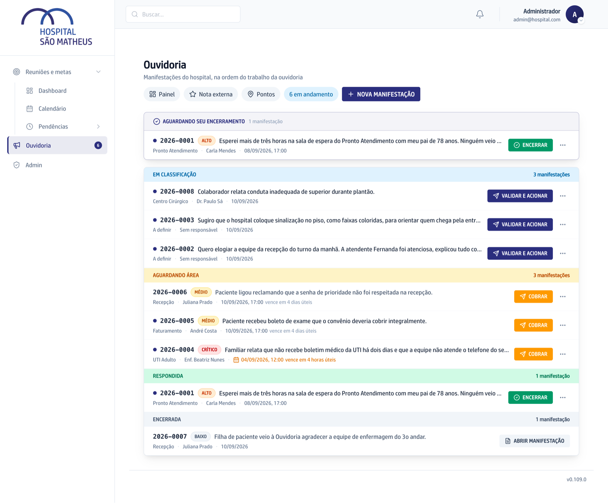

## Quando usar

Quando um caso está com a área, o prazo aperta e você quer chamar de novo. O
sistema já cobra sozinho nos degraus do vencimento: esta é a cobrança que parte
de você, fora dessa escada.

## Passo a passo

1. Na lista, ache a linha do caso. O vencimento em vermelho ou os carimbos
   **Estourado** e **Vence hoje** mostram o que está apertando.
2. Clique em **Cobrar**.
3. Espere a confirmação. A tela mostra **Acionamento reenviado** com o nome de
   quem recebeu.
4. Se o envio não sair na hora, a tela diz que o reenvio ficou na fila: o sistema
   tenta de novo sozinho.

## Se der errado

- **A linha mostra Sem responsável:** o setor está sem titular vigente. Cadastre
  quem responde em
  [Cadastrar responsáveis de setor](/ouvidoria/cadastrar-responsaveis-de-setor/)
  e cobre de novo.
- **O titular do setor mudou:** a cobrança vai para quem responde hoje, não para
  quem recebeu o e-mail original.
- **A área respondeu e o caso continua na lista:** ele sai da fila de tramitação
  no encerramento, não na resposta. Veja
  [Encerrar um caso e avisar a pessoa](/ouvidoria/encerrar-um-caso-e-avisar-a-pessoa/).
