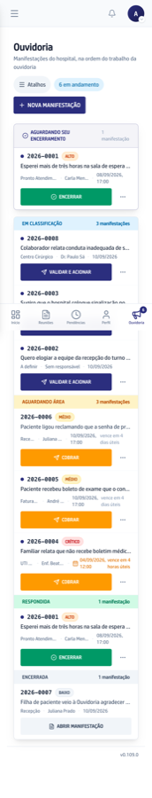

A lista é a tela principal da Ouvidoria, e ela é montada na ordem do trabalho do
dia: primeiro **Aguardando seu encerramento**, o que já foi respondido e espera
você; depois os casos por situação, de **Nova** até **Encerrada**.

## Três informações, três lugares fixos

Cada linha tem dois andares. Em cima, o que identifica o caso: número, gravidade
e o começo do relato. Embaixo, quem cuida e até quando: setor, responsável e
vencimento. À direita fica a ação que faz sentido naquele momento.

A situação fica na faixa colorida do bloco. A gravidade fica na etiqueta
redonda. O prazo fica na cor da data. Elas nunca trocam de lugar e nunca se
misturam.

## A cor da data é só sobre tempo

Vermelho para o que venceu ou vence hoje, com os carimbos **Estourado** e
**Vence hoje**. Âmbar para o que tem menos de um dia útil de folga. Cinza para o
resto. Nada a ver com a cor da gravidade.

## O ponto de novidade é do caso, não da pessoa

Ele quer dizer "a Ouvidoria ainda não viu este caso", e o contador ao lado do
menu soma esses pontos. Abrir o caso, validar ou encerrar apaga o ponto para
todo mundo. Uma pausa, uma devolução ou a resposta do setor acendem de novo: são
novidades que ainda precisam ser vistas.

No celular a linha se empilha e os botões ficam grandes o bastante para o dedo.
A Ouvidoria aparece na barra de baixo para quem tem acesso a ela.

## O que aparece para quem não é da Ouvidoria

Quem tem papel nas Reuniões e não tem acesso à Ouvidoria também abre esta lista,
e nela lê, de cada caso não sigiloso: o protocolo, o setor, a situação, o prazo, a
gravidade, o tipo, o desfecho quando o caso já encerrou e **o resumo**, que é a
frase que descreve o caso. No computador, passar o mouse em cima mostra o resumo
inteiro.

O que essa pessoa não alcança: o relato de quem falou, o nome e o contato dele,
os anexos, a resposta da área e o histórico. A página do caso também não abre
para ela.

Caso sigiloso não aparece nesta lista, nem para quem administra a plataforma. O
que decide isso é só o sigilo, nunca a situação do caso: um caso **Em
classificação** aparece na lista de todo mundo se não for sigiloso.

E o sigilo depende da porta de entrada. O caso que chega pelo formulário, pelo
QR ou pela Ana nasce protegido, porque entra sem tipo, e sai da proteção quando
você classifica. O caso que a Ouvidoria registra à mão nasce com o tipo já
escolhido por você: se não for denúncia nem relato de conduta, ele já aparece
para o hospital no instante em que você clica em **Registrar manifestação**.
