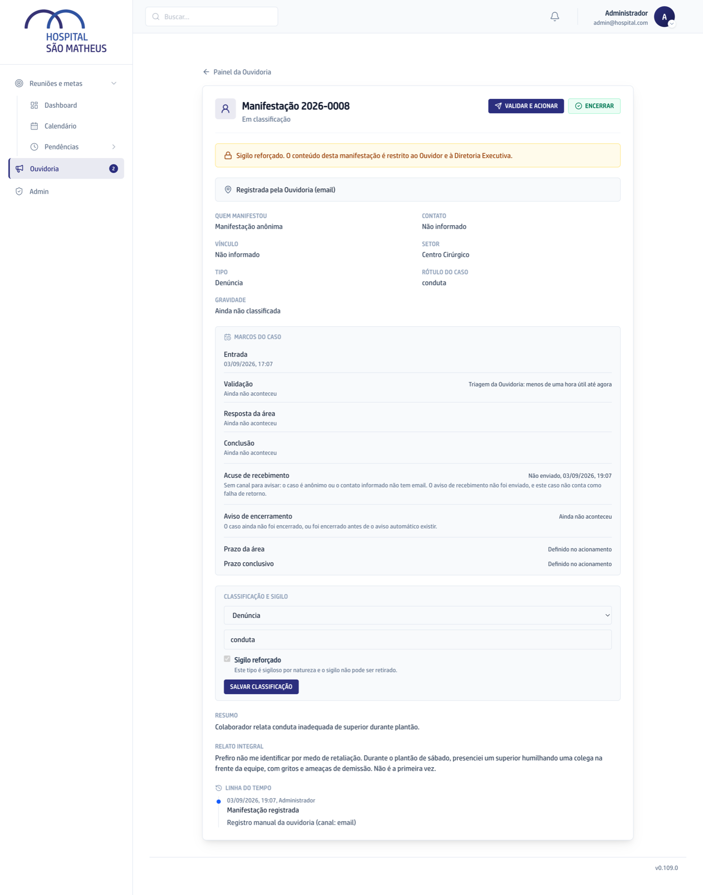

Denúncia e relato de conduta nascem sigilosos em qualquer porta de entrada, sem
ninguém precisar marcar nada. O que faz o caso nascer protegido é o tipo, e só
ele.

Por isso o caso que entra pelo formulário, pelo QR ou pela Ana nasce sigiloso:
essas portas não escolhem tipo, e o caso sem tipo é tratado como protegido até
você classificar. Já o caso que a Ouvidoria registra à mão nasce com o tipo que
você escolheu na hora: uma reclamação digitada no balcão não é sigilosa, e o
resumo dela aparece na lista do hospital assim que você salva.

A regra automática é piso, não teto: o ouvidor pode elevar o sigilo de um caso
que a lista não previu. O que ele não pode é tirar o sigilo de um tipo que é
sigiloso por natureza.

## Quem vê o quê

- **Caso comum:** ouvidor e Diretoria veem tudo. Quem tem papel nas Reuniões e
  não é da Ouvidoria lê na lista o protocolo, o setor, a situação, o prazo, a
  gravidade, o tipo, o desfecho e **o resumo do caso**, e não abre a página dele. O setor responsável
  recebe o resumo, o relato inteiro, a nota da Ouvidoria e quem falou.
- **Caso sigiloso:** só ouvidor e Diretoria. O caso nem aparece na lista de quem
  está fora da Ouvidoria, e o setor recebe só a nota da Ouvidoria.
- **Caso anônimo:** como o comum, mas sem os dados de quem falou. O setor recebe
  a mesma proteção do sigiloso, porque o anonimato se desfaria dentro do próprio
  texto do relato.
- **Quem administra a plataforma:** fica de fora por regra. Cuidar do sistema
  não é o mesmo que poder ler denúncia.

## O resumo é o que atravessa a parede

No caso que entra pelo formulário ou pelo QR, o resumo não é escrito por
ninguém: são as primeiras linhas do relato, do jeito que a pessoa escreveu, até
200 caracteres. No caso que chega pela Ana, é o resumo que ela mesma escreve ao
registrar. No caso que a Ouvidoria registra à mão, é o texto que o ouvidor
escreve no campo **Resumo**.

É esse texto que fica visível na lista para quem tem papel nas Reuniões e não é
da Ouvidoria, assim que o caso deixa de ser sigiloso. Nas três portas que não
escolhem tipo, esse momento é a sua classificação: tirar o sigilo de um caso que
veio do formulário é decidir que o começo daquele relato pode ser lido pelo
hospital. No registro à mão não há esse intervalo, porque o tipo já vai
escolhido: o que você escrever no **Resumo** de uma reclamação é público desde o
clique em **Registrar manifestação**.

## Tirar o sigilo é sempre um ato consciente

Fica registrado no histórico do caso e no registro de quem acessou. Um caso que
entrou pelo site e foi classificado como reclamação continua sigiloso até o
ouvidor desmarcar a caixa de propósito. E a reabertura por reincidência só
eleva o sigilo, nunca o diminui.
