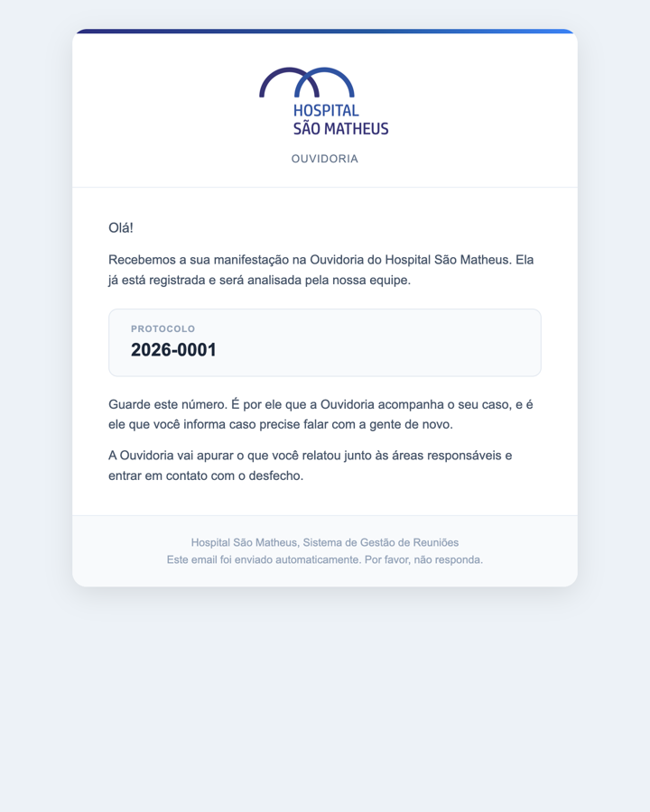
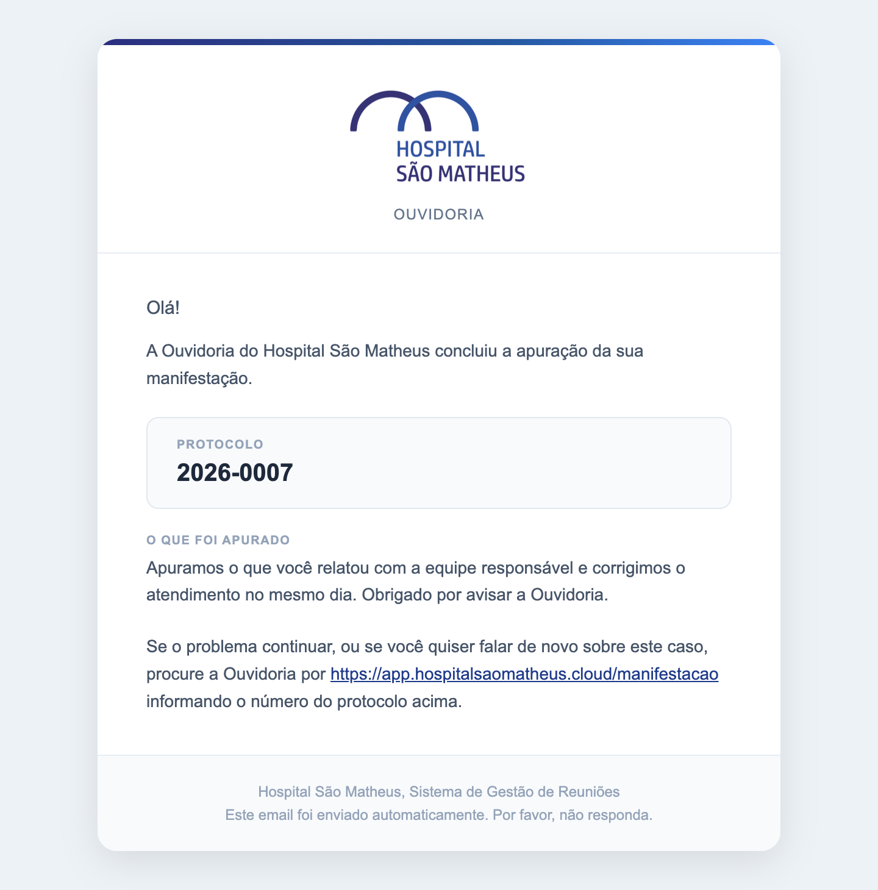

Só dois e-mails saem do hospital para fora, e os dois só existem quando há um
endereço de e-mail no contato do caso. Um avisa que chegou. O outro conta no que
deu.

O primeiro sai sozinho na abertura, em qualquer porta de entrada. Traz o
protocolo e nada do conteúdo.

O segundo sai quando o ouvidor encerra. Traz o protocolo, o desfecho em
linguagem simples e o caminho para voltar a falar, que é o endereço do
formulário no site do hospital.

## Por que os dois contam tão pouco

Os e-mails saem por um serviço de envio de fora do Brasil, e por isso foi
decidido campo a campo o que pode viajar. Para quem falou com a Ouvidoria,
viajam o protocolo e o desfecho. O relato dela nunca volta por e-mail, a
resposta que o setor escreveu nunca sai, e nenhum nome de colaborador aparece.

## O texto do encerramento sai do hospital

A tela avisa isso antes do campo, não depois: quem escreve precisa saber que
aquela frase vai ser lida por um paciente ou um familiar.

## Quando o aviso não sai

Sem e-mail de contato, com pedido de anonimato ou com só um telefone, o aviso
não sai e o caso registra isso com todas as letras. O texto do desfecho continua
no registro do caso.
