Nem todo caso anda em linha reta. O sistema já entende seis desvios, e nenhum
deles apaga o que já aconteceu.

## A área precisa de mais tempo

Ela pede pelo próprio link, com justificativa e quantos dias precisa. Vale uma
vez só, sempre antes de vencer, e o prazo novo nunca passa de 30 dias úteis
contados da entrada. Quem decide é o ouvidor.

## A resposta veio fraca

O ouvidor devolve com um motivo obrigatório. A área volta a ter metade do prazo
da gravidade, somado ao tempo já corrido. Se o prazo já tinha estourado,
continua estourado.

## O caso não é daquela área

A própria área devolve à Ouvidoria pelo link, com o motivo escrito, ou o ouvidor
redireciona sem esperar. Nos dois casos a área nova recebe prazo inteiro, e o
tempo perdido entra na conta da Ouvidoria, que foi quem despachou.

## Falta informação de quem reclamou

O caso vai para **Aguardando manifestante** e o relógio da área para. Quando
volta, o vencimento anda para frente o mesmo tanto de tempo que ficou parado. O
relatório mostra esse tempo separado, para a pausa não esconder lentidão de
verdade.

## A pessoa some

Depois de duas tentativas de contato registradas e cinco dias úteis de espera, o
ouvidor encerra com **Sem retorno do manifestante**. É um desfecho neutro: não
conta como resolvido nem como não resolvido.

## A pessoa volta a reclamar do mesmo

Se ela volta em até 30 dias, o caso original é marcado como reincidência e
reabre. Não nasce protocolo novo, a área recebe um link novo, e cada ida e volta
vira um ciclo com histórico próprio. O indicador de prazo guarda o prazo que foi
rompido, não a hora em que a resposta finalmente chegou.
