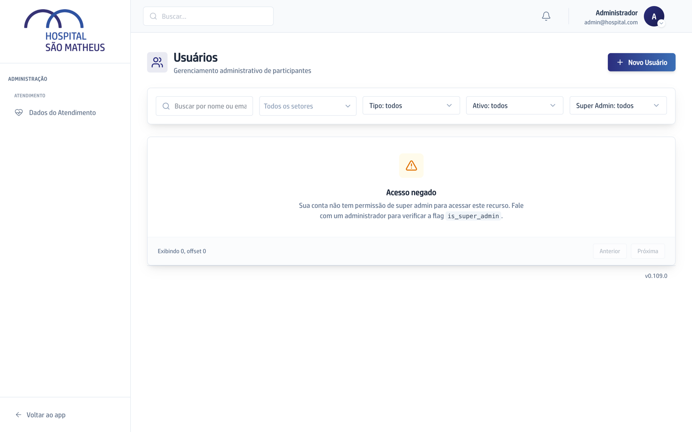

## Quando usar

Quando alguém passa a trabalhar na Ouvidoria, ou deixa de trabalhar. Ter acesso
às reuniões ou aos documentos não dá acesso a caso nenhum: este é um acesso
separado.

## Passo a passo

1. Na área de administração, abra a tela de usuários e edite a pessoa.
2. Vá até **Acesso à Ouvidoria**.
3. Escolha um dos três valores: **Sem acesso**, **Ouvidor** ou **Diretoria
   Executiva**.
4. Salve. A concessão fica registrada.

## Se der errado

- **A pessoa ainda não entrou na plataforma:** pode conceder assim mesmo. O
  acesso fica reservado esperando o primeiro login.
- **Você administra o sistema e não consegue abrir um caso sigiloso:** é de
  propósito. Cuidar do sistema não é o mesmo que poder ler denúncia.
- **Alguém saiu do hospital:** quem é desligado perde o acesso junto, sem
  ninguém precisar lembrar de tirar na mão.
