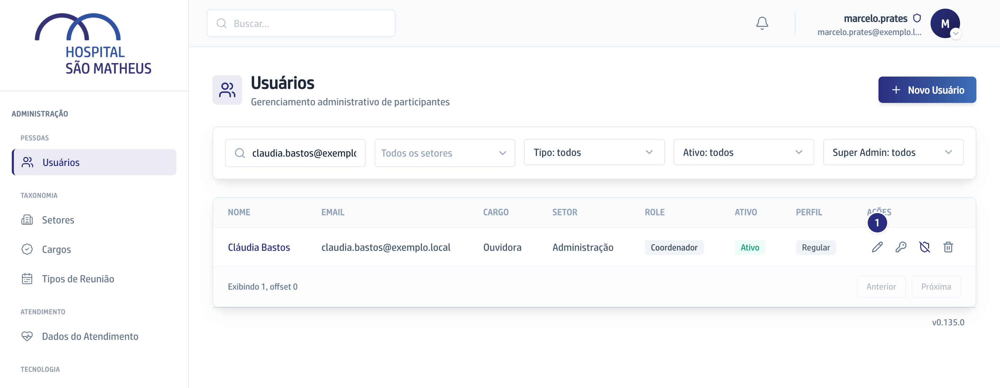
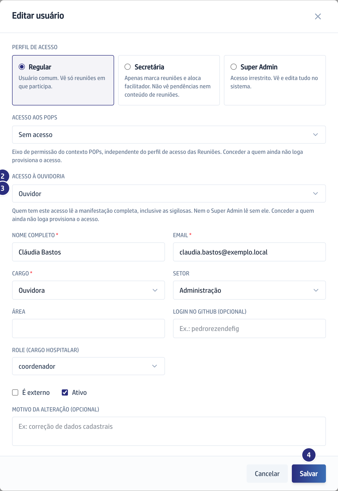

O vídeo é o capítulo 6 do módulo, regravado na versão 0.137.1.

## Quando usar

Quando alguém passa a trabalhar na Ouvidoria, ou deixa de trabalhar. Ter acesso
às reuniões ou aos documentos não dá acesso a caso nenhum: este é um acesso
separado.

## Passo a passo

1. Na área de administração, abra a tela de usuários e edite a pessoa.

   

2. Vá até **Acesso à Ouvidoria**.

   

3. Escolha um dos três valores: **Sem acesso**, **Ouvidor** ou **Diretoria
   Executiva**.
4. Salve. A concessão fica registrada.

## Se der errado

- **A pessoa ainda não entrou na plataforma:** a concessão cria o login dela na
  hora, e a senha aparece uma única vez na tela. Copie e entregue antes de
  fechar. Sem email cadastrado a tela recusa, porque o login precisa de
  endereço. O passo a passo completo está em
  [Dar acesso aos POPs e à Ouvidoria](/admin/dar-acesso-aos-pops-e-a-ouvidoria/).
- **Você administra a plataforma e não consegue abrir um caso sigiloso:**
  administrar o sistema não dá acesso a denúncia. Caso sigiloso é só do ouvidor
  e da Diretoria.
- **Alguém saiu do hospital:** quem é desligado perde o acesso junto, sem
  ninguém precisar lembrar de tirar na mão.
