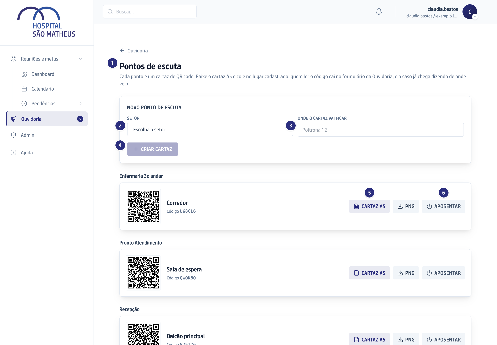
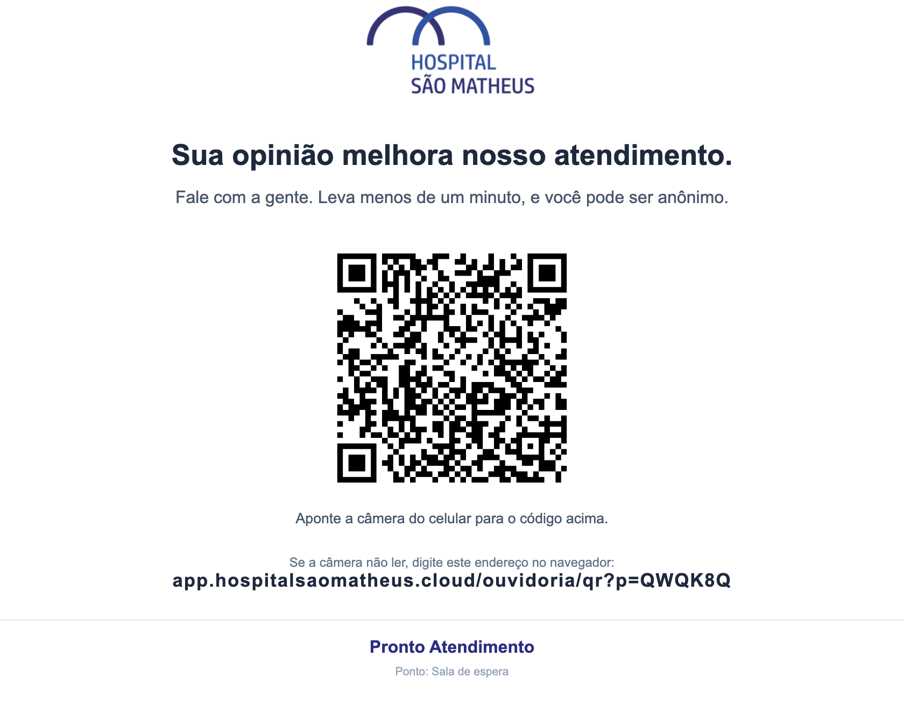

## Quando usar

Quando um lugar do hospital vai passar a ter um cartaz da Ouvidoria na parede.
Cada lugar desses é um ponto de escuta, e o caso que entra por ele já chega
dizendo de onde a pessoa falou.

## Passo a passo

1. Na Ouvidoria, abra o atalho **Pontos**, que leva a **Pontos de escuta**.
2. Em **Novo ponto de escuta**, escolha o **Setor**.
3. Escreva em **Onde o cartaz vai ficar** um nome curto: "Sala de espera".
4. Clique em **Criar cartaz**. O sistema sorteia um código de seis caracteres,
   sem as letras e os números que se confundem ao digitar.
5. Clique em **Cartaz A5** para baixar o cartaz pronto, com a logo, o QR grande
   e o endereço por extenso. Para uma arte própria, **PNG** baixa só o código.
6. Imprima em A5, que é meia folha, e cole. Para tirar de circulação, use
   **Aposentar**.

O endereço embaixo do QR é o do hospital, e é ele que a pessoa digita quando a
câmera não lê o código.

## Se der errado

- **Você aposentou e o cartaz continua na parede:** ele continua funcionando.
  Aposentar não apaga o cartaz nem muda o código: o formulário abre igual, só
  para de dizer de onde a pessoa está falando. **Reativar** desfaz.
- **O setor do cartaz não é quem vai responder:** o cartaz diz de onde a pessoa
  falou. Quem responde é o setor que você escolhe ao classificar.
