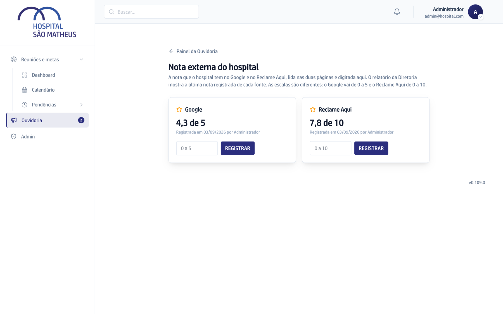

## Quando usar

Sempre que for fechar o mês ou a quinzena, antes do relatório sair. Nenhuma das
duas notas é medida pelo sistema: alguém abre as páginas, lê e digita.

## Passo a passo

1. Na Ouvidoria, abra o atalho **Nota externa**, que leva a **Nota externa do
   hospital**.
2. Abra a página do hospital no Google e leia a nota, de 0 a 5.
3. Digite o valor no cartão **Google** e clique em **Registrar**.
4. Abra a página do Reclame Aqui e leia o índice, de 0 a 10.
5. Digite o valor no cartão **Reclame Aqui** e clique em **Registrar**.
6. Confira a linha **Registrada em**, que mostra a data e quem lançou.

## Se der errado

- **Você digitou errado:** registre de novo com o valor certo. Cada lançamento é
  uma linha nova, e o que vale é a última de cada fonte. Nada é sobrescrito.
- **As escalas parecem trocadas:** são mesmo diferentes. Google vai até 5 e
  Reclame Aqui até 10, e por isso as duas aparecem sempre com a escala junto.
- **Ninguém lançou no mês:** o relatório diz que não foi lançado. Ausência de
  nota não vira zero.
