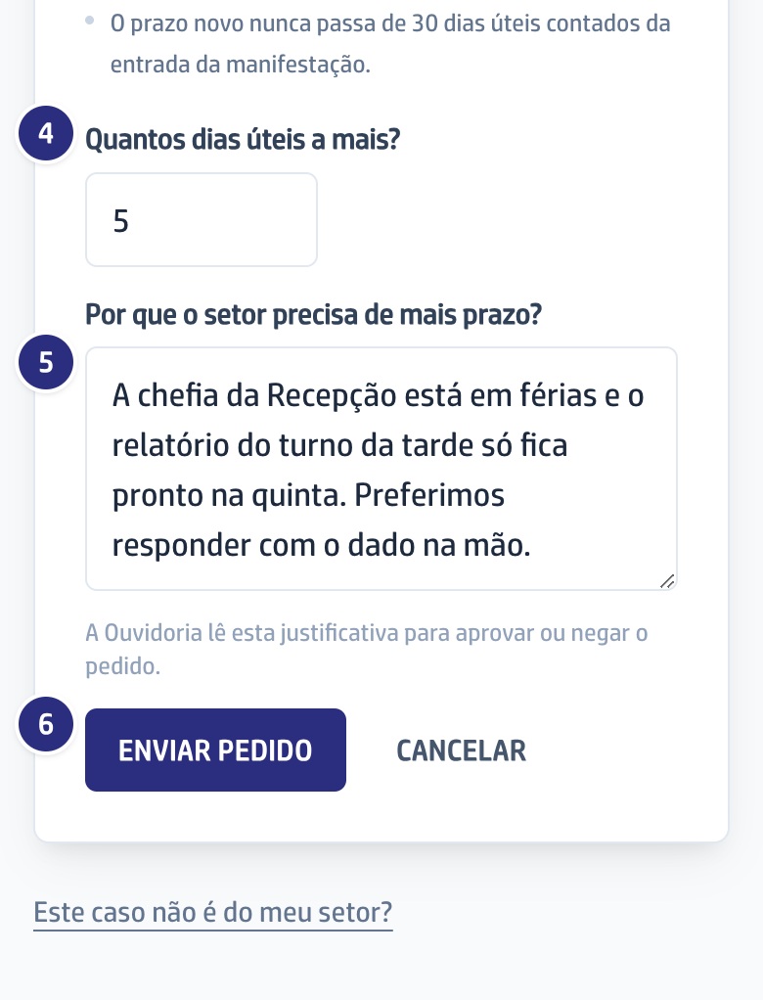

## Quando usar

Quando a apuração não vai ficar pronta dentro do prazo que está na tela. O
pedido vale uma vez por caso e precisa ser feito antes do vencimento.

## Passo a passo

1. Abra o caso pelo link do e-mail da Ouvidoria.
2. Vá até **Precisa de mais prazo?**, no fim da tela, e leia as regras.

   

3. Clique em **Solicitar prorrogação de prazo**.
4. Preencha **Quantos dias úteis a mais?**.

   

5. Explique em **Por que o setor precisa de mais prazo?** o que impede a
   resposta no prazo atual. A Ouvidoria lê essa justificativa para decidir.
6. Clique em **Enviar pedido**. A tela passa a mostrar que a Ouvidoria ainda não
   decidiu, e o prazo atual continua valendo até ela decidir.

## Se der errado

- **O botão de pedir não aparece:** ou o prazo já venceu, ou o caso já teve um
  pedido. Nos dois casos, responda com o que tiver e fale com a Ouvidoria.
- **O pedido foi enviado sem justificativa:** não é possível. Sem o texto, o
  sistema recusa o pedido.
- **A Ouvidoria negou:** a tela diz "A Ouvidoria negou a prorrogação" e o prazo
  de antes continua valendo. Você recebe a decisão por e-mail mesmo que já tenha
  respondido.
