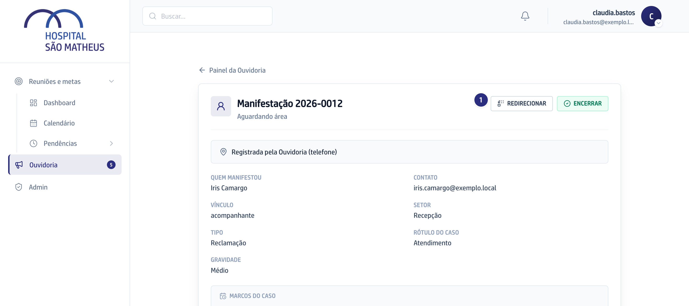
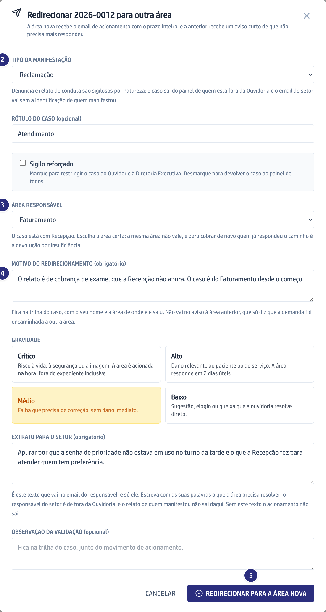

## Quando usar

Quando você percebe que o caso foi para a área errada, esteja ele esperando
resposta ou já respondido. Não é preciso esperar a área devolver.

## Passo a passo

1. Abra o caso, ou use o menu da linha na lista, e clique em **Redirecionar**.

   

2. A janela abre preenchida com o tipo, a gravidade e o extrato que você já
   tinha escrito.

   

3. Escolha a **Área responsável** certa. A mesma área não vale.
4. Escreva o **Motivo do redirecionamento**. Ele é obrigatório e fica na trilha
   do caso, com o seu nome e a área de onde ele saiu.
5. Clique em **Redirecionar para a área nova**. A tela confirma o caso
   redirecionado.
6. A área nova recebe o acionamento com o prazo inteiro, e a anterior recebe um
   aviso curto de que não precisa mais responder.

## Se der errado

- **A área nova não aparece na lista:** ela não tem titular nem gestor vigente.
  Cadastre o responsável antes; nada acontece com o caso enquanto isso.
- **O caso está pausado esperando o manifestante:** retome o caso antes de
  redirecionar.
- **Você queria cobrar de novo quem já respondeu:** aí o caminho é
  [Devolver uma resposta fraca ao setor](/ouvidoria/devolver-uma-resposta-fraca-ao-setor/).
- **O tempo perdido com a área errada:** ele entra na conta da Ouvidoria, não na
  da área nova. O motivo escrito é o que explica isso depois.
