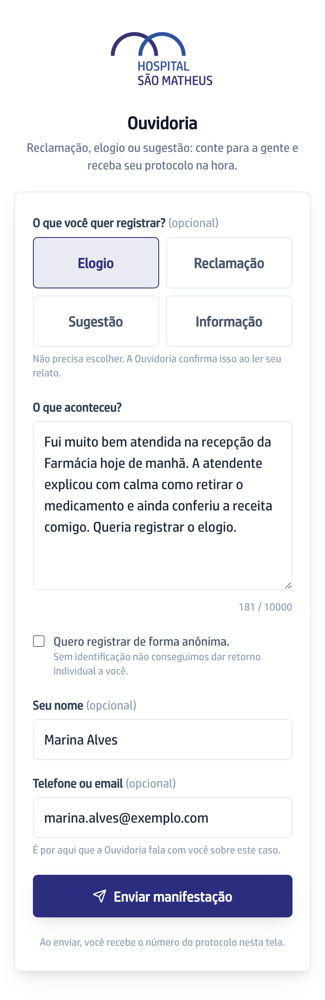

## Quando usar

Quando você quer contar alguma coisa para a Ouvidoria e não tem conta na
plataforma. Você chega a esta tela pelo QR do cartaz do setor ou pelo link do
site do hospital.

## Passo a passo

1. Abra o formulário. A tela mostra **Ouvidoria** no alto.
2. Escolha **Elogio**, **Reclamação**, **Sugestão** ou **Informação**. Não
   precisa escolher: a Ouvidoria confirma isso ao ler o seu relato.
3. Conte o que houve em **O que aconteceu?**, com as suas palavras.
4. Para não se identificar, marque **Quero registrar de forma anônima**.
5. Preencha **Seu nome** e **Telefone ou email**. É por aí que a Ouvidoria fala
   com você sobre este caso.
6. Clique em **Enviar manifestação**. O número do protocolo aparece nesta
   mesma tela: guarde ele.

## Se der errado

- **O botão Enviar manifestação está apagado:** o relato está vazio. Escreva o
  que aconteceu e o botão acende.
- **Você marcou anônima e os campos de nome e contato sumiram:** é assim mesmo.
  Sem identificação, a Ouvidoria não tem como dar retorno a você.
- **Você leu o QR do cartaz e o setor não aparece no alto da tela:** registre do
  mesmo jeito. A Ouvidoria define o setor responsável ao ler o seu relato.
