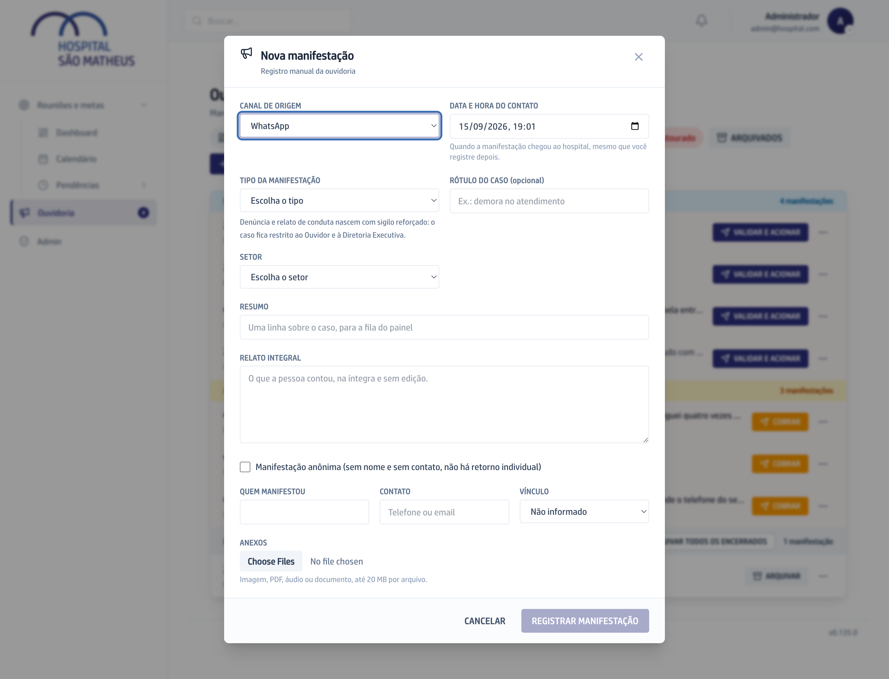
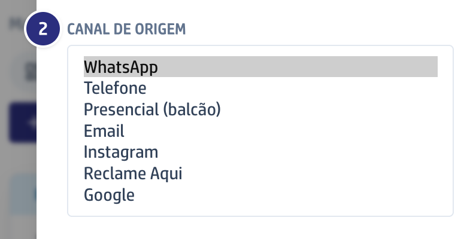

O vídeo é o capítulo 1 do módulo, gravado na versão 0.109.0: ele mostra esta
tarefa, não as mudanças que vieram depois.

## Quando usar

Quando a pessoa não escreveu pelo formulário: ligou, veio ao balcão, mandou
mensagem ou avaliou o hospital na internet.

## Passo a passo

1. Na Ouvidoria, clique em **Nova manifestação**.
2. Confira o **Canal de origem**. A janela abre em **WhatsApp**: registrando um
   telefonema, troque antes de salvar.
3. Preencha **Data e hora do contato** com a hora real em que a pessoa falou. O
   prazo conta a partir dali.
4. Escolha o **Tipo da manifestação** e o **Setor**, e escreva o **Resumo**.
   Denúncia e relato de conduta nascem sigilosos; nos outros tipos, o resumo é
   público desde já.
5. Cole em **Relato integral** o que a pessoa contou, inteiro e sem correção, e
   preencha **Quem manifestou**, **Contato** e **Vínculo**. Do Google, do
   Reclame Aqui ou do Instagram, o endereço da avaliação ou o @ vai no
   **Contato**: não há campo próprio para ele.
6. Junte os **Anexos** e clique em **Registrar manifestação**. O protocolo
   aparece na tela para você informar a quem falou.

## Se der errado

- **A tela pede para conferir os campos:** relato, tipo, setor e resumo são
  obrigatórios, e a data não pode ser futura.
- **Você escreveu no Resumo algo que o hospital não deveria ler:** salvo, ele vai
  para a lista de quem tem papel nas Reuniões, sem classificação no meio. O
  detalhe fica no **Relato integral**, que não sai da Ouvidoria. Veja
  [O que é sigiloso](/ouvidoria/como-funciona/o-que-e-sigiloso/).
- **Você marcou WhatsApp e o caso era da Ana:** o WhatsApp do hospital é
  atendido por gente, e é você quem digita depois. O que a Ana atendeu entra
  sozinho, pelo canal dela, e conta separado.
- **O canal ficou errado:** ele é escolhido uma vez e não muda. Deixe escrito na
  **Observação da validação**, ao classificar.
