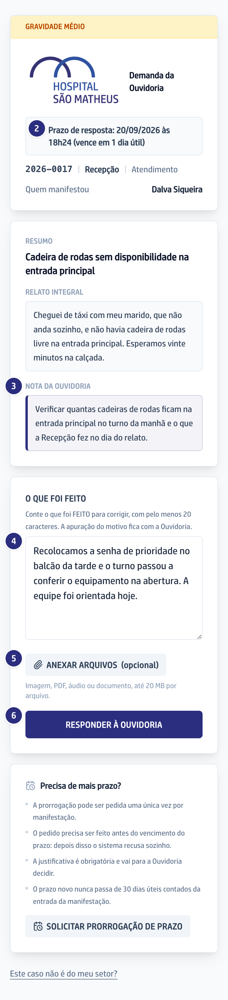

O vídeo é o capítulo 3 do módulo, gravado na versão 0.109.0: ele mostra esta
tarefa, não as mudanças que vieram depois.

## Quando usar

Quando chega no seu e-mail uma **Demanda da Ouvidoria** para a sua área. O link
vale para aquele caso, para você, e não abre de novo depois da resposta.

## Passo a passo

1. Abra o e-mail e toque no botão que leva ao caso. Não há senha nem cadastro.
2. Olhe a gravidade e o **Prazo de resposta**, no alto da tela.
3. Leia os textos do caso na ordem em que aparecem, terminando na **NOTA DA
   OUVIDORIA**, que é o que a Ouvidoria pede que você apure.
4. Escreva em **O que foi feito** o que a área fez para corrigir. O motivo do
   problema fica com a Ouvidoria.
5. Use **Anexar arquivos** para imagem, PDF, áudio ou documento de até 20 MB.
6. Clique em **Responder à Ouvidoria**. A tela confirma que a resposta ficou
   registrada.

## Se der errado

- **O botão não envia:** a resposta está curta demais ou passou do limite de
  10.000 caracteres. A própria tela avisa qual dos dois.
- **O caso não é do seu setor:** use o link **Este caso não é do meu setor?**.
  Está em [Devolver um caso que não é do seu setor](/ouvidoria/devolver-um-caso-que-nao-e-do-seu-setor/).
- **O prazo não dá:** veja
  [Pedir mais prazo pelo portal do setor](/ouvidoria/pedir-mais-prazo-pelo-portal-do-setor/).
- **A tela diz que o link não abre o caso:** ele é de uso único. Fale com a
  Ouvidoria citando o protocolo para receber outro.
