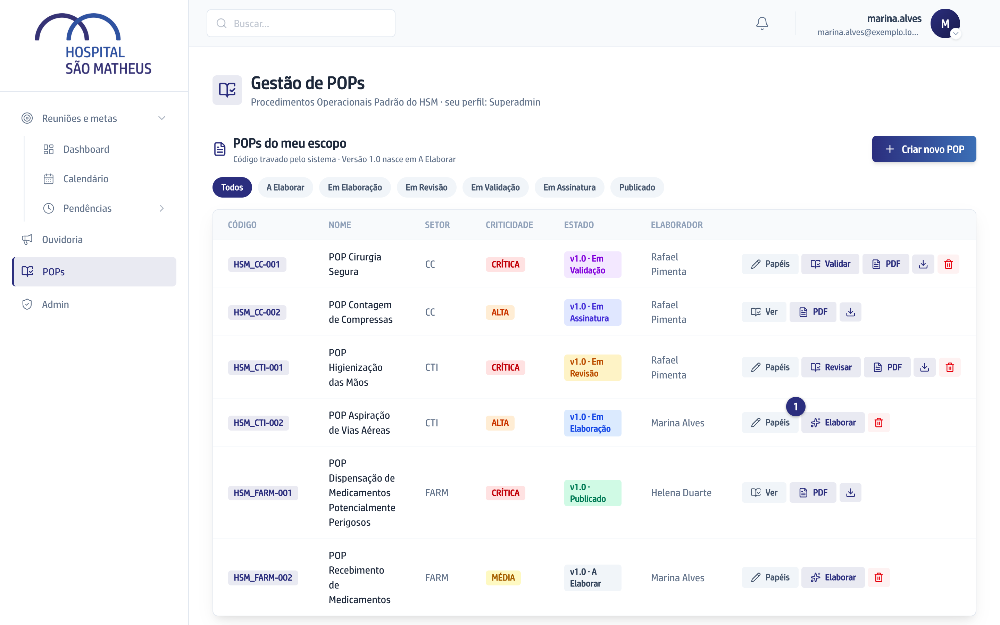
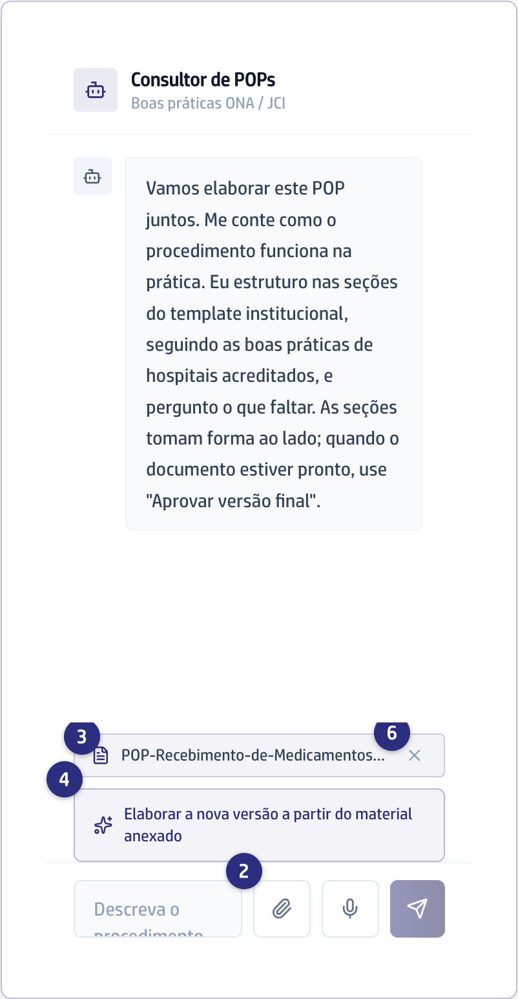
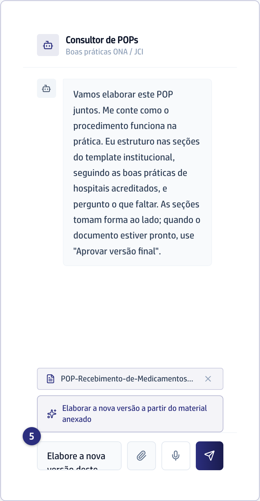

## Quando usar

Sempre que já existe alguma coisa escrita: o POP antigo, uma norma ou um
artigo. O Consultor de POPs lê esses arquivos e escreve a partir deles,
mantendo a estrutura e o conteúdo do original.

## Passo a passo

1. Na tela **Gestão de POPs**, clique em **Elaborar** na linha do seu POP.

   
2. No painel da direita, clique no clipe, ao lado do campo de mensagem.

   
3. Escolha um ou vários arquivos de uma vez. Cada um vira uma etiqueta com o
   nome do arquivo abaixo do campo.
4. Com o material anexado e a conversa ainda vazia, aparece o botão
   **Elaborar a nova versão a partir do material anexado**. Clique nele.
5. O pedido pronto cai no campo de mensagem. Ajuste o texto se quiser e envie.

   
6. Para tirar um arquivo, clique no X da etiqueta dele. Ele sai do que o
   Consultor de POPs considera.

## Se der errado

- **O arquivo foi recusado:** aparece um aviso com o nome dele e o motivo.
  Formatos aceitos são `.txt`, `.md`, `.pdf` e `.docx`. Documento escaneado como
  imagem não é lido.
- **O botão de arranque não aparece:** ele só existe enquanto ninguém escreveu
  nada na conversa. Depois da primeira mensagem, peça a elaboração com suas
  palavras.
- **O texto saiu diferente do documento antigo:** diga no chat o que ficou de
  fora. O Consultor de POPs corrige erros de português do original e confere se
  todo o conteúdo foi abordado.
