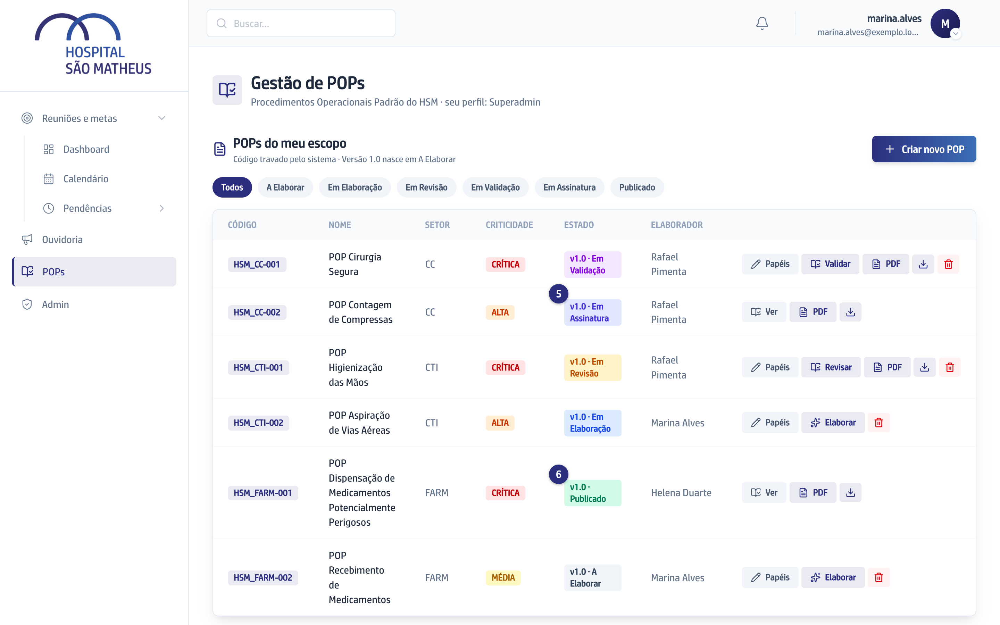

## Quando usar

Quando o Validador aprovou a Versão. O sistema envia o documento sozinho para
as três pessoas do POP, e a assinatura acontece fora da plataforma, no email
que você recebe da ClickSign.

## Passo a passo

1. Procure no seu email a mensagem da ClickSign com o nome do POP. Se não
   achar, olhe no lixo eletrônico.
2. Abra o link da mensagem. O documento aparece para leitura.
3. Confira o Código e o número da Versão no alto do documento.
4. Assine. Cada pessoa assina uma vez, no próprio email, e a ordem não importa.
5. Acompanhe o estado na tela **Gestão de POPs**: enquanto falta alguém, ele
   fica **Em Assinatura**.

   
6. Assinaram os três, o POP passa a **Publicado** e aparece na Biblioteca com o
   documento assinado.

## Se der errado

- **O email não chegou:** confirme com o Superadmin se o seu endereço está
  certo no cadastro, porque é para ele que o documento sai. Corrigir o cadastro
  não faz o documento ser enviado de novo.
- **Você é a mesma pessoa em dois papéis do POP:** você assina uma vez só. O
  sistema não pede duas assinaturas da mesma pessoa.
- **Todo mundo assinou e o POP continua Em Assinatura:** a mudança de estado
  chega alguns instantes depois da última assinatura. Se demorar muito, avise
  quem cuida da plataforma: reenviar o documento não tem botão em tela nenhuma.
