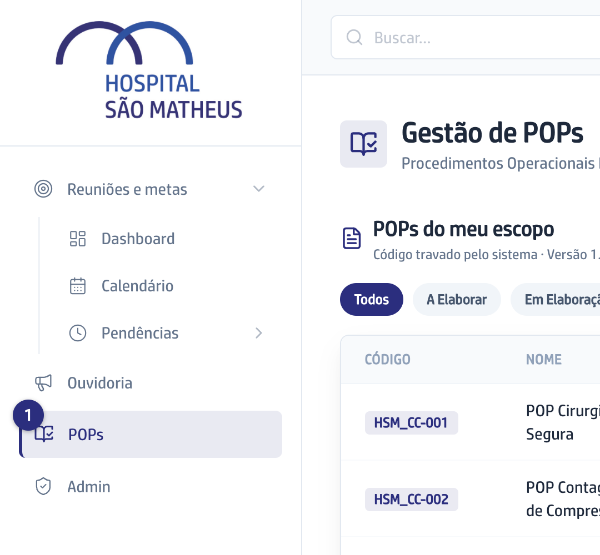
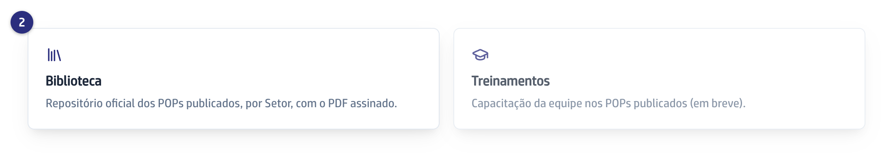
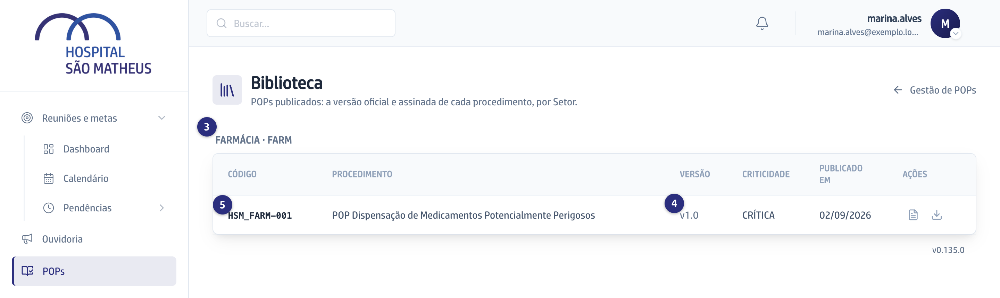
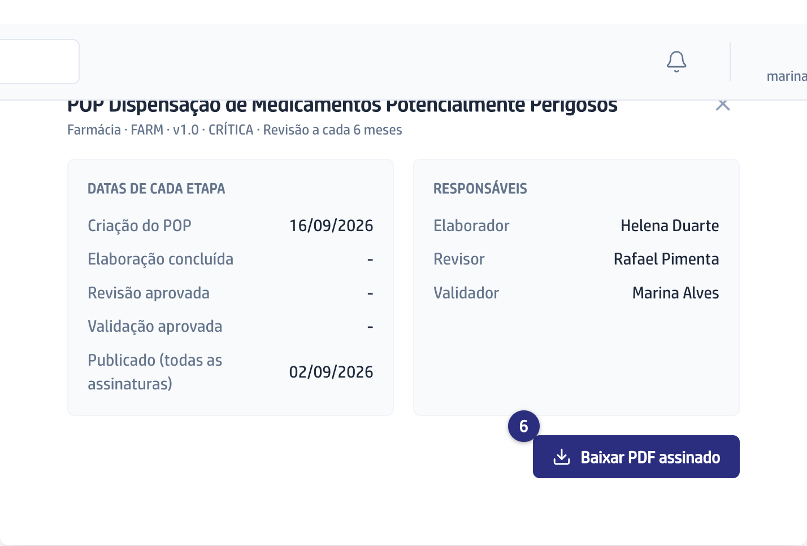

## Quando usar

Quando você precisa do procedimento que vale hoje: para consultar antes de
executar, para treinar a equipe ou para mostrar numa auditoria. A Biblioteca só
tem POP assinado pelas três pessoas responsáveis.

## Passo a passo

1. No menu da esquerda, clique em **POPs**.

   
2. No cartão **Biblioteca**, clique para abrir.

   
3. Procure o Setor: os POPs aparecem agrupados por Setor, com a sigla ao lado
   do nome.

   
4. Na linha do procedimento, veja a **Versão** que está valendo e a data em
   **Publicado em**.
5. Clique na linha para abrir a **Ficha do POP**, com as datas de cada etapa e
   os nomes do Elaborador, do Revisor e do Validador.
6. Clique em **Baixar PDF assinado** para guardar ou imprimir o documento.

   

## Se der errado

- **Aparece "Nenhum POP publicado ainda":** nenhum procedimento do seu Setor
  completou as assinaturas. Enquanto isso, ele aparece na lista da tela
  **Gestão de POPs** com o estado em que está.
- **O POP que você procura não está lá:** a Biblioteca mostra os Setores do seu
  acesso. Se o procedimento é de outro Setor, peça ao Superadmin para incluir
  esse Setor no seu acesso.
- **Você abriu a ficha e um responsável aparece como "-":** o POP foi assinado
  por quem estava designado na época. A ficha mostra as pessoas do cadastro
  atual.
