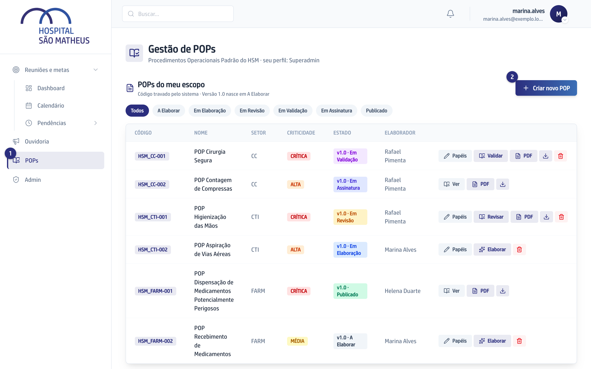
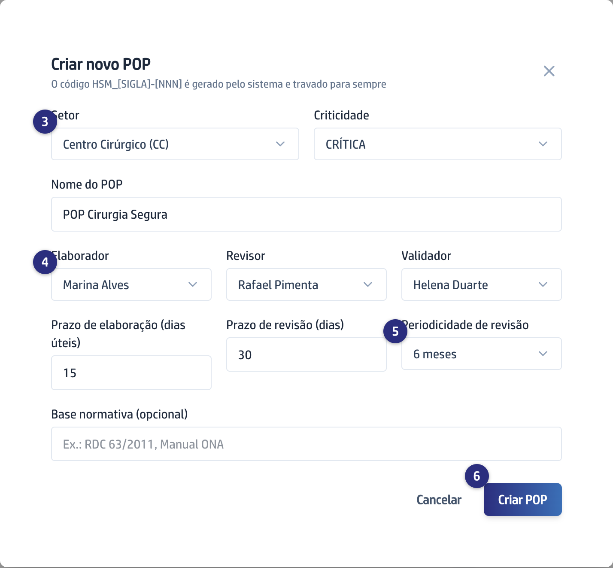

## Quando usar

Quando um procedimento do seu Setor ainda não existe no sistema, ou quando a
equipe vai transformar um documento antigo em POP. Criar o POP é o que reserva
o Código e avisa quem vai escrever.

## Passo a passo

1. No menu da esquerda, clique em **POPs**.

   
2. Em **POPs do meu escopo**, clique em **Criar novo POP**.
3. Escolha o **Setor** e a **Criticidade** (CRÍTICA, ALTA ou MÉDIA). O
   **Nome do POP** já vem sugerido e você pode trocar.

   
4. Escolha as três pessoas: **Elaborador**, **Revisor** e **Validador**.
5. Ajuste **Prazo de elaboração (dias úteis)**, **Prazo de revisão (dias)** e a
   **Periodicidade de revisão**. Preencha a **Base normativa** se o
   procedimento segue alguma norma.
6. Clique em **Criar POP**. O Código aparece pronto e o Elaborador recebe um
   email avisando.

## Se der errado

- **O Setor que você quer não aparece na lista:** a lista traz os Setores do
  seu acesso. Peça ao Superadmin para cadastrar o Setor ou para incluí-lo no
  seu acesso.
- **Uma pessoa não aparece em Elaborador, Revisor ou Validador:** só quem tem
  acesso à Gestão de POPs pode ser escolhida. O Superadmin concede o acesso na
  mesma tela.
- **Você errou uma das três pessoas:** na linha do POP, clique em **Papéis** e
  troque. Vale até a Versão entrar em assinatura.
