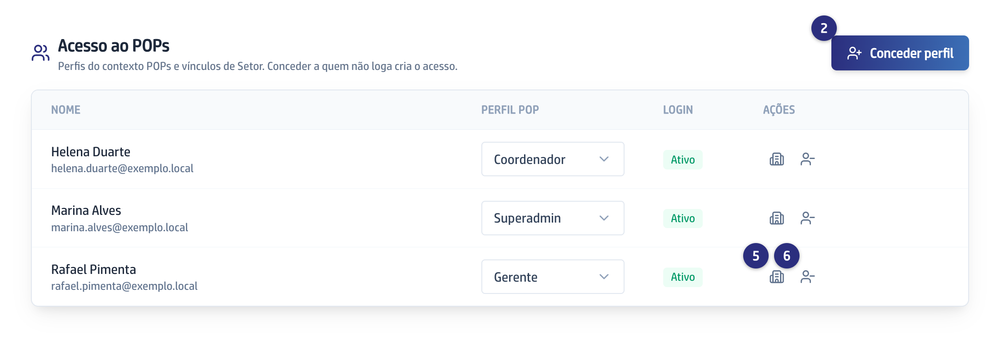
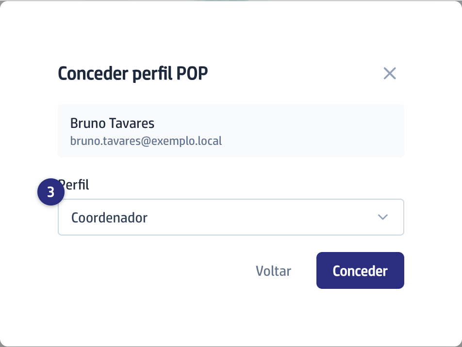
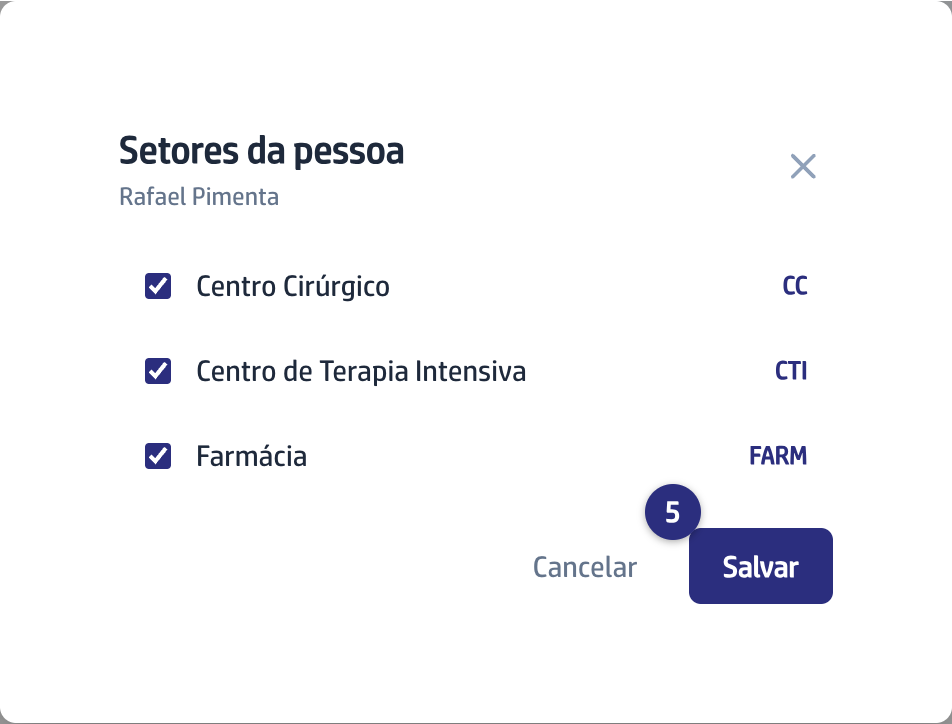

## Quando usar

Quando alguém vai elaborar, revisar ou validar POPs e ainda não entra na área.
Conceder o perfil a quem não tem conta cria o acesso dela na hora. Só o
Superadmin vê este bloco.

O mesmo acesso também se concede pela área de administração, junto com o da
Ouvidoria: [Dar acesso aos POPs e à Ouvidoria](/admin/dar-acesso-aos-pops-e-a-ouvidoria/).

## Passo a passo

1. No menu da esquerda, clique em **POPs** e role até **Acesso ao POPs**.

   
2. Clique em **Conceder perfil** e busque a pessoa por nome ou email.

   
3. Escolha o **Perfil**: **Superadmin**, **Gestor de Qualidade**, **Gerente** ou
   **Coordenador**. Clique em **Conceder**.

   

:::caution[A senha aparece uma vez só]
A senha de quem ainda não entrava aparece uma vez. Copie antes de fechar.
:::
4. Se a pessoa ainda não entrava na plataforma, copie a senha e entregue a ela
   antes de fechar em **Entendi**.
5. Clique no prédio, na linha da pessoa, para marcar os **Setores da pessoa**, e
   salve. É isso que decide quais POPs ela enxerga.

   
6. Para tirar o acesso, clique no ícone de pessoa com o sinal de menos e
   confirme.

## Se der errado

- **A busca não encontra ninguém:** digite ao menos duas letras. Quem nunca foi
  cadastrado no hospital não aparece: cadastre a pessoa antes, na área de
  administração.
- **Você fechou a tela sem copiar a senha:** ela não é mostrada de novo. Peça à
  pessoa para clicar em **Esqueci minha senha** na tela de entrada.
- **A pessoa entra mas não vê POP nenhum:** falta marcar os Setores dela.
  Gerente costuma ter vários, Coordenador costuma ter um.
