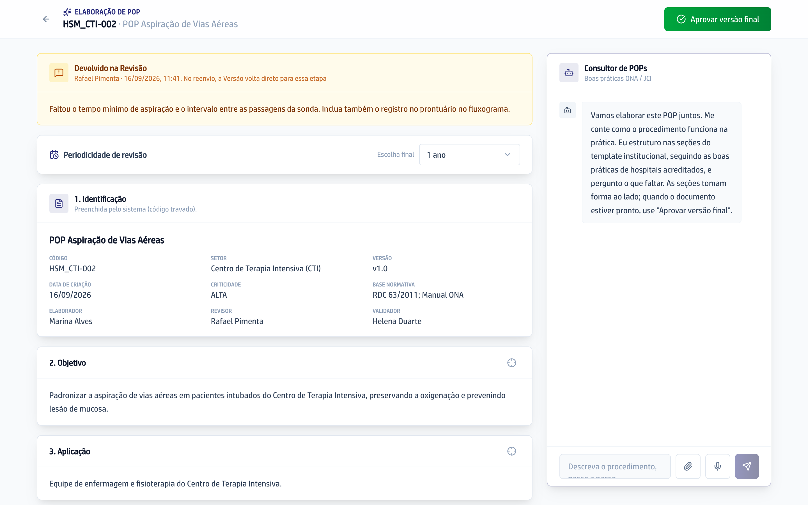

## Quando usar

Quando o POP está com você para escrever. A tela tem o documento à esquerda,
que vai tomando forma, e o **Consultor de POPs** à direita, que pergunta e
escreve as seções.

## Passo a passo

1. Na tela **Gestão de POPs**, clique em **Elaborar** na linha do seu POP.
2. Conte como o procedimento funciona na prática, no campo
   **Descreva o procedimento, passo a passo...**. Para falar em vez de digitar,
   clique no microfone.
3. Para pedir mudança numa parte específica, clique no alvo ao lado do título
   da seção e escreva. A conversa passa a falar só daquela seção.
4. Escolha a **Periodicidade de revisão** no alto da tela. O Consultor de POPs
   sugere uma, e a decisão é sua.
5. Confira o documento inteiro, inclusive o fluxograma.
6. Clique em **Aprovar versão final** e confirme em **Aprovar e enviar**. A
   Versão vai para o Revisor, que recebe um email.

## Se der errado

- **O botão Aprovar versão final está apagado:** nenhuma seção tem conteúdo
  ainda. Escreva com o Consultor de POPs e ele acende.
- **Aparece uma tarja amarela no alto com Devolvido na Revisão:** o Revisor ou
  o Validador devolveu. Leia o comentário, corrija e aprove de novo.
- **Você abriu a tela e diz "Elaboração concluída":** a Versão já saiu da sua
  mão. Dali em diante ela se lê pelo botão **Ver** da lista.
