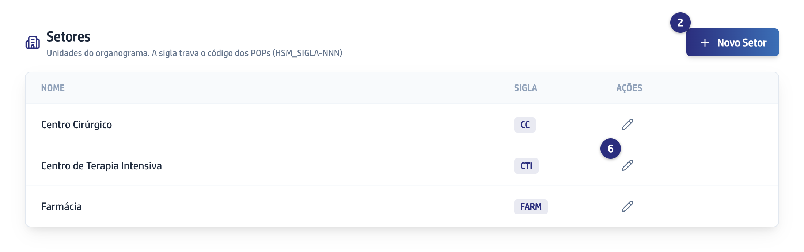
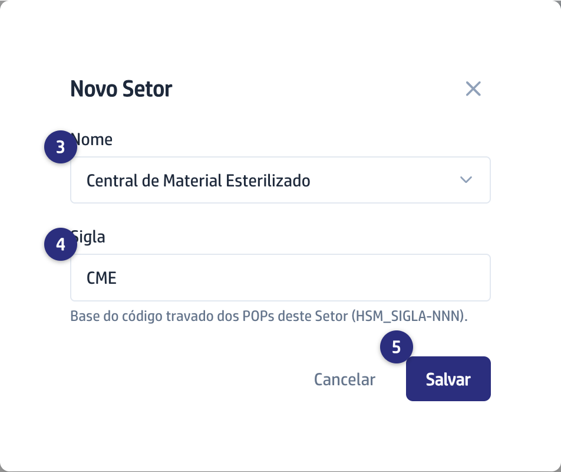

## Quando usar

Antes de criar o primeiro POP de uma unidade. Sem Setor cadastrado não há
Código, e é a sigla do Setor que aparece em `HSM_CTI-001`. Só o Superadmin vê
este bloco.

## Passo a passo

1. No menu da esquerda, clique em **POPs**.

   
2. Role até o bloco **Setores** e clique em **Novo Setor**.

   
3. Em **Nome**, escolha um setor já conhecido na lista ou digite um novo.

   
4. Confira a **Sigla**. Ela vem sugerida a partir do nome, sai sempre em
   maiúsculas e é a base do Código dos POPs daquele Setor.
5. Clique em **Salvar**.
6. Para corrigir um Setor, clique no lápis na linha dele, ajuste e salve.

## Se der errado

- **O botão Salvar está apagado:** falta o Nome ou a Sigla. Os dois são
  obrigatórios.
- **A gravação foi recusada:** já existe Setor com esse nome ou com essa sigla.
  Os dois não se repetem.
- **Você mudou a sigla de um Setor que já tem POP:** os Códigos já criados não
  mudam, porque o Código é travado. A sigla nova só vale para os POPs
  seguintes, e a lista passa a mostrar duas siglas diferentes no mesmo Setor.
