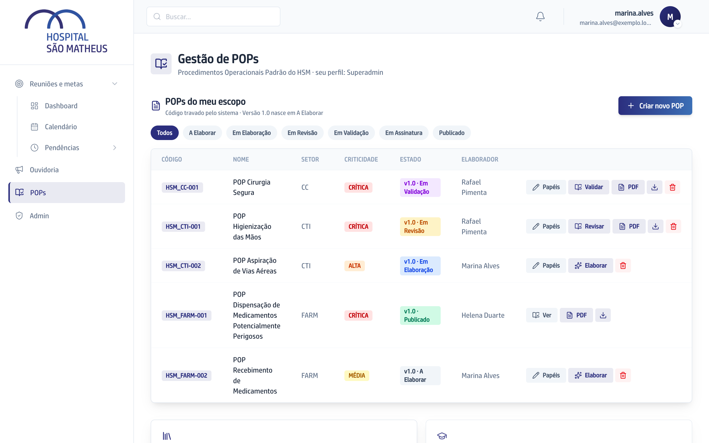

Esta seção cobre a **Gestão de POPs**: onde os procedimentos do hospital são
escritos, revisados, assinados e ficam disponíveis para a equipe.

## As palavras que você vai ver o tempo todo

**POP** é o procedimento em si, por exemplo a higienização das mãos do Centro
de Terapia Intensiva. Ele nasce com um **Código** no formato `HSM_CTI-001`, que
o sistema gera e ninguém muda mais.

**Versão** é o conteúdo do POP numa data. A primeira é a v1.0. Quando o
procedimento muda ou vence o prazo de revisão, nasce uma Versão nova e a
anterior fica guardada.

**Setor** é a unidade do organograma (Centro de Terapia Intensiva, Farmácia,
Centro Cirúrgico). A sigla do Setor é a base do Código.

**Biblioteca** é onde ficam os POPs já assinados: a versão oficial de cada
procedimento, com o documento para baixar.

## Quem faz o quê

Em cada POP, três pessoas são escolhidas na criação:

- **Elaborador** escreve o conteúdo conversando com o **Consultor de POPs**.
- **Revisor** faz a análise técnica e aprova ou devolve com comentários.
- **Validador** dá a aprovação final antes da assinatura.

Quem cuida dos Setores e do acesso das pessoas é o **Superadmin**.

## A tela que reúne tudo

Em **POPs**, no menu da esquerda, a lista **POPs do meu escopo** mostra cada
procedimento com o Setor, a criticidade, o estado da Versão e o botão da etapa
que está com você.

## O caminho de ponta a ponta

1. Alguém cria o POP, escolhe o Setor e as três pessoas. A Versão nasce em
   **A Elaborar**.
2. O Elaborador anexa os materiais que já existem e conversa com o Consultor de
   POPs. Na primeira conversa, a Versão passa para **Em Elaboração**.
3. Com o texto pronto, o Elaborador clica em **Aprovar versão final**. A Versão
   vai para **Em Revisão**.
4. O Revisor lê e clica em **Aprovar revisão** ou **Devolver com comentários**.
5. O Validador faz o mesmo em **Em Validação**.
6. Aprovada a validação, a Versão vai para **Em Assinatura** e as três pessoas
   recebem o documento para assinar por email.
7. Com as três assinaturas, a Versão fica **Publicado** e aparece na
   Biblioteca.

A qualquer momento uma devolução volta a Versão para **Em Elaboração**, com o
comentário de quem devolveu. Depois da correção, ela retorna direto para quem
devolveu, sem repetir a etapa anterior.
