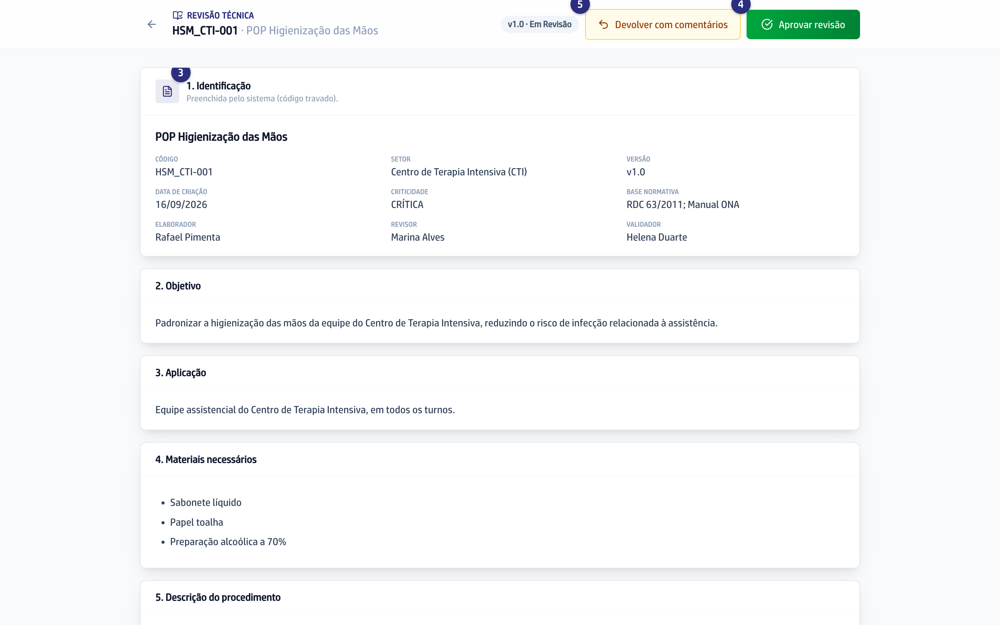

## Quando usar

Quando o Elaborador terminou e você recebeu o email avisando que a Versão está
com você. Enquanto ela estiver em **Em Revisão**, ninguém mais mexe no texto.

## Passo a passo

1. No menu da esquerda, clique em **POPs**.
2. Na linha do POP, clique em **Revisar**. No alto da tela aparece
   **Revisão técnica**.
3. Leia o documento inteiro, da Identificação ao fluxograma.
4. Se estiver tudo certo, clique em **Aprovar revisão** e confirme em
   **Aprovar**. A Versão segue para o Validador, que recebe um email.
5. Se faltar alguma coisa, clique em **Devolver com comentários**.
6. Escreva o que precisa ser ajustado e clique em **Devolver**. O Elaborador
   recebe o comentário com o seu nome e a hora.

## Se der errado

- **Você não vê os botões de aprovar e devolver:** ou a Versão não está em
  **Em Revisão**, ou você não é o Revisor designado deste POP. O alto da tela
  diz **Leitura da Versão** quando é só leitura.
- **O botão Devolver está apagado:** o comentário é obrigatório. Escreva o
  motivo e ele acende.
- **Você devolveu por engano:** peça ao Elaborador para aprovar a versão final
  de novo. Ela volta direto para você, sem passar por mais ninguém.
