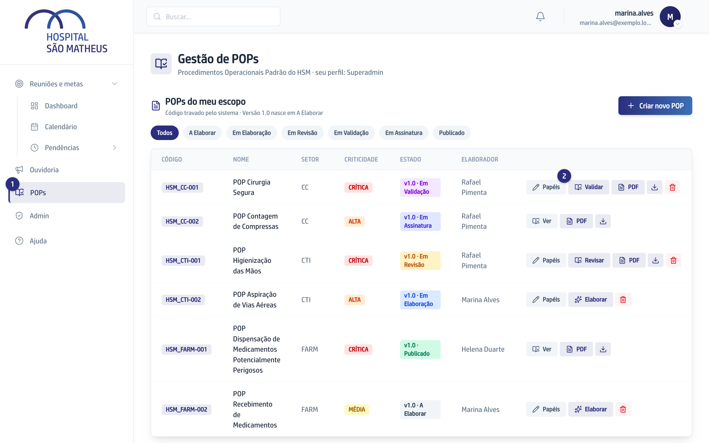
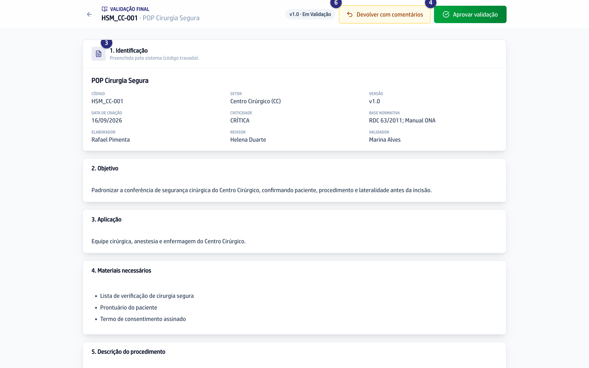
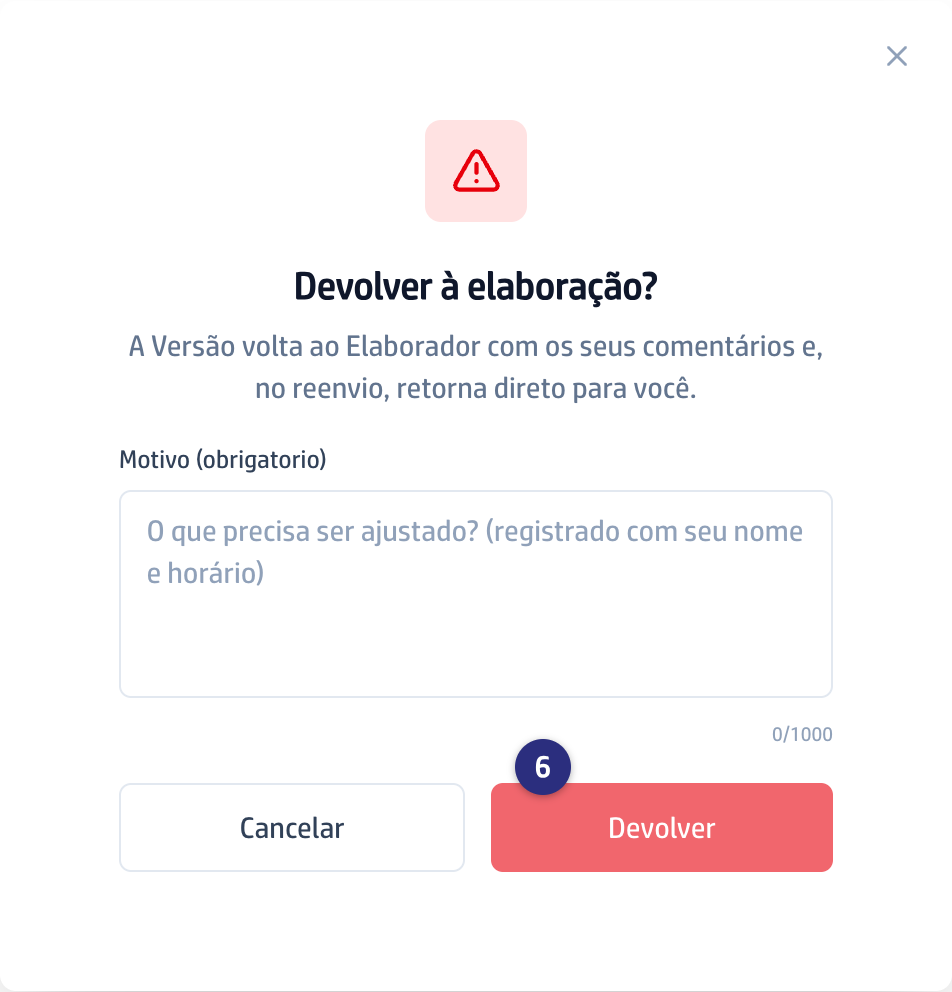

## Quando usar

Quando o Revisor aprovou e você recebeu o email avisando. A validação é a
última conferência antes de o documento ir para assinatura.

## Passo a passo

1. No menu da esquerda, clique em **POPs**.

   
2. Na linha do POP, clique em **Validar**. No alto da tela aparece
   **Validação final**.
3. Leia o documento e, se houver, a tarja com as devoluções anteriores.

   

:::caution[Aprovar aqui não tem volta]
A validação aprovada manda o documento para a assinatura e trava o conteúdo.
:::
4. Estando de acordo, clique em **Aprovar validação** e confirme em
   **Aprovar**.
5. A Versão passa para **Em Assinatura** e o documento sai por email para o
   Elaborador, o Revisor e você assinarem.
6. Se ainda faltar algo, clique em **Devolver com comentários**, escreva o
   motivo e clique em **Devolver**.

   

## Se der errado

- **Você devolveu e quer saber por onde a Versão volta:** ela vai para o
  Elaborador e, quando ele reenviar, volta direto para você. Não passa pelo
  Revisor de novo.
- **Você aprovou e quer mudar alguma coisa:** não dá. A partir de
  **Em Assinatura** o conteúdo está travado. O caminho é aguardar a publicação
  e abrir uma Versão nova.
- **Você não vê os botões:** confira se o estado na lista é
  **v1.0 · Em Validação** e se o Validador designado é você.
