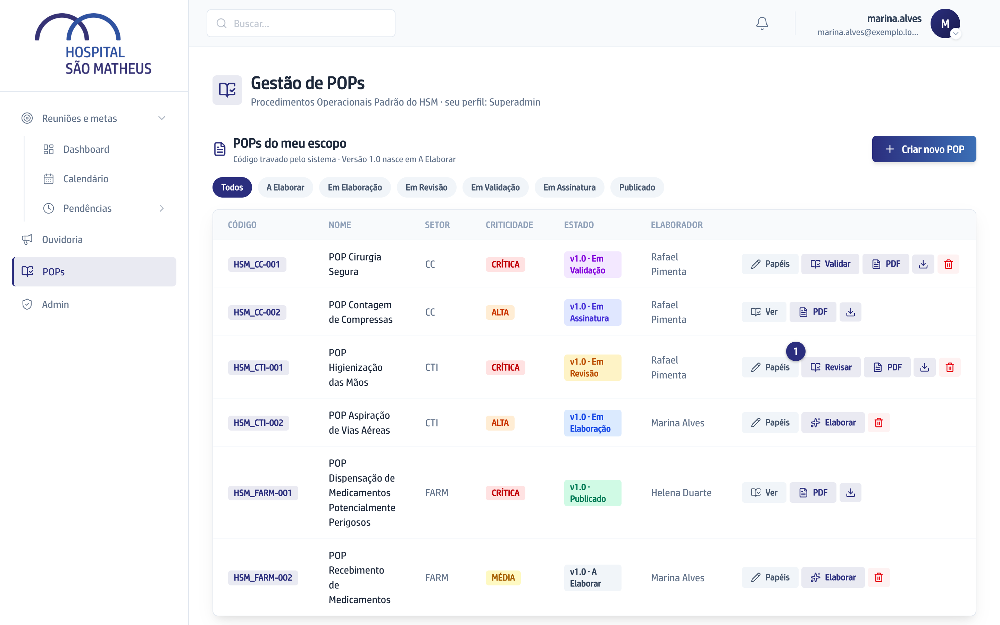
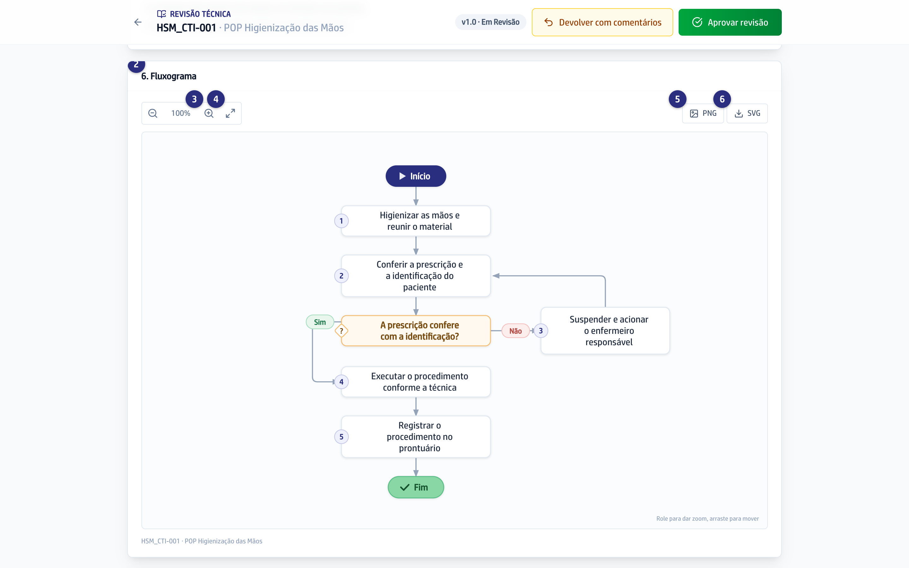

## Quando usar

Quando você quer entender o procedimento pelo desenho, e não pelo texto: o que
vem antes, o que vem depois e o que fazer quando a resposta é não. Todo POP tem
a seção de fluxograma, e ela também sai no documento assinado.

## Passo a passo

1. Abra o POP: **Elaborar**, se ele é seu para escrever, ou **Revisar**,
   **Validar** ou **Ver**.

   
2. Role até a seção **Fluxograma**. O desenho já abre inteiro na tela.

   
3. Para enxergar um passo de perto, use o botão de mais ou role o dedo sobre o
   desenho. Arraste para andar pelo caminho.
4. Para voltar a ver o desenho inteiro, clique no botão de **Ajustar à tela**.
5. Clique em **PNG** para salvar uma imagem, por exemplo para um treinamento.
6. Clique em **SVG** quando precisar de uma imagem que não perde qualidade ao
   ampliar.

## Se der errado

- **Aparece "O fluxograma toma forma conforme a conversa com o agente":** o
  desenho ainda não foi escrito. Ele nasce na elaboração, junto com as outras
  seções.
- **Aparece "Não consegui desenhar o fluxograma":** o desenho saiu num formato
  que a tela não entende. Na elaboração, peça ao Consultor de POPs, pelo chat,
  para refazer o fluxograma.
- **O desenho está grande demais para a tela:** clique em **Ajustar à tela**.
  Ele volta a caber inteiro, com o mesmo enquadramento de quando a tela abre.
