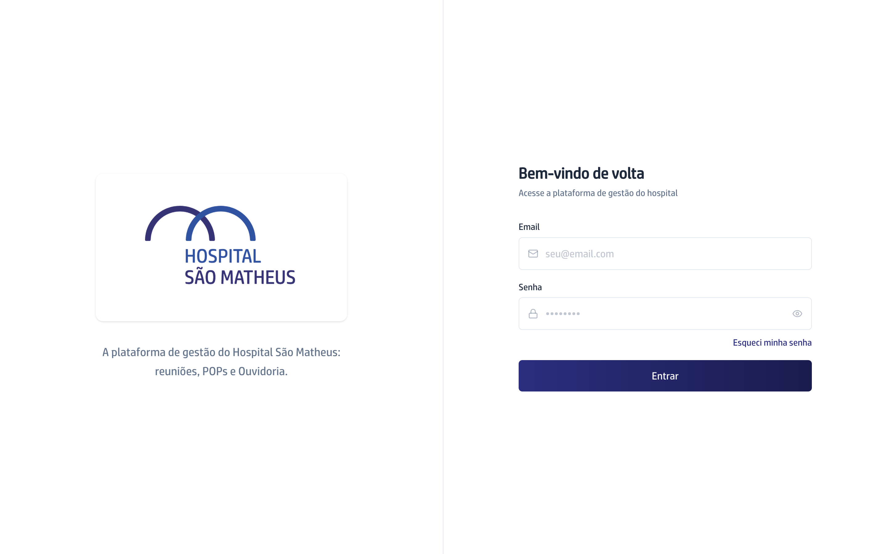

## Quando usar

Toda vez que você abre a plataforma num computador ou num celular novo, e
sempre que você tiver saído da sua conta.

## Passo a passo

1. Abra o endereço da plataforma no navegador. A tela mostra
   **Bem-vindo de volta**.
2. Escreva o seu **Email**.
3. Escreva a sua **Senha**. O olho no canto direito do campo mostra o que você
   digitou, para conferir antes de entrar.
4. Clique em **Entrar**. O botão fica **Entrando...** enquanto a plataforma
   confere.

Quem entra pela primeira vez cai no **Dashboard** ou no **Início**, conforme o
perfil de acesso. A Secretária cai em **Início**; quem só cuida de
procedimentos cai em **POPs**.

## Se der errado

- **A tela mostra o aviso vermelho "Invalid login credentials":** é a plataforma
  dizendo que o email ou a senha não conferem. Confira o email, apague a senha e
  digite de novo com o olho aberto. O aviso aparece em inglês.
- **Você não lembra a senha:** clique em **Esqueci minha senha**, logo abaixo do
  campo. O caminho completo está em
  [Redefinir a senha que você esqueceu](/primeiros-passos/redefinir-a-senha-esquecida/).
- **Você entrou e o menu não tem o que você esperava:** o menu mostra só o que o
  seu perfil de acesso alcança. Peça a quem administra a plataforma para
  conferir o seu acesso.
