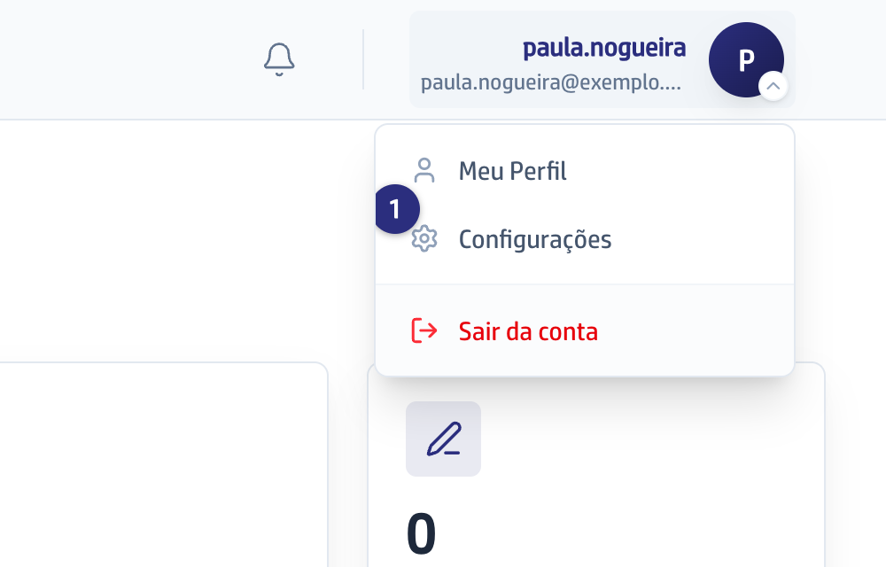
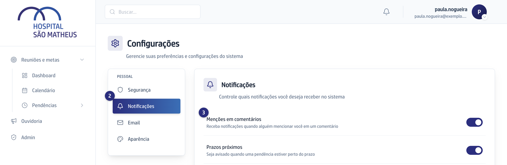

## Quando usar

Quando você quer deixar registrado quais avisos interessam a você. A escolha
fica guardada, mas os avisos continuam chegando do mesmo jeito.

## Passo a passo

1. Clique no seu nome, no alto da tela à direita, e escolha **Configurações**.

   
2. Na coluna **Pessoal**, clique em **Notificações**.

   
3. Ligue ou desligue cada chave:
   - **Menções em comentários**, quando escrevem o seu nome com arroba.
   - **Prazos próximos**, quando uma pendência sua está perto de vencer.
   - **Novos comentários**, nas reuniões de que você participa.
   - **Atribuição de pendências**, quando uma delas passa a ser sua.
4. Cada chave salva sozinha, no clique: não existe botão de salvar. Um aviso
   verde confirma **Preferências salvas!**.

## Se der errado

- **Você desligou uma chave e o aviso continuou chegando:** a plataforma guarda
  a sua escolha e não a consulta na hora de avisar, então a chave desligada não
  silencia nada.
- **A tela avisa Erro ao salvar preferências:** a chave fica como você deixou,
  mas a escolha não foi guardada. Recarregue a página para ver o que vale, e
  clique de novo.
- **Você ligou Prazos próximos e nunca recebeu nada:** a plataforma não emite
  esse aviso. Quem acompanha prazo acompanha pelo cartão **Vencem em 3 dias**
  do painel, que abre a lista de pendências já só com as críticas.
- **Você procurou preferência de email, ou escolheu o tema Escuro:** as abas
  **Email** e **Aparência** dizem na própria tela que essas duas coisas ainda
  vêm.
