Esta seção é para quem abre a plataforma do hospital pela primeira vez. Ela
cobre o que todo mundo faz igual, seja da Diretoria, da Secretaria, da
Qualidade ou da Ouvidoria: entrar com email e senha, reconhecer o menu da
esquerda e deixar a conta do seu jeito.

## As palavras que você vai ver o tempo todo

**Plataforma** é este sistema inteiro, com tudo o que ele guarda: as reuniões e
as atas, as pendências, os procedimentos da Gestão de POPs e os casos da
Ouvidoria. Um endereço só, uma conta só.

**Conta** é o seu acesso, formado pelo seu email e pela sua senha. Ela é
pessoal: o que você faz na plataforma fica registrado no seu nome.

**Perfil de acesso** é o que a sua conta pode fazer. Quem administra a
plataforma define o seu, e é ele que decide o que aparece no seu menu.

**Menu** é a lista da esquerda, com os módulos que a sua conta alcança. Dois
colegas abrem a mesma plataforma e veem menus diferentes.

**Participante** é toda pessoa cadastrada, com conta ou sem conta. Quem é
citado numa reunião ou fica responsável por uma ação não precisa ter conta para
aparecer na plataforma.

## Quem entra e quem não entra

Nem todo mundo que aparece na plataforma precisa entrar nela.

- **Quem entra** é quem conduz o trabalho: Facilitador, Secretária, quem cuida
  da Gestão de POPs, quem cuida da Ouvidoria e o Super Admin.
- **Quem não entra** é quem só é citado numa reunião ou fica responsável por
  uma ação. Essa pessoa recebe o convite da reunião por email e, quando a ata
  vai a assinatura, o email de assinar. Quem precisa aceitar uma ata ganha um
  link que abre a ata inteira sem pedir senha.

Algumas telas são feitas para abrir sem conta, e todas chegam até você por um
link ou por um QR: o aceite de uma ata, o formulário da Ouvidoria e as telas em
que uma área responde um caso são as mais comuns. Neste manual elas levam o
selo **Sem login**. A assinatura digital, de uma ata ou de um POP, nem é tela
da plataforma: acontece no email do serviço que assina. Fora isso, a plataforma
pede email e senha.

## O caminho do seu primeiro dia

1. **Quem administra a plataforma cria a sua conta** e passa a você, em mãos, o
   endereço de email do acesso e uma senha. A senha vem pronta e é para ser
   trocada; nenhum email de boas-vindas chega para você.
2. **Você entra** pelo endereço da plataforma, em
   [Entrar na plataforma](/primeiros-passos/entrar-na-plataforma/).
3. **Você troca a senha** por uma que só você saiba, em
   [Trocar a sua senha](/primeiros-passos/trocar-a-sua-senha/).
4. **Você olha o menu** e reconhece o que é seu. O que cada item significa
   está em
   [O que aparece no seu menu](/primeiros-passos/como-funciona/o-que-aparece-no-seu-menu/).
5. **Você ajusta os avisos** que quer receber, em
   [Escolher os avisos que você recebe](/primeiros-passos/escolher-os-avisos-que-voce-recebe/).

No fim do menu existe sempre um item **Ajuda**. Ele abre este manual na parte
da plataforma em que você está, numa aba nova.
