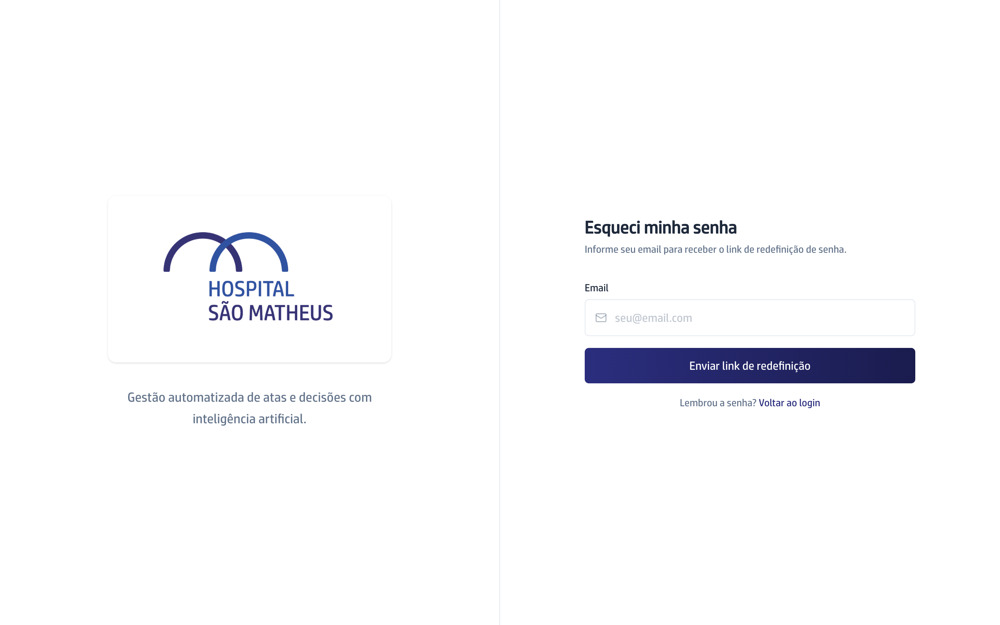

## Quando usar

Quando você não consegue entrar porque não lembra a senha. Este caminho é seu:
ninguém precisa gerar senha nova para você.

## Passo a passo

1. Na tela de entrada, clique em **Esqueci minha senha**.
2. Escreva o seu **Email** e clique em **Enviar link de redefinição**.
3. A tela responde **Verifique seu email**. Abra a sua caixa de entrada e
   clique no link que chegou.
4. O link abre a tela **Redefinir senha**. Escreva a **Nova senha**, com pelo
   menos 8 caracteres, e repita em **Confirmar nova senha**.
5. Clique em **Redefinir senha**. A tela mostra
   **Senha redefinida com sucesso!** e leva você de volta para a entrada.

## Se der errado

- **O email não chega:** olhe a caixa de spam. A tela responde
  **Verifique seu email** mesmo quando o endereço não existe na plataforma, para
  não contar a estranhos quem tem conta aqui. Confira se você digitou o email
  certo e tente de novo.
- **A tela mostra Link inválido:** o aviso explica que o link expirou ou já foi
  usado. Clique em **Solicitar novo link** e repita o pedido.
- **A tela recusa a senha:** ela avisa **A senha deve ter no mínimo 8
  caracteres** ou **As senhas não coincidem**. Escreva uma senha mais longa, ou
  repita a mesma nos dois campos.
