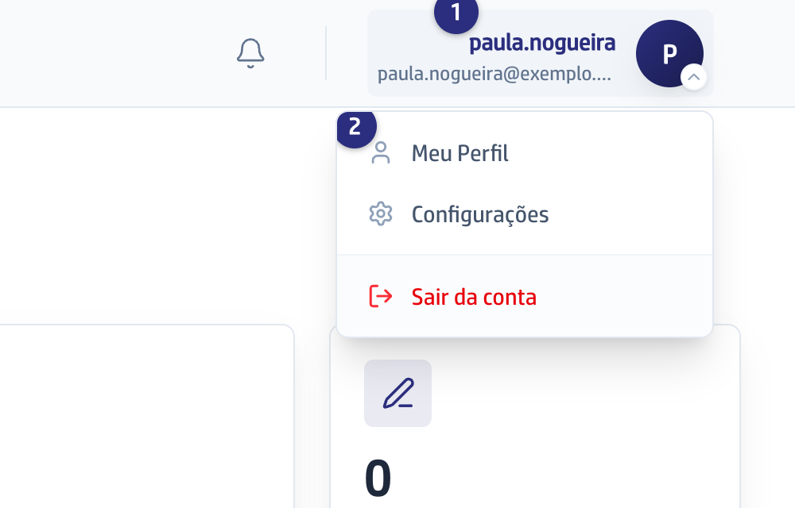
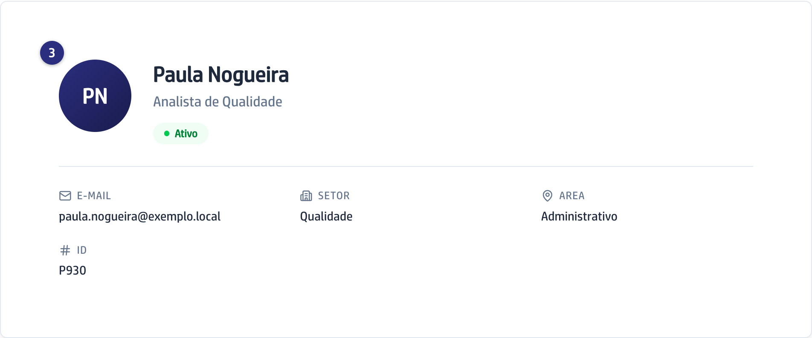

## Quando usar

Quando você quer conferir com que email a plataforma conhece você, em que setor
você está cadastrado, ou ter um número rápido de quantas pendências ainda estão
com você.

## Passo a passo

1. Clique no seu nome, no alto da tela à direita.

   
2. Escolha **Meu Perfil**. No celular, o mesmo atalho fica em **Perfil**, na
   barra de baixo.
3. O cartão de cima mostra o seu nome, o seu cargo e o selo **Ativo**, com
   **E-mail**, **Setor**, **Area** e **ID**.

   
4. Em **Resumo de Atividade** estão os quatro números do seu trabalho:
   **Reunioes**, **Pendencias Ativas**, **Concluidas** e **No Prazo**.

Esta tela é só de leitura: quem corrige nome, cargo, setor ou email é quem
administra a plataforma. A senha você troca em
[Trocar a sua senha](/primeiros-passos/trocar-a-sua-senha/).

## Se der errado

- **A tela mostra Perfil indisponivel:** a sua conta de entrada existe, mas
  ainda não está ligada a um cadastro de participante. Peça a quem administra a
  plataforma para ligar as duas; sem isso, reuniões e pendências não encontram
  você.
- **O seu cargo aparece como Cargo nao informado:** o cadastro está sem cargo.
  Quem administra a plataforma preenche.
- **Os números do resumo estão zerados:** o resumo conta reuniões e pendências
  em que você é participante ou responsável. Zero quer dizer que nada foi
  atribuído a você ainda.
