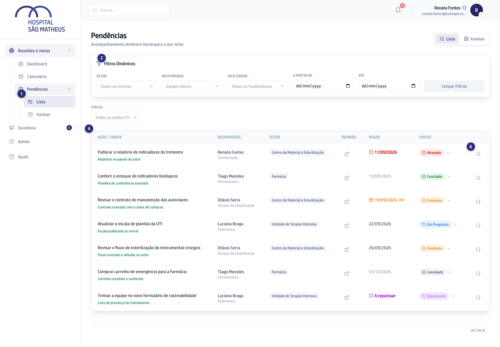
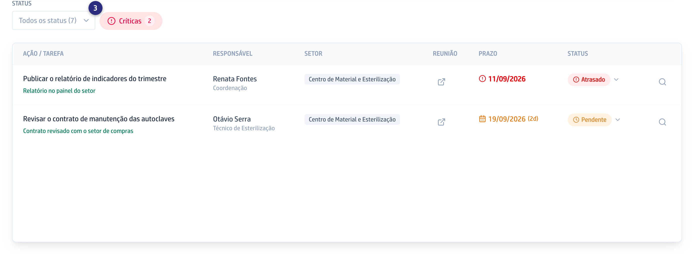
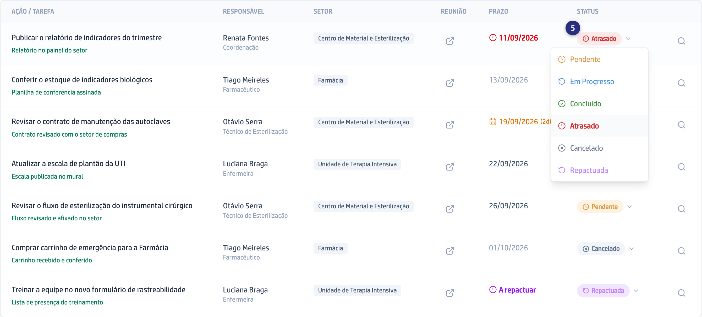

## Quando usar

Quando você quer ver muita coisa de uma vez: o que está atrasado, o que vence
esta semana, o que está com cada setor.

## Passo a passo

1. No menu, abra **Reuniões e metas**, depois **Pendências**, depois **Lista**.

   
2. Abra **Filtros Dinâmicos** e escolha o recorte: **Facilitador**, o
   **Status**, ou um intervalo em **A partir de** e **Até**.
3. Para ver só o que aperta, venha do **Dashboard** pelo cartão
   **Vencem em 3 dias**: a lista abre com o selo **Críticas** ligado, só com as
   que vencem em até três dias e todas as atrasadas. Clicar no selo desliga o
   recorte; não existe botão para ligá-lo por aqui.

   
4. Leia a tabela: **Ação / Tarefa**, **Responsável**, **Setor**, **Reunião**,
   **Prazo** e **Status**.
5. Para mudar o estado, clique no selo colorido da coluna **Status** e escolha
   **Pendente**, **Em Progresso**, **Concluido**, **Atrasado**, **Cancelado**
   ou **Repactuada**.

   
6. Para ver a pendência inteira, clique na lupa
   **Abrir detalhes da pendência**, no fim da linha.

## Se der errado

- **A tela avisa que existem mais pendências do que ela mostra:** a lista tem
  teto. Use os filtros, senão o que é crítico pode ficar de fora.
- **O prazo aparece como A definir ou A repactuar:** a ação nasceu sem data, ou
  foi remarcada e a nova ainda está sem data. Abra a pendência e escreva o
  prazo.
- **Você não vê os filtros de Setor e Responsável:** eles aparecem só para quem
  tem o acesso mais alto de Reuniões e metas.
- **Você não acha a pendência de alguém:** clique em **Limpar Filtros** e
  procure de novo.
