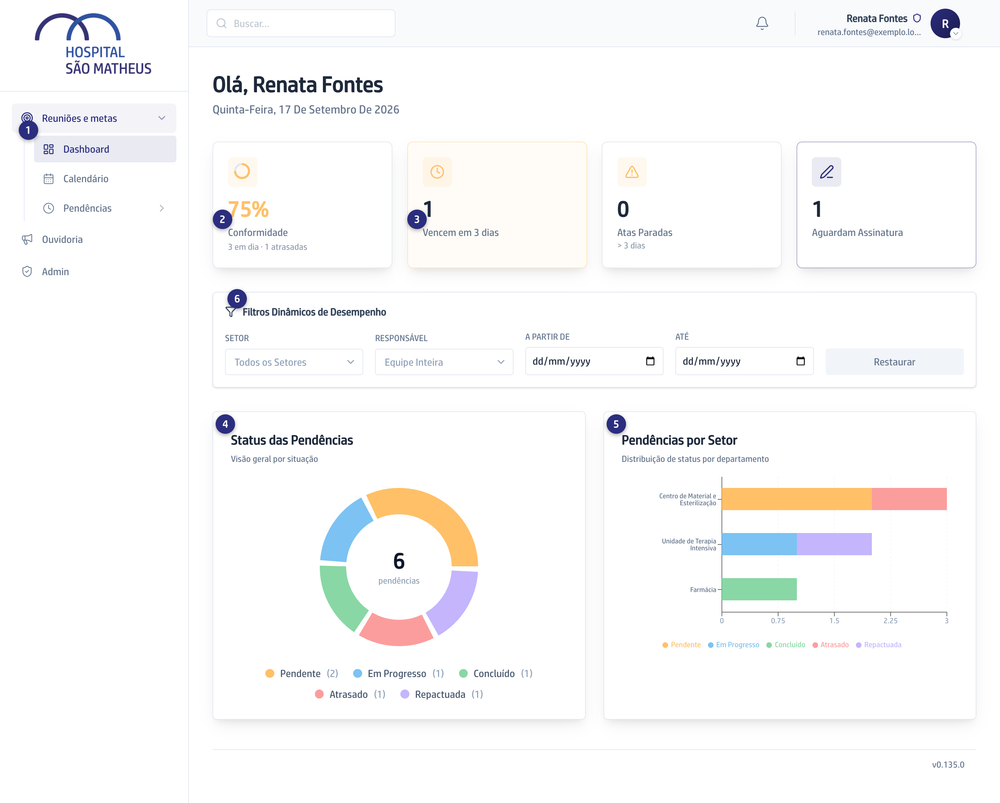

## Quando usar

No começo do dia, ou antes da reunião de acompanhamento, quando você quer o
retrato geral em vez da lista item a item.

## Passo a passo

1. No menu, abra **Reuniões e metas** e clique em **Dashboard**. A tela abre
   com **Olá** e o seu nome.
   

2. Leia os quatro números do alto, todos clicáveis: **Conformidade**,
   **Vencem em 3 dias**, **Atas Paradas** e **Aguardam Assinatura**.
3. Clique em **Vencem em 3 dias** para cair na lista de pendências já filtrada
   pelas críticas.
4. Em **Status das Pendências**, veja a divisão por situação: **Pendente**,
   **Em Progresso**, **Concluído**, **Atrasado** e **Repactuada**.
5. Em **Pendências por Setor**, compare os setores. As barras usam as mesmas
   cores do gráfico de cima.
6. Para recortar tudo de uma vez, use **Filtros Dinâmicos de Desempenho**:
   **Setor**, **Responsável** e o intervalo entre **A partir de** e **Até**.

## Se der errado

- **Os gráficos aparecem vazios:** a tela avisa **Sem pendências para os
  filtros aplicados**. Clique em **Restaurar** para tirar os filtros.
- **Um setor aparece como Sem Setor:** o responsável daquelas pendências está
  cadastrado sem setor. Quem administra a plataforma corrige o cadastro.
- **Atas Paradas não zera:** são atas esperando alguém há mais de três dias.
  Clique no número e veja em que passo cada uma travou.
- **Você é Secretária e não acha o Dashboard:** o menu da Secretaria abre em
  **Início**. O painel de desempenho é do Facilitador.
