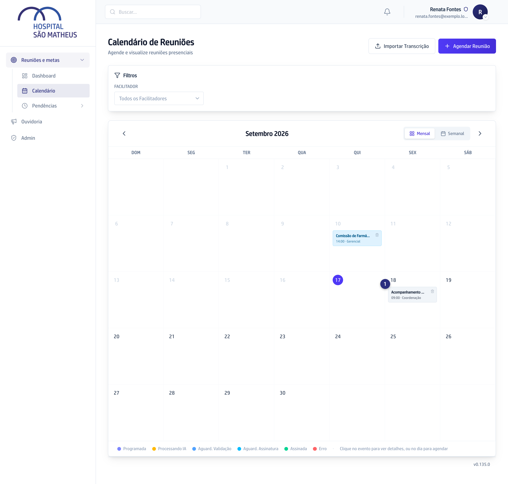
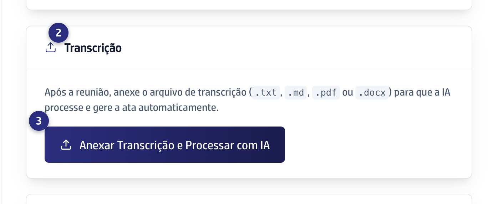
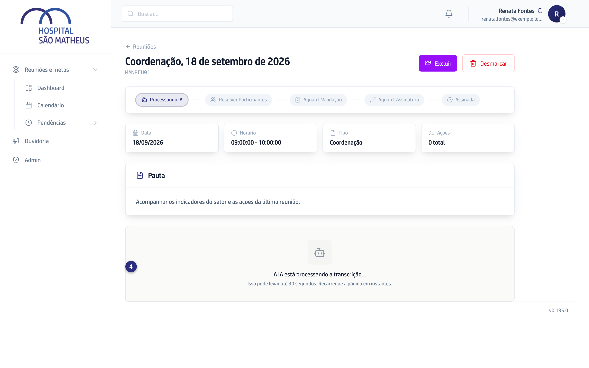
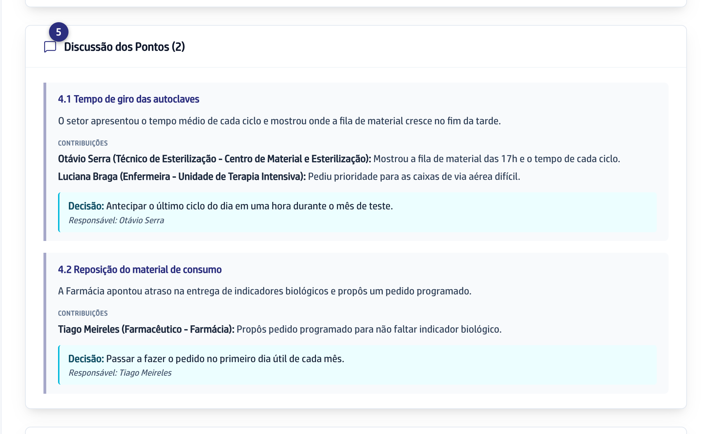

## Quando usar

Depois da reunião, quando você tem o texto do que foi falado. É este passo que
faz a ata nascer completa, com discussão, decisões e o quadro de ações.

## Passo a passo

1. Abra a reunião pelo **Calendário**, clicando no cartão dela.

   
2. Desça até o bloco **Transcrição**.

   
3. Clique em **Anexar Transcrição e Processar com IA** e escolha o arquivo.
   Valem os formatos `.txt`, `.md`, `.pdf` e `.docx`.
4. Espere. O bloco passa a mostrar **A IA está processando a transcrição...**,
   e a reunião fica em **Processando IA**.

   
5. Recarregue a página em instantes. A ata aparece escrita, pronta para você
   revisar.

   

Se a reunião nem chegou a ser marcada, dá para começar pela transcrição: no
**Calendário**, clique em **Importar Transcrição**, preencha título, data e
tipo, solte os arquivos e clique em **Processar com IA**. A reunião nasce junto
com a ata.

## Se der errado

- **A tela avisa "Formato não suportado":** o arquivo não é `.txt`, `.md`,
  `.pdf` nem `.docx`. Salve o texto num desses formatos e tente de novo.
- **A reunião fica em Processando IA e não sai:** a tela diz que pode levar até
  30 segundos. Passando disso, recarregue; se aparecer
  **Erro no Processamento**, anexe o arquivo outra vez.
- **Aparece Participantes Não Cadastrados:** é esperado. O assistente achou
  nomes que não batem com o cadastro. Resolva cada um e clique em
  **Confirmar e Continuar**, ou em **Ignorar Todos**.
- **Não existe transcrição desta reunião:** use
  [Montar a ata conversando](/reunioes/montar-a-ata-conversando/).
