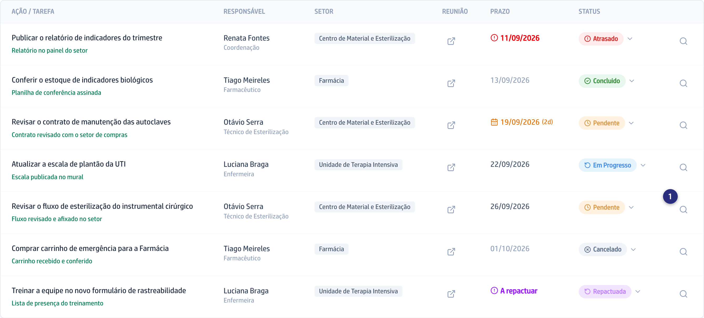
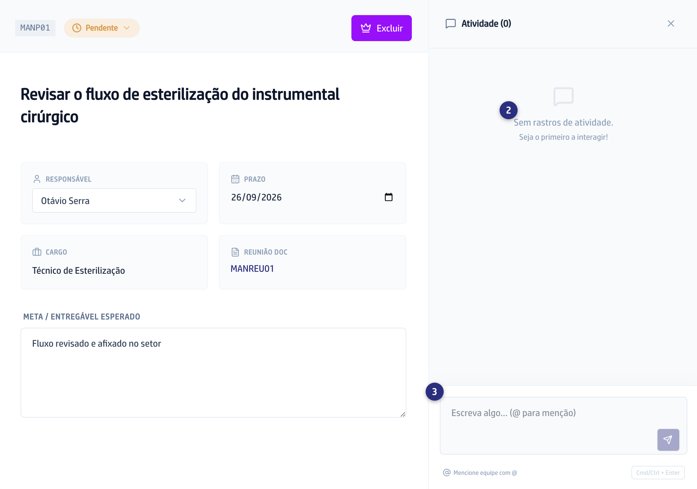
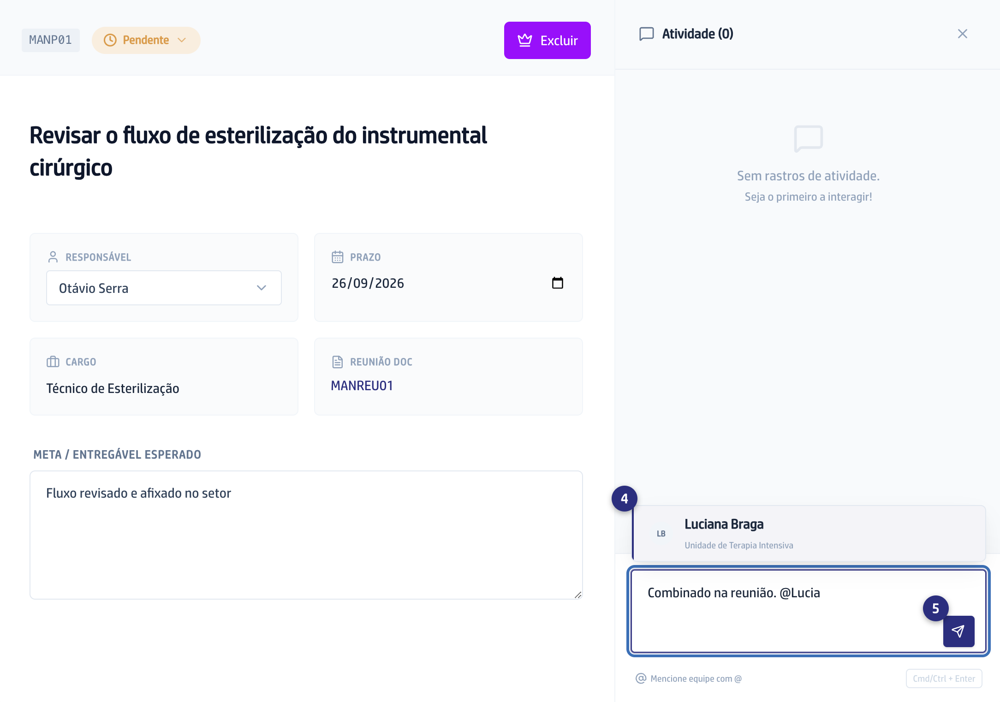

## Quando usar

Quando o combinado mudou, quando falta alguma coisa para a pendência andar, ou
quando você precisa da resposta de uma pessoa específica. O comentário fica na
pendência, e quem vier depois lê o histórico inteiro.

## Passo a passo

1. Abra a pendência: na **Lista**, clique na lupa
   **Abrir detalhes da pendência**, no fim da linha; no **Kanban**, clique no
   cartão.

   
2. Desça até o histórico. Sem nenhum comentário, ele mostra
   **Sem rastros de atividade.**

   
3. Escreva na caixa **Escreva algo... (@ para menção)**.
4. Para chamar alguém, digite arroba e comece o nome. A lista de pessoas abre;
   escolha com as setas e confirme, ou clique no nome.

   
5. Envie no botão azul ao lado da caixa, ou pelo atalho
   **Cmd/Ctrl + Enter**.
6. A pessoa mencionada recebe um aviso no sino da plataforma, com o texto
   **Fulano mencionou você**.

   

## Se der errado

- **O botão de enviar está apagado:** o comentário está vazio. Escreva alguma
  coisa.
- **A lista de nomes não abre depois da arroba:** escreva as primeiras letras
  do nome. A lista mostra oito por vez e filtra pelo que você digita.
- **Você mencionou e a pessoa não viu:** o aviso fica no sino dela, no alto da
  tela, até ser lido. Quem não entra na plataforma não recebe menção: fale com
  a pessoa por fora.
- **Você comentou na pendência errada:** apague o seu comentário pelo ícone de
  lixeira na linha dele e escreva no lugar certo.
